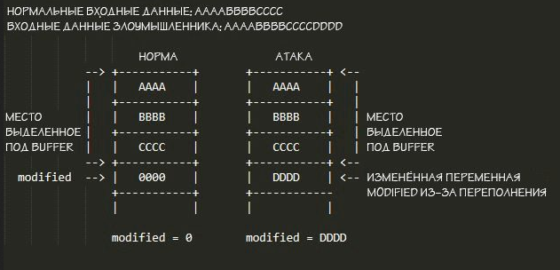

---
## Author
author:
  name: Бессонов Андрей Максимович
  degrees: DSc
  orcid: 0000-0002-0877-7063
  email: 1032253499@rudn.ru
  affiliation:
    - name: Российский университет дружбы народов
      country: Российская Федерация
      postal-code: 117198
      city: Москва
      address: ул. Миклухо-Маклая, д. 6
## Title
title: "Методы защиты от атаки типа переполнение буфера."
license: "CC BY"
---

# Цель работы

Изучить современные методы защиты от атак типа переполнение буфера, применяемые в операционных системах семейства UNIX, и оценить их эффективность.

# Теоретическое введение

## Переполнение буфера как угроза безопасности UNIX

Операционные системы семейства UNIX (Linux, macOS, BSD) широко используются в серверной инфраструктуре, облачных платформах и встраиваемых системах. Их надёжность напрямую зависит от защищённости системного и прикладного программного обеспечения. Переполнение буфера (buffer overflow) остаётся одной из наиболее опасных и распространённых уязвимостей на протяжении десятилетий.

### Причины возникновения уязвимости

Основная причина кроется в особенностях языков C и C++, которые применяются для написания ядра UNIX, системных утилит и высоконагруженных сервисов. Эти языки предоставляют прямой доступ к памяти через указатели и не осуществляют автоматического контроля границ массивов. Функции стандартной библиотеки, такие как `strcpy()`, `strcat()`, `sprintf()` и `gets()`, при неосторожном использовании копируют данные без проверки достаточности размера буфера-приёмника [1]. Если объём входных данных превышает выделенный размер буфера, происходит запись за его пределы – в соседние области оперативной памяти.

В многопользовательской среде UNIX особую опасность представляют программы с установленным SUID-битом, которые временно получают привилегии суперпользователя. Уязвимость в такой программе позволяет локальному пользователю повысить свои права [2].

### Принцип классической атаки (stack overflow)

Наиболее известный тип атаки направлен на стек вызова функций (stack-based buffer overflow). При вызове функции в стек помещаются локальные переменные, параметры и **адрес возврата** – указатель на инструкцию, которую нужно выполнить после завершения функции. Если локальный буфер переполняется, злоумышленник может перезаписать этот адрес возврата произвольным значением.

Схема атаки включает три этапа [3]:
1. В буфер записывается блок данных большего размера, чем выделено.
2. В этот блок помещается вредоносный код (шелл-код).
3. Адрес возврата подменяется указателем на начало шелл-кода.

После завершения функции управление передаётся не легитимному коду, а коду злоумышленника. Это приводит к выполнению произвольных команд с привилегиями атакуемого процесса.

# Основная часть

Современная защита от переполнения буфера в UNIX является многоуровневой и включает меры на этапе компиляции, на уровне операционной системы и процессора, а также организационные меры, связанные с культурой программирования.

## Защита на этапе компиляции (StackGuard, ASLR)

**StackGuard (канарейки).** Это расширение компилятора GCC, которое размещает в стеке специальное значение – «канарейку» (canary) – между локальными переменными и адресом возврата. Перед выходом из функции проверяется целостность канарейки. Если она изменилась (что указывает на переполнение), программа немедленно завершается [4]. Такой подход эффективно предотвращает классическую перезапись адреса возврата.

**ASLR (Address Space Layout Randomization).** Механизм, реализованный в ядре Linux и других UNIX-подобных системах, случайным образом размещает в памяти сегменты стека, кучи, библиотек и исполняемого файла при каждом запуске процесса. Это делает невозможным точное предсказание адресов, необходимых для перехода на шелл-код. Даже если злоумышленник найдёт способ переполнить буфер, он не сможет гарантированно передать управление своему коду [5].

*Таблица 1 – Сравнение методов компиляторной защиты*

| Метод        | Суть                                 | Эффективность                          |
|--------------|--------------------------------------|----------------------------------------|
| StackGuard   | Контрольная сумма (канарейка) в стеке | Высокая против stack overflow          |
| ASLR         | Рандомизация адресного пространства  | Высокая при 64-разрядной архитектуре   |

## Аппаратно-системные средства (NX-бит, изоляция памяти)

Современные процессоры (начиная с Intel x86-64) поддерживают аппаратный запрет на исполнение кода из областей памяти, помеченных как данные. Этот механизм называется **NX-бит (No-eXecute)** или **XD-бит (eXecute Disabled)**. Операционная система может пометить страницы стека и кучи как неисполняемые. При попытке выполнить код из такой области процессор генерирует исключение, и процесс завершается [6].

В сочетании с ASLR технология NX делает большинство классических атак неработоспособными, хотя и не защищает от более сложных методов (например, return-oriented programming).

## Безопасное программирование и анализ кода

Никакие технические средства не заменяют грамотного написания кода. Основные рекомендации включают:
- Использование безопасных версий функций: `strncpy()` и `strncat()` вместо `strcpy()` и `strcat()`, а также функций с ограничением длины.
- Применение современных языков с автоматическим управлением памятью (Rust, Go) для новых проектов, где критична безопасность.
- Регулярное использование статических анализаторов (Splint, Coverity) и динамических анализаторов (Valgrind, AddressSanitizer) для выявления потенциальных переполнений на этапе разработки [7].

Эти меры позволяют устранить уязвимости до того, как код попадёт в эксплуатацию.

# Выводы

Проблема переполнения буфера в среде UNIX не утратила актуальности, однако современные методы защиты позволяют свести риск успешной атаки к минимуму. Ключевыми элементами защиты являются:

1. **Компиляторные техники** (StackGuard, ASLR), которые делают эксплуатацию уязвимости сложной или невозможной.
2. **Аппаратная поддержка** (NX-бит), предотвращающая выполнение кода в областях данных.
3. **Организационные меры** – безопасное программирование и анализ кода, устраняющие саму причину появления багов.

Только комплексное применение всех трёх уровней обеспечивает надёжную защиту UNIX-систем от атак, основанных на переполнении буфера.

# Список литературы{.unnumbered}

1. Керниган, Б., Ритчи, Д. Язык программирования C. – М.: Вильямс, 2019. – 288 с.  
2. Робачевский, А. Н. Операционная система UNIX. – 2-е изд. – СПб.: БХВ-Петербург, 2017. – 656 с.  
3. Aleph One. Smashing The Stack For Fun And Profit // Phrack Magazine. – 1996. – Vol. 7, Issue 49. – URL: http://www.phrack.org/issues/49/14.html (дата обращения: 14.02.2026).  
4. Cowan, C. et al. StackGuard: Automatic Adaptive Detection and Prevention of Buffer-Overflow Attacks // Proceedings of the 7th USENIX Security Symposium. – San Antonio, 1998. – P. 63-78.  
5. Безруков, Н. Н. Компьютерная вирусология и защита информации. – М.: Радио и связь, 2021. – 320 с.  
6. VMware. Защита от переполнения буфера: аппаратная поддержка NX/XD. – URL: https://kb.vmware.com/ (дата обращения: 14.02.2026).  
7. Столлингс, В. Операционные системы: внутреннее устройство и принципы проектирования. – М.: Вильямс, 2018. – 848 с.

::: {#refs}
:::

# ********
