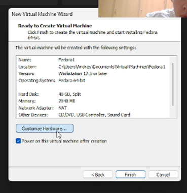
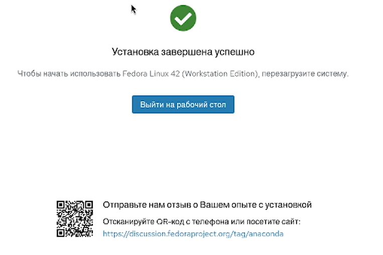
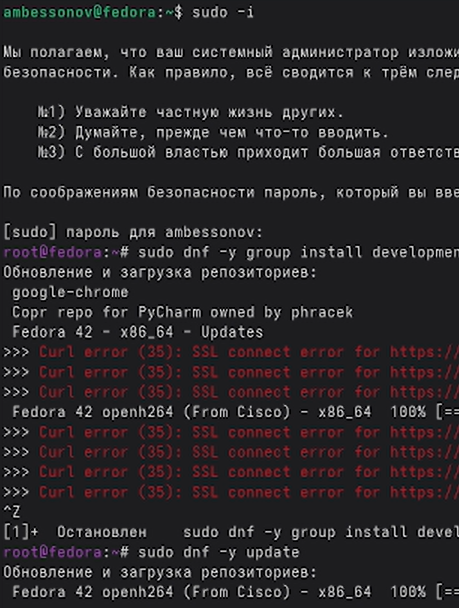
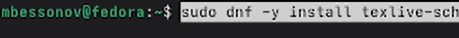
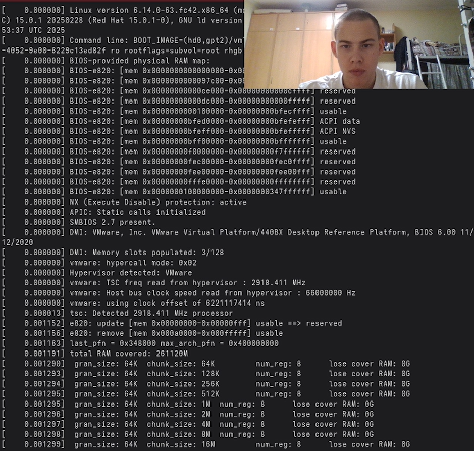
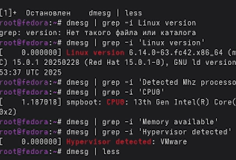

---
## Author
author:
  name: Бессонов Андрей Максимович
  degrees: DSc
  orcid: 0000-0002-0877-7063
  email: 1032253499@rudn.ru
  affiliation:
    - name: Российский университет дружбы народов
      country: Российская Федерация
      postal-code: 117198
      city: Москва
      address: ул. Миклухо-Маклая, д. 6
## Title
title: "Лабораторная работа №1"
license: "CC BY"
---

# Цель работы

Приобретение практических навыков установки операционной системы на виртуальную машину, настройки минимально необходимых для дальнейшей работы сервисов.

# Теоретическое введение

## Техническое обеспечение
Лабораторная работа подразумевает установку на виртуальную машину VirtualBox (https://www.virtualbox.org/) операционной системы Linux (дистрибутив Fedora).
Выполнение работы возможно как в дисплейном классе факультета физико-математических и естественных наук РУДН, так и дома. Описание выполнения работы приведено для дисплейного класса со следующими характеристиками техники:
Intel Core i3-550 3.2 GHz, 4 GB оперативной памяти, 80 GB свободного места на жёстком диске;
ОС Linux Gentoo (http://www.gentoo.ru/);
VirtualBox версии 7.0 или новее.
Для установки в виртуальную машину используется дистрибутив Linux Fedora (https://getfedora.org), вариант с менеджером окон sway (https://fedoraproject.org/spins/sway/).
При выполнении лабораторной работы на своей технике вам необходимо скачать необходимый образ операционной системы (https://fedoraproject.org/spins/sway/download/index.html).
В дисплейных классах можно воспользоваться образом в каталоге /afs/dk.sci.pfu.edu.ru/common/files/iso.
Для определённости в описании будем использовать версию Fedora-Sway-Live-x86_64-41-1.4.iso.

## Соглашения об именовании
При выполнении работ следует придерживаться следующих правил именования:

Пользователь внутри виртуальной машины должен иметь имя, совпадающее с учётной записью студента, выполняющего лабораторную работу.
Имя хоста вашей виртуальной машины должно совпадать с учётной записью студента, выполняющего лабораторную работу.
Имя виртуальной машины должно совпадать с учётной записью студента, выполняющего лабораторную работу.
В дисплейных классах вы можете посмотреть имя вашей учётной записи, набрав в терминале команду:

id -un
При установке на своей технике необходимо использовать имя вашей учётной записи дисплейных классов.

# Выполнение лабораторной работы

## Установили федору на WMware, запустили виртуальную машину, загрузили с ISO, запустили установщика из Live-режима, задали начальные параметры, такие как раскладка клавиатуры, имя пользователя и тп.
Параметры виртуальной машины: Гостевая ОС: Linux / Fedora 64-bit, Оперативная память: 2048 МБ, Жесткий диск: 40 ГБ (динамический), Сетевой адаптер: NAT, Прошивка: UEFI, ISO-образ: Fedora-Sway-Live-x86_64-41-1.4.iso

## Обновили систему и установили базовые пакеты
Команды:
- sudo -i
- dnf -y group install development-tools
- dnf -y update
- dnf -y install tmux mc kitty

Установили ПО для создания документации

Команды:
- sudo dnf -y install pandoc
- sudo dnf -y install texlive-scheme-full

## Анализ загрузки системы (Домашнее задание):

**Итог:** Выполнили задания лабораторной работы, еще раз попрактиковали установку виртуальной машины.

# Контрольные вопросы

##  Какую информацию содержит учётная запись пользователя?

Учётная запись пользователя в Linux содержит информацию для идентификации пользователя и определения его прав. Основные атрибуты хранятся в файлах /etc/passwd и /etc/shadow:
- Имя пользователя (username) — уникальное имя для входа.
- Пароль (password) — хранится в зашифрованном виде в /etc/shadow.
- UID (User ID) — уникальный числовой идентификатор пользователя.
- GID (Group ID) — идентификатор основной группы пользователя.
- GECOS — комментарий (обычно ФИО пользователя).
- Домашний каталог (home directory) — путь к личной папке (например, /home/username).
- Командная оболочка (shell) — программа, запускаемая после входа (например, /bin/bash).

## Укажите команды терминала и приведите примеры:

- Для получения справки по команде: man ls (руководство по команде ls)
- Для перемещения по файловой системе: cd /etc (перейти в каталог /etc)
- Для просмотра содержимого каталога: ls -la (подробный список всех файлов)
- Для определения объёма каталога: du -sh /home (размер каталога /home)
- Для создания / удаления каталогов / файлов:
- mkdir folder (создать каталог)
- touch file.txt (создать файл)
- rm file.txt (удалить файл)
- rm -r folder (удалить каталог)
- Для задания определённых прав на файл / каталог: chmod +x script.sh (добавить право на выполнение)
- Для просмотра истории команд: history

## Что такое файловая система? Приведите примеры с краткой характеристикой.

- Файловая система (ФС) — это способ организации, хранения и именования данных на носителе. Она определяет структуру каталогов и правила доступа к файлам.
Примеры:
- ext4 — стандартная ФС Linux, журналируемая, стабильная.
- XFS — высокопроизводительная ФС для больших файлов и серверов.
- Btrfs — современная ФС с поддержкой снапшотов и сжатия.
- NTFS — основная ФС Windows, поддерживает большие файлы и права доступа.
- FAT32 — простая ФС, совместима со всеми ОС, ограничение на размер файла 4 ГБ.

## Как посмотреть, какие файловые системы подмонтированы в ОС?

Можно использовать команды:
- mount (без параметров) — выводит список всех смонтированных ФС.
- findmnt — выводит список в виде дерева.
- df -hT — выводит информацию о смонтированных ФС, их типе и заполненности.

## Как удалить зависший процесс?

- Найти PID процесса: ps aux | grep <имя_процесса> или через top.
- Отправить сигнал:
- kill <PID> — сигнал SIGTERM (запрос на завершение)
- kill -9 <PID> — сигнал SIGKILL (принудительное завершение, если процесс не реагирует на обычный kill).

# Выводы

В ходе выполнения лабораторной работы была установлена операционная система Fedora (окружение Sway) на виртуальную машину VMware. Выполнена первичная настройка системы: заданы требуемые имена пользователя и хоста в соответствии с соглашением об именовании, настроено переключение раскладки клавиатуры, установлен минимально необходимый набор ПО. С помощью команды dmesg проанализированы параметры загруженной системы. Виртуальная машина полностью готова к выполнению следующих лабораторных работ.

# Список литературы{.unnumbered}

::: {#refs}
:::

# ********
