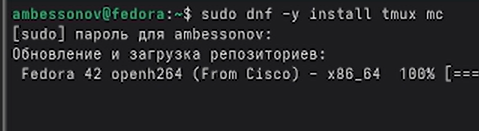
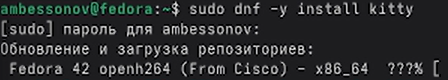
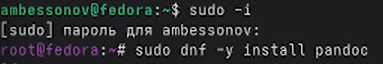

---
## Author
author:
  name: Бессонов Андрей Максимович
  degrees: DSc
  orcid: 0000-0002-0877-7063
  email: 1032253499@rudn.ru
  affiliation:
    - name: Российский университет дружбы народов
      country: Российская Федерация
      postal-code: 117198
      city: Москва
      address: ул. Миклухо-Маклая, д. 6
## Title
title: Презентация лабораторной работы №1
subtitle: Установка и настройка ОС
license: CC BY
date: 2026-03-04
---

# Информация

## Докладчик

:::::::::::::: {.columns align=center}
::: {.column width="70%"}

  * Бессонов Андрей Максимович
  * Студент 1-го курса
  * Группа НКАбд-01-25
  * Российский университет дружбы народов им. П. Лумумбы

:::
::: {.column width="30%"}

:::
::::::::::::::

# Вводная часть

## Актуальность

- Умение устанавливать и настраивать операционную систему — базовая компетенция любого специалиста в области ИТ
- Работа в виртуальной среде позволяет изолировать эксперименты от основной системы и быстро возвращаться к исходному состоянию
- Fedora — современный дистрибутив, включающий новейшие версии программного обеспечения

## Объект и предмет исследования

- **Объект:** Операционная система Linux (дистрибутив Fedora Sway)
- **Предмет:** Процесс установки ОС на виртуальную машину и первичная настройка системы

## Цели и задачи

- **Цель:** Приобретение практических навыков установки ОС на виртуальную машину
- **Задачи:**
    1. Создать виртуальную машину в VMware с заданными параметрами
    2. Установить ОС Fedora (Sway)
    3. Выполнить базовую настройку системы
    4. Проанализировать загрузку системы с помощью утилиты `dmesg`

## Материалы и методы

- **Оборудование:** VMware Workstation/Player
- **ОС хоста:** Не имеет значения (Windows/Linux)
- **Образ гостевой ОС:** `Fedora-Sway-Live-x86_64-41-1.4.iso`
- **Инструменты:** Установщик Anaconda, эмулятор терминала, пакетный менеджер `dnf`

# Выполнение работы

## Создание виртуальной машины

Параметры ВМ для лабораторной работы:

| Параметр | Значение |
|---|---|
| Гостевая ОС | Linux / Fedora 64-bit |
| Оперативная память | 2048 МБ |
| Жесткий диск | 40 ГБ (динамический) |
| Сетевой адаптер | NAT |
| Прошивка | UEFI |
| ISO-образ | Fedora-Sway-Live-x86_64-41-1.4.iso |

## Установка ОС (Anaconda)

- Загрузка в Live-режиме
- Запуск установщика (`Install to Hard Drive`)
- Задание начальных параметров:
    - Раскладка клавиатуры
    - Часовой пояс
    - Имя пользователя (`ambessonov`) и хоста (`ambessonov`)
    - Пароль

## Первичная настройка системы

После первой загрузки и выхода на рабочий стол была произведена настройка.

**Обновление системы и установка пакетов:**

- sudo -i
- dnf -y update
- dnf -y install tmux mc kitty
- dnf -y group install development-tools

## Установка ПО для документации

Для оформления отчетов по лабораторным работам были установлены инструменты:

- sudo dnf -y install pandoc
- sudo dnf -y install texlive-scheme-full

# Заключение

## Результаты работы

- Создана виртуальная машина с параметрами, соответствующими заданию
- Установлена и настроена ОС Fedora (окружение Sway)
- Произведен базовый анализ загруженной системы с помощью dmesg
- Получены ответы на контрольные вопросы

## Вывод

В ходе выполнения лабораторной работы была установлена операционная система Fedora на виртуальную машину VMware. Выполнена первичная настройка системы: заданы требуемые имена пользователя и хоста, настроена раскладка клавиатуры, установлен минимально необходимый набор ПО. Виртуальная машина полностью готова к выполнению следующих лабораторных работ.
