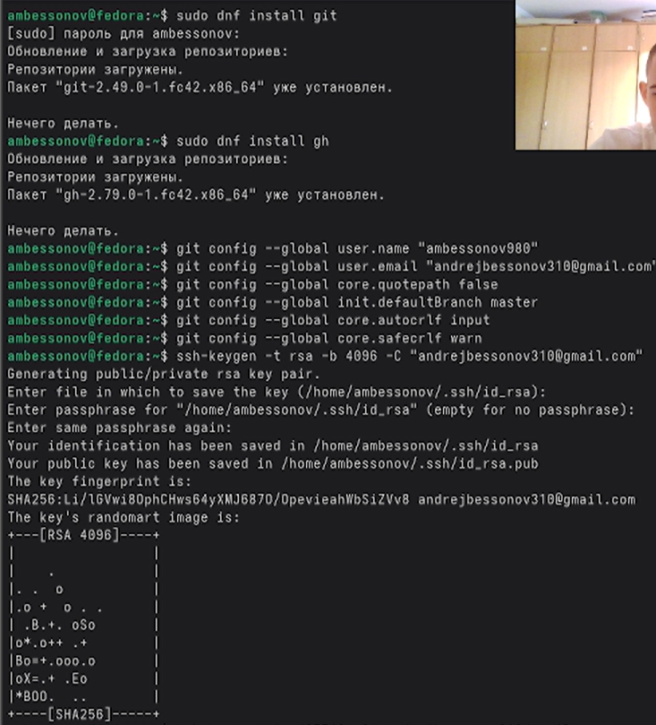
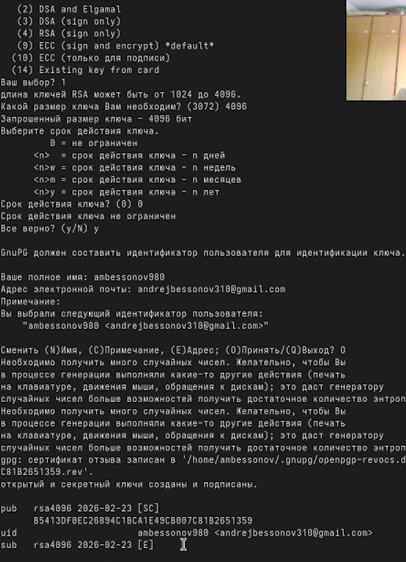
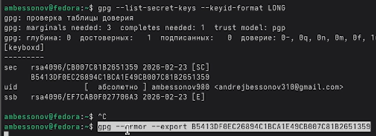
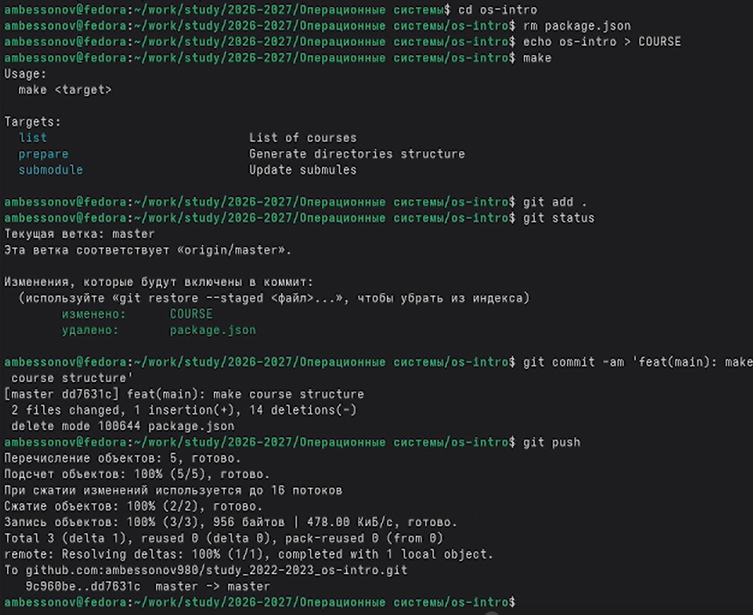
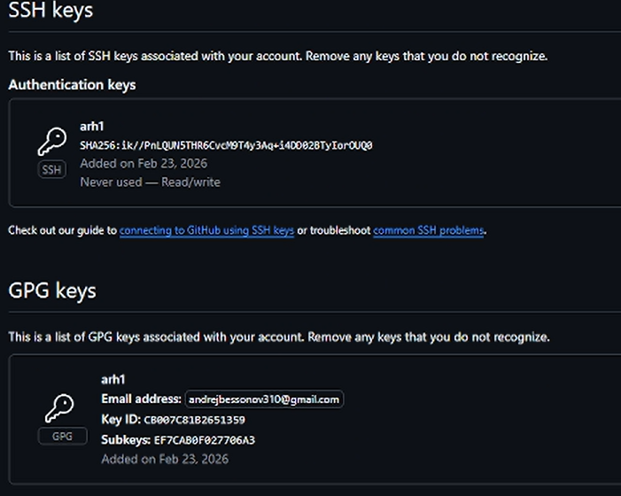

---
## Author
author:
  name: Бессонов Андрей Максимович
  degrees: DSc
  orcid: 0000-0002-0877-7063
  email: 1032253499@rudn.ru
  affiliation:
    - name: Российский университет дружбы народов
      country: Российская Федерация
      postal-code: 117198
      city: Москва
      address: ул. Миклухо-Маклая, д. 6
## Title
title: "Лабораторная работа №2"
license: "CC BY"
---

# Цель работы

Изучить идеологию и применение средств контроля версий. Освоить умения по работе с git.

# Задание

Сделайте отчёт по предыдущей лабораторной работе в формате Markdown.
В качестве отчёта просьба предоставить отчёты в 3 форматах: pdf, docx и md (в архиве,
поскольку он должен содержать скриншоты, Makefile и т.д.)

# Теоретическое введение

### Системы контроля версий. Общие понятия

Системы контроля версий (Version Control System, VCS) применяются при работе нескольких человек над одним проектом. Обычно основное дерево проекта хранится в локальном или удалённом репозитории, к которому настроен доступ для участников проекта. При внесении изменений в содержание проекта система контроля версий позволяет их фиксировать, совмещать изменения, произведённые разными участниками проекта, производить откат к любой более ранней версии проекта, если это требуется.

В классических системах контроля версий используется централизованная модель, предполагающая наличие единого репозитория для хранения файлов. Выполнение большинства функций по управлению версиями осуществляется специальным сервером. Участник проекта (пользователь) перед началом работы посредством определённых команд получает нужную ему версию файлов. После внесения изменений, пользователь размещает новую версию в хранилище. При этом предыдущие версии не удаляются из центрального хранилища и к ним можно вернуться в любой момент. Сервер может сохранять не полную версию изменённых файлов, а производить так называемую дельта-компрессию — сохранять только изменения между последовательными версиями, что позволяет уменьшить объём хранимых данных.

Системы контроля версий поддерживают возможность отслеживания и разрешения конфликтов, которые могут возникнуть при работе нескольких человек над одним файлом. Можно объединить (слить) изменения, сделанные разными участниками (автоматически или вручную), вручную выбрать нужную версию, отменить изменения вовсе или заблокировать файлы для изменения. В зависимости от настроек блокировка не позволяет другим пользователям получить рабочую копию или препятствует изменению рабочей копии файла средствами файловой системы ОС, обеспечивая таким образом, привилегированный доступ только одному пользователю, работающему с файлом.

Системы контроля версий также могут обеспечивать дополнительные, более гибкие функциональные возможности. Например, они могут поддерживать работу с несколькими версиями одного файла, сохраняя общую историю изменений до точки ветвления версий и собственные истории изменений каждой ветви. Кроме того, обычно доступна информация о том, кто из участников, когда и какие изменения вносил. Обычно такого рода информация хранится в журнале изменений, доступ к которому можно ограничить.

В отличие от классических, в распределённых системах контроля версий центральный репозиторий не является обязательным.

Среди классических VCS наиболее известны CVS, Subversion, а среди распределённых — Git, Bazaar, Mercurial. Принципы их работы схожи, отличаются они в основном синтаксисом используемых в работе команд.

### Примеры использования git

Система контроля версий Git представляет собой набор программ командной строки. Доступ к ним можно получить из терминала посредством ввода команды git с различными опциями. Благодаря тому, что Git является распределённой системой контроля версий, резервную копию локального хранилища можно сделать простым копированием или архивацией.

# Выполнение лабораторной работы

В ходе работы мы выполнили все поставленные задачи:

### Базовая конфигурация Git
Мы настроили глобальную конфигурацию Git:
- Указали имя пользователя и email
- Настроили корректное отображение UTF-8 символов
- Задали имя начальной ветки `master`
- Настроили параметры окончаний строк для кросс-платформенной работы

### Создание ключей SSH
Мы сгенерировали ключи для безопасного подключения к GitHub:
- Создали RSA ключ (4096 бит)
- Создали Ed25519 ключ (современный алгоритм)

### Создание PGP ключа
Мы создали ключ для подписи коммитов:
- Сгенерировали GPG ключ с параметрами RSA and RSA (4096 бит)
- Нашли отпечаток ключа
- Экспортировали публичный ключ для добавления на GitHub

### Настройка подписей коммитов
Мы настроили автоматическую подпись всех коммитов:
- Указали Git какой ключ использовать для подписи
- Включили автоматическую подпись коммитов
- Настроили программу для GPG

### Регистрация на GitHub
Мы создали учетную запись на GitHub и заполнили основные данные

### Создание локального каталога
Мы создали рабочее пространство для выполнения заданий:
- Создали структуру каталогов `~/work/study/2022-2023/Операционные системы/os-intro`
- Склонировали репозиторий на основе шаблона
- Выполнили первичную настройку каталога курса

### Добавление ключей на GitHub
Мы привязали созданные ключи к нашей учетной записи:
- Добавили SSH-ключ в настройки аккаунта
- Добавили PGP-ключ в настройки аккаунта

### Первый подписанный коммит
Мы выполнили первый коммит с автоматической подписью:
- Создали необходимые файлы и каталоги
- Добавили файлы в отслеживание
- Создали подписанный коммит
- Отправили изменения на GitHub

**Итог:** Мы полностью настроили рабочее окружение, создали ключи безопасности, связали их с GitHub и выполнили первый подписанный коммит в наш репозиторий.

# Выводы

Изучили идеологию и применение средств контроля версий. Освоили умения по работе с git.

# Список литературы{.unnumbered}

::: {#refs}
:::

# ********
