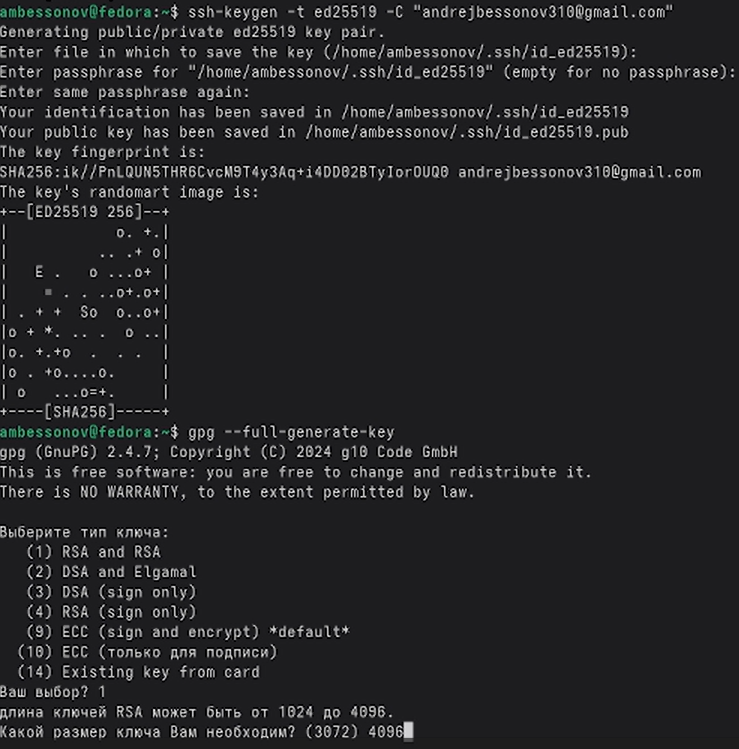
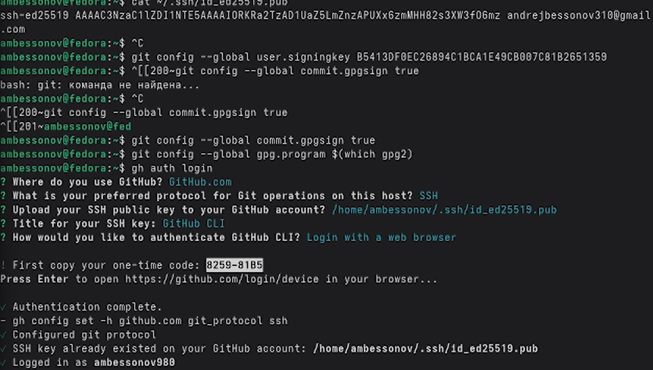
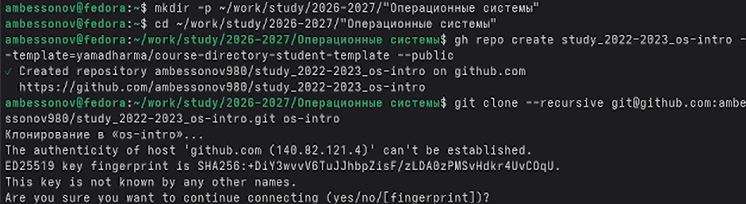

---
## Author
author:
  name: Бессонов Андрей Максимович
  degrees: DSc
  orcid: 0000-0002-0877-7063
  email: 1032253499@rudn.ru
  affiliation:
    - name: Российский университет дружбы народов
      country: Российская Федерация
      postal-code: 117198
      city: Москва
      address: ул. Миклухо-Маклая, д. 6
## Title
title: Презентация лабораторной работы №2
subtitle: Системы контроля версий Git
license: CC BY
date: 2026-03-04
---

# Информация

## Докладчик

:::::::::::::: {.columns align=center}
::: {.column width="70%"}

  * Бессонов Андрей Максимович
  * Студент 1-го курса
  * Группа НКАбд-01-25
  * Российский университет дружбы народов им. П. Лумумбы

:::
::: {.column width="30%"}

:::
::::::::::::::

# Вводная часть

## Актуальность

- Системы контроля версий (VCS) — неотъемлемый инструмент современной разработки программного обеспечения
- Git является наиболее популярной распределённой VCS, обеспечивающей эффективную командную работу и управление версиями
- Интеграция с облачными платформами (GitHub) позволяет организовать удалённую работу и резервное копирование проектов

## Объект и предмет исследования

- **Объект:** Распределённая система контроля версий Git и платформа GitHub
- **Предмет:** Процесс первичной настройки Git, генерации ключей аутентификации и подписи, создание первого подписанного коммита

## Цели и задачи

- **Цель:** Изучить идеологию и применение средств контроля версий, освоить базовые навыки работы с Git
- **Задачи:**
    1. Выполнить базовую конфигурацию Git
    2. Сгенерировать SSH-ключи для безопасного подключения к GitHub
    3. Создать PGP-ключ для подписи коммитов
    4. Зарегистрироваться на GitHub и добавить ключи в аккаунт
    5. Настроить автоматическую подпись коммитов
    6. Создать локальный репозиторий и выполнить первый подписанный коммит
    7. Отправить изменения в удалённый репозиторий

## Материалы и методы

- **Оборудование:** ПК с ОС Linux (Fedora Sway)
- **Программное обеспечение:** Git, утилиты `ssh-keygen`, `gpg`, браузер, терминал
- **Платформа:** GitHub
- **Методы:** Работа с командной строкой, настройка конфигурационных файлов, генерация ключей, использование веб-интерфейса GitHub

# Выполнение работы

## Базовая конфигурация Git

- Указаны имя пользователя и email
- Настроено корректное отображение UTF-8 символов
- Задано имя начальной ветки `master`
- Настроены параметры окончаний строк для кросс-платформенной работы

## Создание SSH-ключей

- Сгенерирован RSA-ключ (4096 бит)
- Сгенерирован Ed25519-ключ (современный алгоритм)

## Создание PGP-ключа

- Выбран тип ключа RSA and RSA (4096 бит)
- Указаны имя и email владельца
- Получен отпечаток ключа для последующего экспорта

## Настройка подписей коммитов

- Указан Git-у какой ключ использовать для подписи
- Включена автоматическая подпись всех коммитов
- Настроена программа для GPG

## Регистрация на GitHub и добавление ключей

- Создана учётная запись на GitHub
- Выполнена аутентификация через CLI (`gh auth login`)
- Добавлены SSH-ключи и PGP-ключ в настройках аккаунта

## Создание локального каталога курса

- Создана структура каталогов `~/work/study/2022-2023/Операционные системы/os-intro`
- Склонирован шаблон репозитория
- Выполнена первичная настройка каталога

## Добавление PGP-ключа на GitHub

- Открыт раздел настроек «SSH and GPG keys»
- Вставлен публичный PGP-ключ, экспортированный из GnuPG

## Первый подписанный коммит

- Созданы необходимые файлы
- Выполнено добавление файлов в отслеживание
- Создан подписанный коммит
- Изменения отправлены в удалённый репозиторий (`git push`)

# Заключение

## Результаты работы

- Выполнена базовая настройка Git (имя, email, окончания строк)
- Сгенерированы SSH-ключи для аутентификации
- Создан PGP-ключ для подписи коммитов
- Учётная запись GitHub связана с локальными ключами
- Настроена автоматическая подпись всех коммитов
- Создан локальный репозиторий и выполнен первый подписанный коммит
- Изменения успешно отправлены на GitHub

## Вывод

В ходе выполнения лабораторной работы изучена идеология систем контроля версий, освоены базовые навыки работы с Git: конфигурация, генерация ключей, работа с удалённым репозиторием, создание подписанных коммитов. Полученные знания и умения являются фундаментом для дальнейшей командной разработки и эффективного управления версиями проектов.
