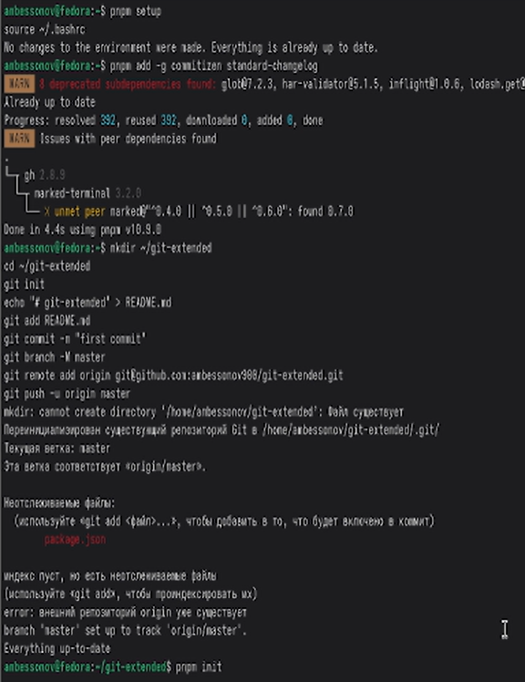
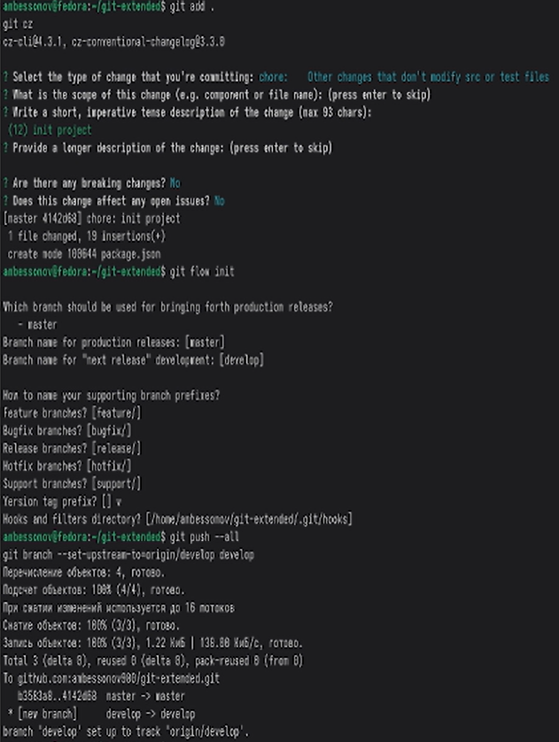
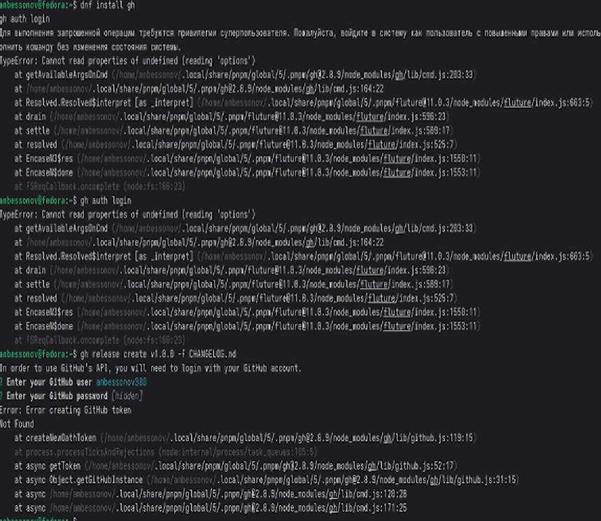
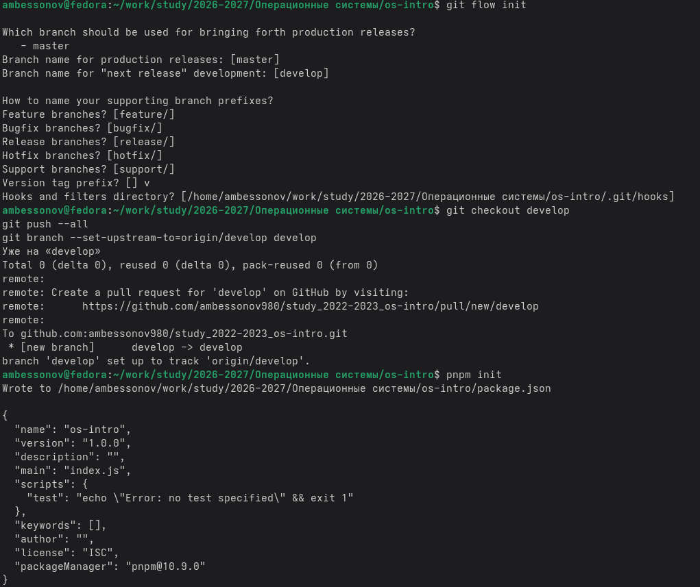
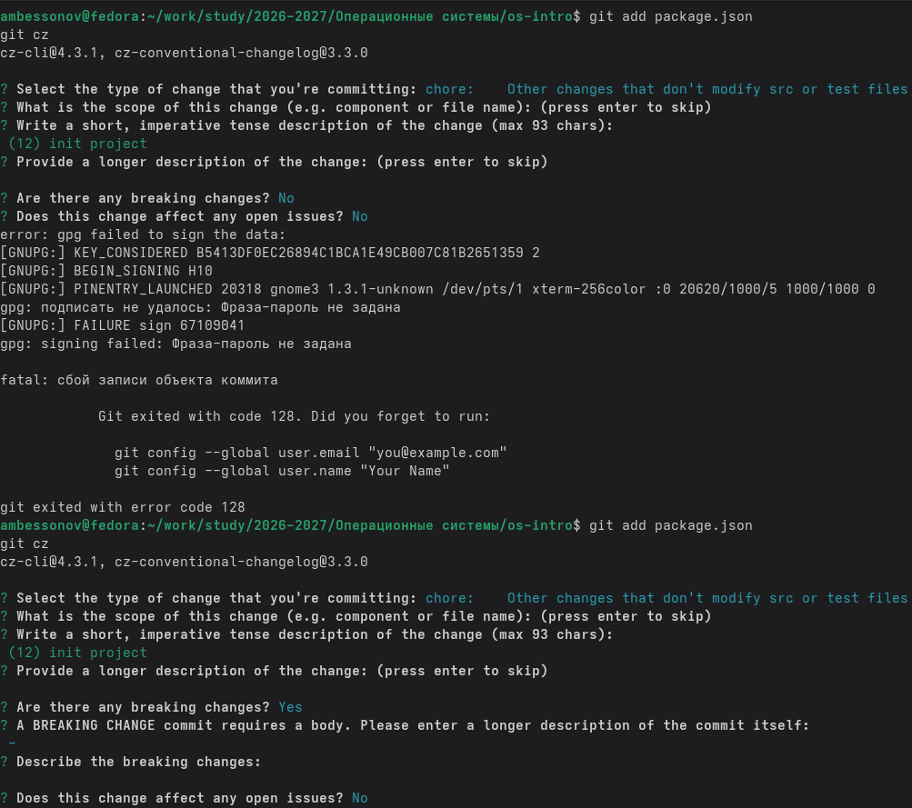
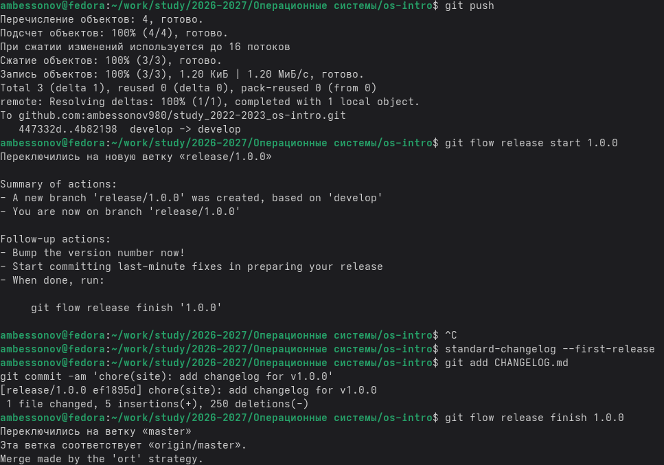
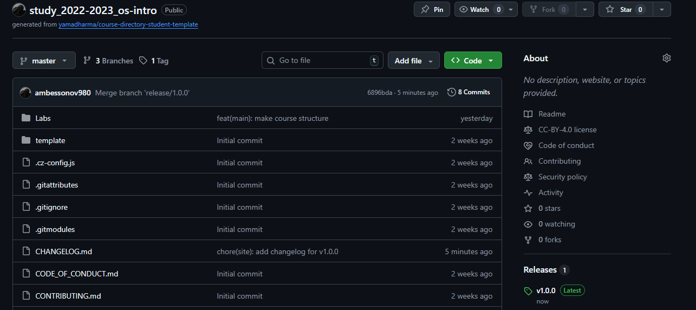

---
## Author
author:
  name: Бессонов Андрей Максимович
  degrees: DSc
  orcid: 0000-0002-0877-7063
  email: 1032253499@rudn.ru
  affiliation:
    - name: Российский университет дружбы народов
      country: Российская Федерация
      postal-code: 117198
      city: Москва
      address: ул. Миклухо-Маклая, д. 6
## Title
title: "Лабораторная работа №4"
license: "CC BY"
---

# Цель работы

Получение навыков правильной работы с репозиториями git, освоение модели ветвления Gitflow, семантического версионирования и стандартизации коммитов.

# Задание

Выполнить работу для тестового репозитория. Преобразовать рабочий репозиторий в репозиторий с git-flow и conventional commits.

# Теоретическое введение

## Рабочий процесс Gitflow
- Gitflow Workflow — это строгая модель ветвления, ориентированная на управление релизами. Основные положения:
- master — хранит официальную историю релизов. Каждый коммит на master соответствует релизу и должен быть помечен тегом версии.
- develop — ветка разработки, в которой интегрируются все новые функции. Служит базой для создания веток функций и релизов.
- feature — ветки для разработки отдельных функций. Создаются от develop и после завершения сливаются обратно в develop.
- release — ветки подготовки релиза. Создаются от develop, когда набрано достаточно функций для выпуска. Допускается только отладка и документация. После завершения сливаются в master и develop.
- hotfix — ветки для срочных исправлений в работающем релизе. Создаются от master и после завершения сливаются в master и develop.
- Для работы с Gitflow используется пакет git-flow. Инициализация выполняется командой git flow init. После этого создаётся ветка develop, и все новые функции разрабатываются в ветках feature.

## Семантическое версионирование
Семантическое версионирование (SemVer) задаёт формат номера версии: MAJOR.MINOR.PATCH.
- MAJOR увеличивается при несовместимых изменениях API.
- MINOR — при добавлении новой функциональности с обратной совместимостью.
- PATCH — при обратно совместимых исправлениях ошибок.
- Номер версии фиксируется в файле package.json и в тегах репозитория.

## Общепринятые коммиты (Conventional Commits)
Спецификация Conventional Commits регламентирует структуру сообщений коммитов, что позволяет автоматически определять следующий номер версии и генерировать журнал изменений. Основные типы коммитов:
- feat: — новая функция (MINOR).
- fix: — исправление ошибки (PATCH).
- BREAKING CHANGE: — несовместимое изменение (MAJOR), может быть частью любого типа.
- docs:, style:, refactor:, perf:, test:, chore: и др. — не влияют на версию, но используются для каталогизации изменений.
- Для помощи в написании коммитов по стандарту используется утилита commitizen. Генерация журнала изменений выполняется с помощью standard-changelog.

# Выполнение лабораторной работы

В ходе работы мы выполнили все поставленные задачи:

## Установка необходимого ПО
На ОС Fedora были выполнены следующие команды для установки git-flow, Node.js и инструментов:
- Установка git-flow из репозитория copr
sudo dnf copr enable elegos/gitflow
sudo dnf install gitflow
- Установка Node.js и pnpm
sudo dnf install nodejs pnpm
- Настройка pnpm (добавление в PATH)
pnpm setup
source ~/.bashrc
- Установка commitizen и standard-changelog глобально
pnpm add -g commitizen standard-changelog

## Создание локального репозитория и первый коммит
Был создан каталог для нового репозитория и инициализирован Git:

- mkdir ~/git-extended
- cd ~/git-extended
- git init
- echo "# git-extended" > README.md
- git add README.md
- git commit -m "first commit"
- git branch -M master
- git remote add origin git@github.com:ambessonov980/git-extended.git
- git push -u origin master

Настройка package.json и commitizen
Для использования commitizen был инициализирован пакет Node.js:

pnpm init

После завершения wizard'а в файл package.json была добавлена секция config для настройки commitizen:
json
"config": {
  "commitizen": {
    "path": "cz-conventional-changelog"
  }
}

Затем выполнено добавление файлов и создание первого коммита с помощью git cz:
git add .
git cz
Был выбран тип chore, сообщение init project.

## Инициализация git-flow
В репозитории выполнена инициализация git-flow:
- git flow init
После инициализации произошло автоматическое переключение на ветку develop. Проверено:
- git branch
Затем ветка develop была отправлена на GitHub и настроена как вышестоящая:
- git push --all
- git branch --set-upstream-to=origin/develop develop

## Создание первого релиза (v1.0.0)
Начата релизная ветка для версии 1.0.0:
- git flow release start 1.0.0
Сгенерирован начальный журнал изменений:
- standard-changelog --first-release
Файл CHANGELOG.md был добавлен и закоммичен:
- git add CHANGELOG.md
- git commit -am 'chore(site): add changelog'
Завершён релиз (ветка вливается в master и develop, проставляется тег):
- git flow release finish 1.0.0
После этого все изменения и теги отправлены на GitHub:
- git push --all
- git push --tags

## Создание релиза на GitHub
С помощью утилиты gh (GitHub CLI) создан релиз на GitHub с описанием из CHANGELOG.md. Предварительно gh был установлен и выполнена аутентификация:
- sudo dnf install gh
- gh auth login
- gh release create v1.0.0 -F CHANGELOG.md

Разработка новой функциональности
Для демонстрации рабочего процесса была создана функциональная ветка feature/awesome-feature:
- git flow feature start awesome-feature
В этой ветке был создан файл feature.js с простым кодом, затем изменения закоммичены с использованием git cz (тип feat):
- echo "console.log('Awesome feature');" > feature.js
- git add feature.js
- git cz
После завершения разработки ветка была влита в develop:
- git flow feature finish awesome-feature

## Создание релиза v1.2.3
Предположим, что после добавления нескольких функций решено выпустить новую минорную версию 1.2.3.
- git flow release start 1.2.3
В файле package.json версия изменена на 1.2.3. Обновлён журнал изменений:
- standard-changelog
- git add CHANGELOG.md package.json
- git commit -am 'chore(site): update changelog for 1.2.3'
Релиз завершён:
- git flow release finish 1.2.3
Изменения отправлены на GitHub:
- git push --all
- git push --tags
И создан релиз на GitHub:
- gh release create v1.2.3 -F CHANGELOG.md

## Выполнение задания

# Выводы
В ходе лабораторной работы были изучены и применены на практике:
- модель ветвления Gitflow и её реализация с помощью пакета git-flow;
- семантическое версионирование (SemVer);
- стандартизация коммитов согласно спецификации Conventional Commits;
- использование инструментов commitizen и standard-changelog для автоматизации подготовки коммитов и журналов изменений;
- создание релизов на GitHub с помощью утилиты gh.
- Полученные навыки позволяют организовать эффективную командную работу над проектами с чёткой историей изменений и автоматическим управлением версиями.

# Список литературы{.unnumbered}

::: {#refs}
:::

# ********
