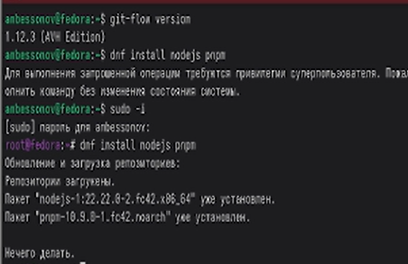
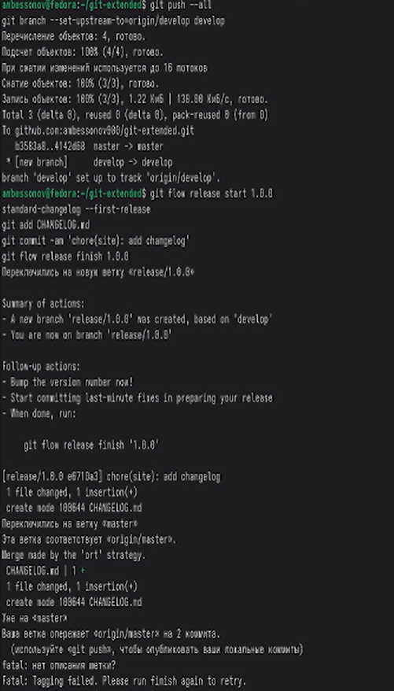
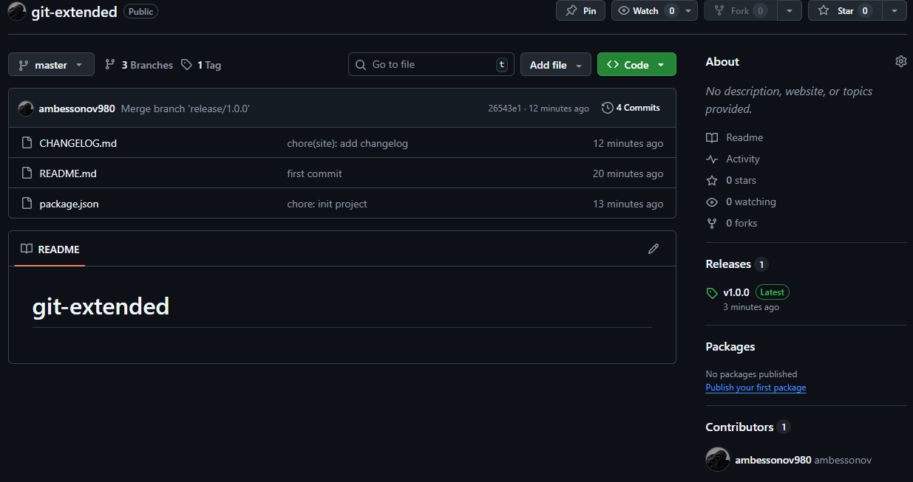

---
## Author
author:
  name: Бессонов Андрей Максимович
  degrees: DSc
  orcid: 0000-0002-0877-7063
  email: 1032253499@rudn.ru
  affiliation:
    - name: Российский университет дружбы народов
      country: Российская Федерация
      postal-code: 117198
      city: Москва
      address: ул. Миклухо-Маклая, д. 6
## Title
title: Презентация лабораторной работы №4
subtitle: Рабочий процесс Gitflow
license: CC BY
date: 2026-03-04
---

# Информация

## Докладчик

:::::::::::::: {.columns align=center}
::: {.column width="70%"}

  * Бессонов Андрей Максимович
  * Студент 1-го курса
  * Группа НКАбд-01-25
  * Российский университет дружбы народов им. П. Лумумбы

:::
::: {.column width="30%"}

:::
::::::::::::::

# Вводная часть

## Актуальность

- Современная разработка ПО требует чёткой организации совместной работы над кодом.
- Модель ветвления Gitflow обеспечивает структурированный процесс управления релизами и функциями.
- Семантическое версионирование (SemVer) и стандартизация коммитов (Conventional Commits) позволяют автоматизировать генерацию журналов изменений и определение следующей версии проекта.
- Инструменты commitizen и standard-changelog упрощают соблюдение этих стандартов.

## Объект и предмет исследования

- **Объект:** Распределённая система контроля версий Git и модель ветвления Gitflow.
- **Предмет:** Процесс применения Gitflow, семантического версионирования и стандартизации коммитов для управления репозиторием проекта.

## Цели и задачи

- **Цель:** Получение навыков правильной работы с репозиториями Git, освоение модели ветвления Gitflow, семантического версионирования и стандартизации коммитов.
- **Задачи:**
    1. Установить необходимое ПО (git-flow, Node.js, pnpm, commitizen, standard-changelog).
    2. Создать локальный репозиторий и выполнить первый коммит.
    3. Настроить package.json и commitizen для стандартизации коммитов.
    4. Инициализировать Gitflow в репозитории.
    5. Создать первый релиз (v1.0.0) с использованием Gitflow и standard-changelog.
    6. Опубликовать релиз на GitHub с помощью GitHub CLI.
    7. Продемонстрировать разработку новой функциональности в ветке feature.
    8. Создать последующий релиз (v1.2.3) с обновлением версии и журнала изменений.

## Материалы и методы

- **Оборудование:** ПК с ОС Linux (Fedora Sway)
- **Программное обеспечение:** Git, git-flow, Node.js, pnpm, commitizen, standard-changelog, GitHub CLI (gh), терминал.
- **Платформа:** GitHub
- **Методы:** РРабота с командной строкой, настройка конфигурационных файлов (package.json), использование инструментов для автоматизации коммитов и журналов, работа с ветвлением Gitflow.

# Выполнение работы

## Установка необходимого ПО

- Установлены git-flow, Node.js, pnpm.
- Настроены пути для pnpm.
- Глобально установлены commitizen и standard-changelog.

## Создание репозитория и первый коммит
- Создан каталог git-extended, инициализирован Git.
- Создан файл README.md, выполнен первый коммит.
- Репозиторий связан с удалённым на GitHub и отправлен.
- Настройка package.json и commitizen
- Инициализирован Node.js-пакет (pnpm init).
- В package.json добавлена секция для настройки commitizen на использование cz-conventional-changelog.
- Выполнен первый стандартизированный коммит с помощью git cz (тип chore).

## Инициализация Gitflow
- В репозитории выполнена команда git flow init.
- Автоматически создана и активирована ветка develop.
- Ветка develop отправлена на GitHub и настроена как вышестоящая.

## Создание первого релиза (v1.0.0)
- Начата релизная ветка release/1.0.0.
- Сгенерирован начальный журнал изменений (standard-changelog --first-release).
- Файл CHANGELOG.md добавлен и закоммичен.
- Релиз завершён (git flow release finish), ветки слиты, проставлен тег.
- Изменения и теги отправлены на GitHub

## Публикация релиза на GitHub
- Установлен и настроен GitHub CLI (gh).
- Создан релиз на GitHub с описанием из CHANGELOG.md.

## Создание релиза v1.2.3
Предположим, что после добавления нескольких функций решено выпустить новую минорную версию 1.2.3.
- git flow release start 1.2.3
В файле package.json версия изменена на 1.2.3. Обновлён журнал изменений:
- standard-changelog
- git add CHANGELOG.md package.json
- git commit -am 'chore(site): update changelog for 1.2.3'
Релиз завершён:
- git flow release finish 1.2.3
Изменения отправлены на GitHub:
- git push --all
- git push --tags
И создан релиз на GitHub:
- gh release create v1.2.3 -F CHANGELOG.md

# Заключение

## Результаты работы
В ходе лабораторной работы были изучены и применены на практике:
- модель ветвления Gitflow и её реализация с помощью пакета git-flow;
- семантическое версионирование (SemVer);
- стандартизация коммитов согласно спецификации Conventional Commits;
- использование инструментов commitizen и standard-changelog для автоматизации подготовки коммитов и журналов изменений;
- создание релизов на GitHub с помощью утилиты gh.
- Полученные навыки позволяют организовать эффективную командную работу над проектами с чёткой историей изменений и автоматическим управлением версиями.

## Вывод

Получили навыки правильной работы с репозиториями Git, освоили модели ветвления Gitflow, семантического версионирования и стандартизации коммитов.
