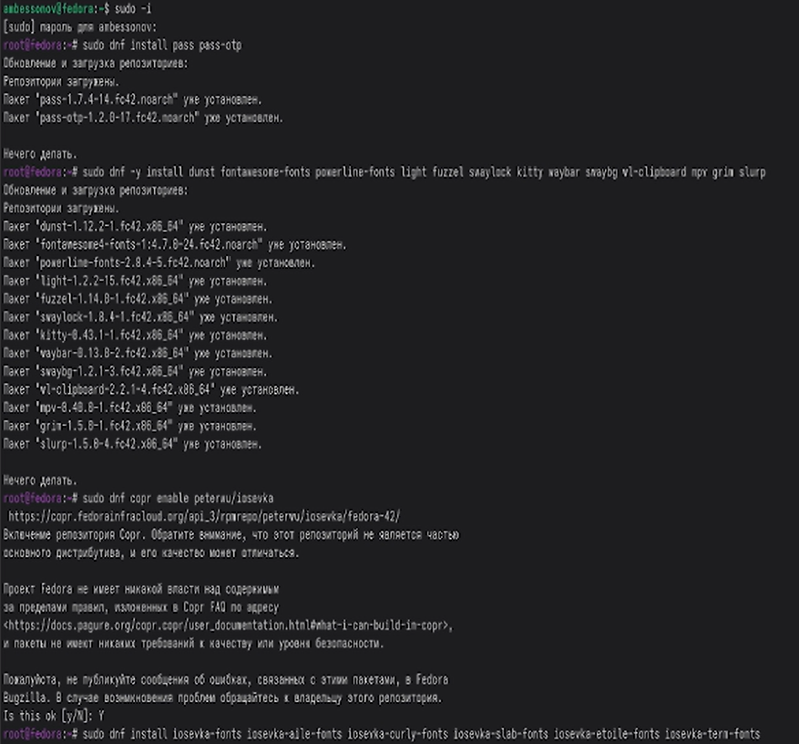
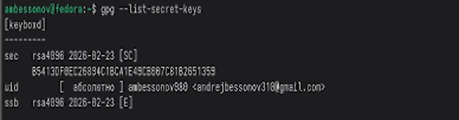
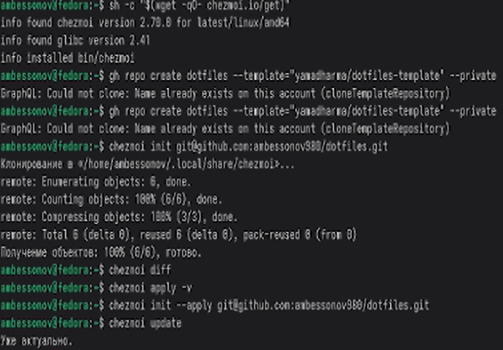

---
## Author
author:
  name: Бессонов Андрей Максимович
  degrees: DSc
  orcid: 0000-0002-0877-7063
  email: 1032253499@rudn.ru
  affiliation:
    - name: Российский университет дружбы народов
      country: Российская Федерация
      postal-code: 117198
      city: Москва
      address: ул. Миклухо-Маклая, д. 6
## Title
title: "Лабораторная работа №5"
license: "CC BY"
---

# Цель работы

Изучить менеджер паролей pass и систему управления файлами конфигурации chezmoi. Освоить установку, настройку и применение данных инструментов для безопасного хранения паролей и синхронизации конфигурационных файлов.

# Теоретическое введение

## Менеджер паролей pass
Менеджер паролей pass (The standard Unix password manager) следует идеологии Unix и предназначен для безопасного хранения паролей. Пароли хранятся в файловой системе в виде обычных файлов, каждый из которых зашифрован с помощью GPG-ключа. Это обеспечивает простоту и надёжность.

Основные свойства
- Данные организованы в иерархию каталогов и файлов.
- Каждый файл содержит пароль (и может включать дополнительную информацию, например, логин или заметки) и зашифрован GPG.
- Структура хранилища может быть произвольной, но для интеграции с дополнительным программным обеспечением рекомендуется придерживаться определённой семантики имён файлов (например, example.com/user.gpg, user@example.com:22.gpg).

Существует две основные реализации командной строки:
- pass — классическая реализация в виде shell-скриптов.
- gopass — реализация на Go с расширенными возможностями.

## Управление файлами конфигурации с chezmoi
chezmoi — инструмент для безопасного и воспроизводимого управления персональными конфигурационными файлами (dotfiles). Он позволяет хранить конфигурации в Git-репозитории, адаптировать их под разные машины с помощью шаблонов и легко развёртывать на новых системах.

Основные возможности
- Хранение исходных файлов в каталоге ~/.local/share/chezmoi, который является клоном репозитория.
- Использование шаблонов на языке Go для изменения содержимого файлов в зависимости от окружения.
- Поддержка различных форматов конфигурации (JSON, TOML, YAML).
- Возможность автоматической фиксации и отправки изменений в репозиторий.
- Лёгкое развёртывание на новой машине одной командой.

Шаблоны
Файл обрабатывается как шаблон, если его имя имеет суффикс .tmpl или он находится в каталоге .chezmoitemplates. В шаблонах доступны переменные, предоставляемые chezmoi (например, .chezmoi.os, .chezmoi.hostname), а также пользовательские данные. Для отладки шаблонов используется команда chezmoi execute-template.

# Выполнение лабораторной работы

В ходе работы мы выполнили все поставленные задачи:

## Установка и настройка pass
Первым шагом была установка менеджера паролей pass и дополнительной утилиты для одноразовых паролей pass-otp. Также была установлена альтернативная реализация gopass. Перед началом работы с хранилищем была выполнена проверка наличия GPG-ключей; при их отсутствии был создан новый ключ с параметрами RSA и RSA (4096 бит) и неограниченным сроком действия.

 

Инициализация хранилища была произведена с указанием email-адреса, соответствующего созданному GPG-ключу.

## Настройка синхронизации с Git
Для возможности синхронизации паролей между разными устройствами хранилище было превращено в Git-репозиторий. Затем был добавлен удалённый репозиторий, предварительно созданный на GitHub. После этого выполнена первая синхронизация (получение и отправка изменений).

## Интеграция с браузером (browserpass)
Для удобного использования паролей в веб-браузере был установлен плагин browserpass. Для этого сначала был подключён репозиторий COPR, содержащий необходимые пакеты, а затем установлен компонент native messaging. После этого в браузере (Firefox/Chrome) было установлено соответствующее расширение.

## Установка дополнительного программного обеспечения
Для обеспечения полноценной работы окружения рабочего стола (в частности, для корректного применения конфигураций через chezmoi) были установлены дополнительные пакеты, включая утилиты для Wayland, шрифты Iosevka и другие необходимые компоненты.
Создание репозитория dotfiles

После этого была выполнена инициализация chezmoi с указанием созданного репозитория. Перед применением изменений была проверена разница между текущим состоянием домашнего каталога и тем, что предлагает chezmoi. Убедившись в корректности изменений, мы применили конфигурацию.

## С Работа с chezmoi на нескольких машинах
Для проверки возможности развёртывания конфигурации на новой машине была выполнена команда инициализации с ключом --apply, которая одновременно клонирует репозиторий и применяет все настройки. Также был протестирован процесс обновления локальной копии репозитория и применения последних изменений.

# Выводы
В ходе выполнения лабораторной работы были изучены и практически освоены современные инструменты для безопасного хранения паролей и управления конфигурациями:
- Менеджер паролей pass позволяет организовать надёжное хранение паролей с использованием GPG-шифрования и обеспечивает их синхронизацию через Git.
- Интеграция с браузером через browserpass значительно упрощает повседневное использование паролей.
- Система chezmoi предоставляет гибкие возможности для управления dotfiles, включая использование шаблонов для адаптации под разные окружения и автоматизацию развёртывания на новых машинах.
- Полученные навыки позволяют эффективно организовать рабочую среду, обеспечивая безопасность и воспроизводимость конфигураций на различных компьютерах.

# Список литературы{.unnumbered}

::: {#refs}
:::

# ********
