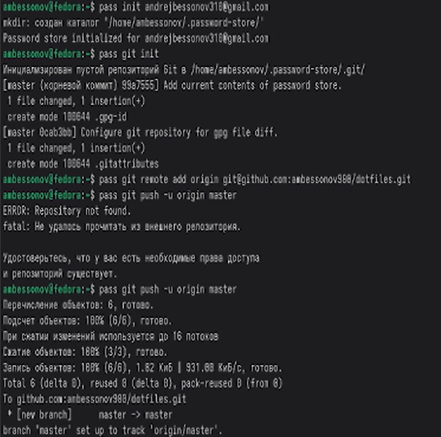
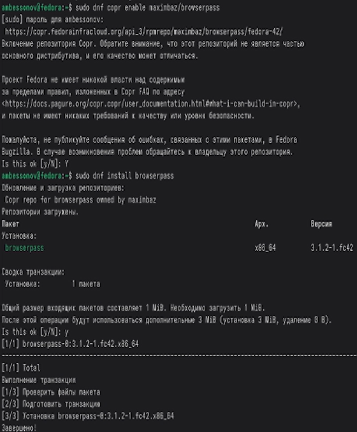
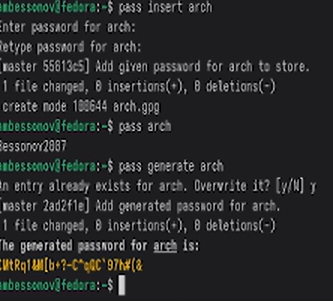

---
## Author
author:
  name: Бессонов Андрей Максимович
  degrees: DSc
  orcid: 0000-0002-0877-7063
  email: 1032253499@rudn.ru
  affiliation:
    - name: Российский университет дружбы народов
      country: Российская Федерация
      postal-code: 117198
      city: Москва
      address: ул. Миклухо-Маклая, д. 6
## Title
title: Презентация лабораторной работы №5
subtitle: Рабочий процесс Gitflow
license: CC BY
date: 2026-03-04
---

# Информация

## Докладчик

:::::::::::::: {.columns align=center}
::: {.column width="70%"}

  * Бессонов Андрей Максимович
  * Студент 1-го курса
  * Группа НКАбд-01-25
  * Российский университет дружбы народов им. П. Лумумбы

:::
::: {.column width="30%"}

:::
::::::::::::::

# Вводная часть

## Актуальность

- Безопасное хранение паролей и управление ими — критически важная задача для любого пользователя ПК и разработчика.
- Менеджер паролей pass реализует простой и надёжный Unix-подход к шифрованию данных с помощью GPG.
- Управление конфигурационными файлами (dotfiles) необходимо для быстрого развёртывания рабочего окружения на новых машинах и его синхронизации.
- Инструмент chezmoi предоставляет гибкие возможности для этой цели, включая шаблонизацию и интеграцию с Git.

## Объект и предмет исследования

- **Объект:** Инструменты для безопасного хранения данных и управления конфигурацией в ОС Linux.

- **Предмет:** Процесс установки, настройки и применения менеджера паролей pass и системы управления файлами конфигурации chezmoi.

## Цели и задачи

- **Цель:** Изучить менеджер паролей pass и систему управления файлами конфигурации chezmoi. Освоить установку, настройку и применение данных инструментов.

- **Задачи:**
    1. Установить и инициализировать pass и gopass с использованием GPG-ключа.
    2. Настроить синхронизацию хранилища паролей с удалённым Git-репозиторием.
    3. Установить и настроить плагин browserpass для интеграции с браузером.
    4. Установить chezmoi и инициализировать репозиторий для управления dotfiles.
    5. Применить конфигурацию на текущей машине и протестировать развёртывание на новой.

## Материалы и методы

- **Оборудование:** ПК с ОС Linux (Fedora Sway)
- **Программное обеспечение:** pass, gopass, pass-otp, browserpass, chezmoi, Git, GPG, браузер Firefox/Chrome.
- **Платформа:** GitHub
- **Методы:** Работа с командной строкой, управление GPG-ключами, настройка синхронизации через Git, использование шаблонов конфигурации.

# Выполнение работы

## Установка ПО и создание GPG-ключа
- Установлены pass, pass-otp, gopass.
- Выполнена проверка наличия GPG-ключей. При отсутствии создан новый ключ (RSA/RSA, 4096 бит) с неограниченным сроком действия.

Инициализация хранилища pass
Хранилище pass инициализировано с использованием email созданного GPG-ключа.

## Настройка синхронизации с Git
- Хранилище pass превращено в Git-репозиторий.
- Добавлен удалённый репозиторий, созданный на GitHub.
- Выполнена первая синхронизация (push/pull).

## Интеграция с браузером (browserpass)
- Подключён репозиторий COPR для установки browserpass.
- Установлен компонент native messaging.
- В браузере установлено расширение browserpass для удобного автозаполнения паролей.

## Управление конфигурациями с chezmoi
- Установлен chezmoi.
- Создан репозиторий для dotfiles на GitHub.
- Выполнена инициализация chezmoi с указанием созданного репозитория.

## Применение и синхронизация конфигураций
- Проверена разница между текущими файлами и теми, что предлагает chezmoi.
- Применена конфигурация к системе.
- Протестировано развёртывание на "новой" машине с помощью команды chezmoi init --apply.

# Заключение

## Результаты работы
В ходе лабораторной работы были изучены и применены на практике:
Менеджер паролей pass:
- Установка и инициализация с использованием GPG-шифрования.
- Создание и синхронизация хранилища через Git.
- Интеграция с веб-браузером через browserpass.
- Система управления конфигурациями chezmoi:
- Инициализация репозитория для dotfiles.
- Применение конфигурации на текущей машине.
- Развёртывание конфигурации на новой системе одной командой.
- Полученные навыки позволяют организовать безопасное хранение паролей и обеспечить воспроизводимость рабочего окружения на различных компьютерах.

## Вывод

Освоили современные инструменты для безопасного хранения паролей и эффективного управления конфигурационными файлами, что значительно упрощает настройку новых рабочих мест и повышает общую безопасность цифровой среды.
