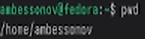
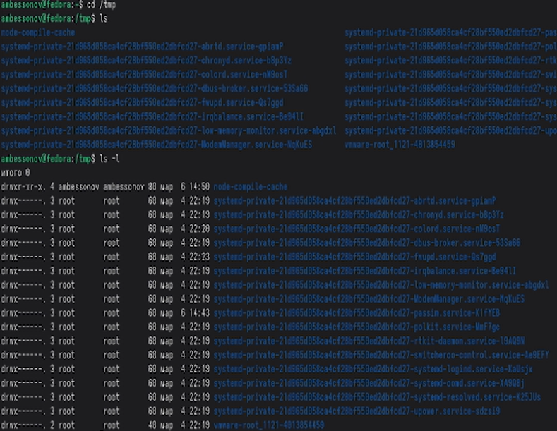
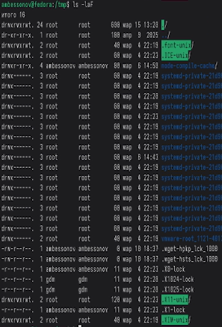
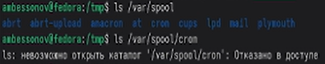
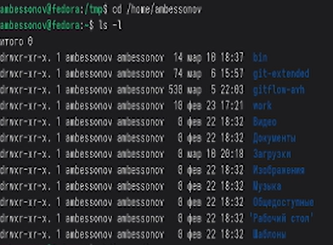
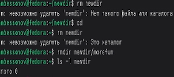
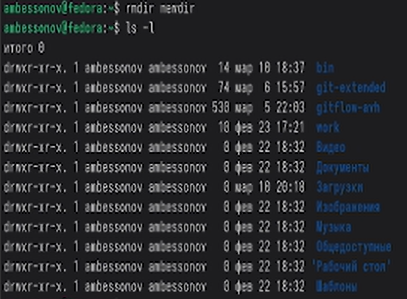
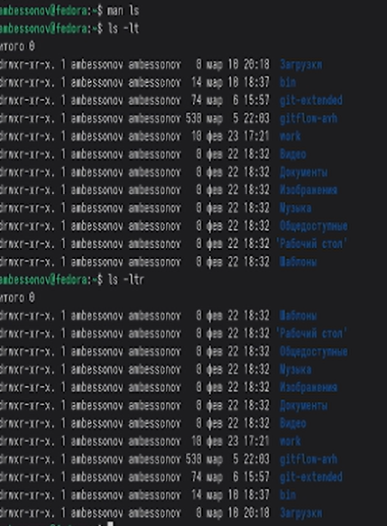
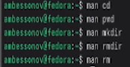

---
## Author
author:
  name: Бессонов Андрей Максимович
  degrees: DSc
  orcid: 0000-0002-0877-7063
  email: 1032253499@rudn.ru
  affiliation:
    - name: Российский университет дружбы народов
      country: Российская Федерация
      postal-code: 117198
      city: Москва
      address: ул. Миклухо-Маклая, д. 6
## Title
title: "Лабораторная работа №6"
license: "CC BY"
---

# Цель работы

Приобретение практических навыков взаимодействия пользователя с системой посредством командной строки в операционной системе Linux.

# Теоретическое введение

## Стандарт иерархии файловой системы (FHS)
В операционных системах семейства Linux и Unix принят стандарт FHS (Filesystem Hierarchy Standard), который определяет назначение основных директорий. Согласно этому стандарту, директория /var (от англ. variable) предназначена для хранения изменяемых данных, которые создаются и модифицируются в процессе работы системы и приложений. В отличие от /usr (статические файлы программ) или /etc (конфигурационные файлы), содержимое /var постоянно меняется: здесь хранятся логи, временные файлы, кэш, очереди заданий и другая динамическая информация.

## Директория /var/spool
/var/spool (от англ. Simultaneous Peripheral Operations On-Line) — это специальный каталог, используемый для организации очередей задач. Термин "spool" исторически связан с буферизацией данных при работе с медленными периферийными устройствами.

## Директория /var/cron и планировщик задач Cron
Cron — это демон (фоновый процесс) для автоматического выполнения заданий по расписанию. Он позволяет пользователям и системе запускать команды, скрипты и программы в точно заданное время (например, ежедневно, еженедельно, с точностью до минуты).

Принцип работы:
Планировщик читает конфигурационные файлы (crontabs), в которых описано, что и когда выполнять. Каждая строка такого файла содержит пять полей времени (минута, час, день месяца, месяц, день недели) и команду для исполнения.

# Выполнение лабораторной работы

В ходе работы мы выполнили все поставленные задачи:

## Определение домашнего каталога
**Выполненные команды:**
- pwd

## Работа с каталогом /tmp

**Выполненные команды:**
- cd /tmp
- ls
- ls -l
- ls -a
- ls -F
- ls -la
- ls -laF

## Проверка наличия каталога cron в /var/spool

**Выполненные команды:**
- ls /var/spool
- ls /var/spool/cron

## Возврат в домашний каталог и просмотр содержимого

**Выполненные команды:**
- cd /home/ambessonov
- pwd
- ls -l

## Создание каталогов

**Выполненные команды:**
- mkdir newdir
- ls -l
- mkdir newdir/morefun
- ls -l newdir
- mkdir letters memos misk
- ls -l

## Попытка удаления каталога командой rm

**Выполненные команды:**
- rm newdir
- rmdir newdir/morefun
- ls -l newdir
- rmdir newdir
- ls -l

## Поиск опции для рекурсивного просмотра
**Выполненные команды:**
man ls
ls -R
man ls
ls -lt
ls -ltr
man cd
man pwd
man mkdir
man rmdir
man rm
history
!5 - выполнить команду №5 (cd /home/ambessonov)
!! - выполнить последнюю команду
!3:s/-a/-la/ - выполнить команду №3, заменив -a на -la

# Выводы
В ходе выполнения лабораторной работы были изучены и практически освоены:
- Основные команды навигации
- Просмотр содержимого каталогов
- Создание и удаление каталогов
- Работа с документацией
- Работа с историей команд
Полученные навыки являются основой для эффективной работы в командной строке Unix-подобных операционных систем.

# Контрольные вопросы
1. Что такое командная строка?
Командная строка — это интерфейс взаимодействия пользователя с операционной системой, где команды вводятся в виде текстовых строк. Пользователь вводит команды, а система их выполняет и выводит результат.

2. При помощи какой команды можно определить абсолютный путь текущего каталога?
Команда `pwd` (print working directory). Пример:
pwd

3. При помощи какой команды и каких опций можно определить только тип файлов и их имена в текущем каталоге?
Команда `ls` с опцией `-F`. Пример:
- ls -F
- Desktop/  documents/  script.sh*  link@  file.txt
где `/` — каталог, `*` — исполняемый файл, `@` — ссылка.

4. Каким образом отобразить информацию о скрытых файлах?
С помощью опции `-a` команды `ls`. Пример:
ls -a
.  ..  .bashrc  .profile  Documents  file.txt

5. При помощи каких команд можно удалить файл и каталог? Можно ли это сделать одной и той же командой?
- Файл: `rm имя_файла`
- Пустой каталог: `rmdir имя_каталога`
- Каталог с содержимым: `rm -r имя_каталога`
Да, можно одной командой `rm -r`. Пример:
rm file.txt
rmdir empty_dir
rm -r dir_with_files

6. Каким образом можно вывести информацию о последних выполненных пользователем командах?
Команда `history`. Пример:
- history
- 1  pwd
- 2  cd /tmp
- 3  ls -la
- 4  history

7. Как воспользоваться историей команд для их модифицированного выполнения?
С помощью конструкции `!номер_команды:s/что_меняем/на_что_меняем/`. Пример:
- !3:s/ls -a/ls -la/    # выполнить команду №3, заменив ls -a на ls -la

8. Примеры запуска нескольких команд в одной строке?
- С использованием `;` (последовательное выполнение):
cd /tmp; ls -l; pwd
- С использованием `&&` (выполнение при успехе предыдущей):
mkdir newdir && cd newdir && pwd

9. Дайте определение и приведите примеры символов экранирования.
Экранирование — это способ отмены специального значения символов. Символ `\` отменяет специальное значение следующего за ним символа. Примеры:
- echo \$HOME
- touch file\ with\ spaces

10. Охарактеризуйте вывод информации на экран после выполнения команды ls с опцией l.
Команда `ls -l` выводит для каждого файла:
- тип файла и права доступа (например, `-rw-r--r--`)
- количество ссылок
- владельца
- группу
- размер в байтах
- дату последнего изменения
- имя файла

11. Что такое относительный путь к файлу? Приведите примеры использования относительного и абсолютного пути.
Относительный путь указывает расположение файла относительно текущего каталога. Абсолютный путь начинается от корневого каталога `/`. Примеры:
- Относительный путь (находясь в /home/ambessonov):
cd Documents
ls ./projects/file.txt

- Абсолютный путь:
ls /home/ambessonov/projects/file.txt

12. Как получить информацию об интересующей вас команде?
- С помощью команды `man` (manual).

13. Какая клавиша или комбинация клавиш служит для автоматического дополнения вводимых команд?
- Клавиша **Tab**. При вводе начала команды или пути нажатие Tab автоматически дополняет ввод или показывает возможные варианты.

# Список литературы{.unnumbered}

::: {#refs}
:::

# ********
