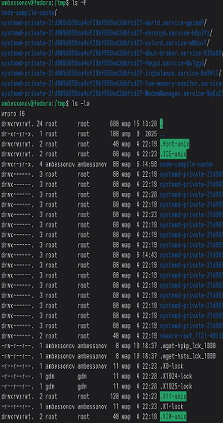
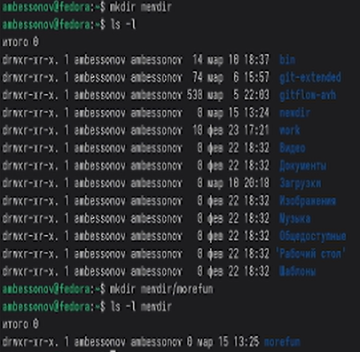
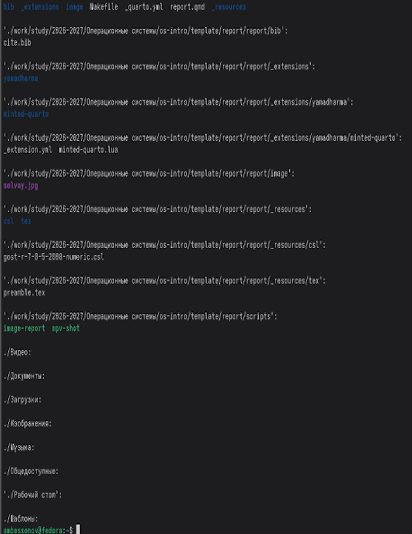
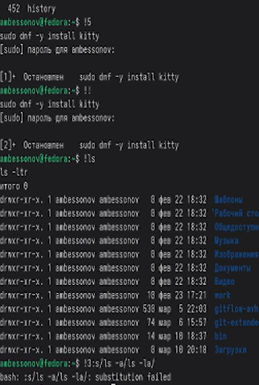

---
## Author
author:
  name: Бессонов Андрей Максимович
  degrees: DSc
  orcid: 0000-0002-0877-7063
  email: 1032253499@rudn.ru
  affiliation:
    - name: Российский университет дружбы народов
      country: Российская Федерация
      postal-code: 117198
      city: Москва
      address: ул. Миклухо-Маклая, д. 6
## Title
title: Презентация лабораторной работы №6
subtitle: Взаимодействия пользователя с системой посредством командной строки в операционной системе Linux
license: CC BY
date: 2026-03-04
---

# Информация

## Докладчик

:::::::::::::: {.columns align=center}
::: {.column width="70%"}

  * Бессонов Андрей Максимович
  * Студент 1-го курса
  * Группа НКАбд-01-25
  * Российский университет дружбы народов им. П. Лумумбы

:::
::: {.column width="30%"}

:::
::::::::::::::

# Вводная часть

## Актуальность

- Командная строка (CLI) является мощнейшим и гибким инструментом взаимодействия с операционной системой Linux, используемым как рядовыми пользователями, так и системными администраторами и разработчиками.
- Знание базовых команд и принципов навигации, управления файлами и каталогами — фундамент для эффективной работы в Unix-подобных средах.
- Умение работать с документацией (`man`) и историей команд (`history`) значительно ускоряет решение повседневных задач и освоение новых инструментов.

## Объект и предмет исследования

- **Объект:** Интерфейс командной строки операционной системы Linux.

- **Предмет:** Базовые команды для навигации по файловой системе (`cd`, `pwd`), просмотра содержимого каталогов (`ls`), создания (`mkdir`) и удаления (`rmdir`, `rm`) каталогов, а также методы получения справки и работы с историей команд.

## Цели и задачи

- **Цель:** Приобретение практических навыков взаимодействия пользователя с системой посредством командной строки в Linux.

- **Задачи:**
    1.  Освоить навигацию по файловой системе с помощью команды `cd`.
    2.  Научиться определять абсолютный путь к текущему каталогу командой `pwd`.
    3.  Изучить различные опции команды `ls` для детального просмотра содержимого каталогов.
    4.  Освоить создание и удаление каталогов (`mkdir`, `rmdir`, `rm -r`).
    5.  Научиться получать справочную информацию о командах (`man`).
    6.  Изучить возможности работы с историей команд (`history`).

## Материалы и методы

- **Оборудование:** ПК с ОС Linux.
- **Программное обеспечение:** Эмулятор терминала, командная оболочка.
- **Методы:** Выполнение практических заданий в командной строке, анализ вывода команд, работа со встроенной документацией.

# Выполнение работы

## Определение домашнего каталога
- Первым делом необходимо убедиться в своем местоположении в файловой системе.
- Команда `pwd` (print working directory) выводит полный (абсолютный) путь к текущему каталогу.

## Работа с каталогом /tmp
- Переход в каталог `/tmp` выполнен командой `cd /tmp`.
- Для просмотра содержимого использована команда `ls` с различными опциями:
    - `ls` — краткий список.
    - `ls -l` — подробный список (тип файла, права, владелец, размер, дата).
    - `ls -a` — показ всех файлов, включая скрытые (начинающиеся с `.`).
    - `ls -F` — отображение информации о типе файлов (например, `/` для каталогов, `*` для исполняемых).

## Проверка наличия каталога cron в /var/spool
- Согласно стандарту FHS, в каталоге `/var/spool` хранятся очереди задач.
- Мы проверили наличие подкаталога `cron`, связанного с планировщиком задач, и убедились, что он существует.

## Возврат в домашний каталог и просмотр содержимого
- Команда `cd` без аргументов или `cd /home/ambessonov` возвращает нас в домашний каталог.
- С помощью `ls -l` можно детально рассмотреть его содержимое на момент начала работы.

## Создание каталогов
- Команда `mkdir` используется для создания новых каталогов.
- Мы создали иерархию `newdir/morefun`, а также несколько каталогов (`letters`, `memos`, `misk`) в текущей директории.
- Проверка созданных объектов выполнена командой `ls`.

## Удаление каталогов
- Важно различать команды:
    - `rmdir` — удаляет только **пустые** каталоги. Сначала был удален пустой подкаталог `morefun`.
    - `rm -r` — удаляет каталоги **рекурсивно** вместе со всем их содержимым. После удаления `morefun` каталог `newdir` стал пустым и был удален командой `rmdir`.

## Работа с документацией (man) и историей команд
- Для изучения опций команд использовалась документация `man` (manual), например: `man ls`, `man rm`.
- Благодаря `man` были найдены опции `-R` (рекурсивный просмотр), `-lt` (сортировка по времени), `-ltr` (обратная сортировка по времени).
- Команда `history` выводит список последних выполненных команд.
- Изучены приёмы работы с историей:
    - `!5` — выполнить команду из истории под номером 5.
    - `!!` — выполнить последнюю команду.
    - `!3:s/-a/-la/` — выполнить команду №3, заменив в ней `-a` на `-la`.

# Заключение

## Результаты работы
В ходе лабораторной работы были изучены и практически закреплены следующие навыки работы в командной строке Linux:
- **Навигация:** Уверенное перемещение по файловой системе с помощью `cd` и определение текущего пути через `pwd`.
- **Просмотр:** Гибкое использование команды `ls` с опциями `-l`, `-a`, `-F`, `-R` для получения разносторонней информации о файлах и каталогах.
- **Управление каталогами:** Создание одиночных и вложенных каталогов (`mkdir`) и их корректное удаление с учетом вложенности (`rmdir` для пустых, `rm -r` для заполненных).
- **Получение справки:** Эффективный поиск информации о командах и их опциях с помощью `man`.
- **История команд:** Применение механизмов истории (`history`, `!!`, `!n`, подстановки) для ускорения и автоматизации ввода.

## Вывод

В результате выполнения работы были успешно приобретены фундаментальные практические навыки взаимодействия с операционной системой Linux через интерфейс командной строки. Освоенные команды и принципы работы являются базой для дальнейшего изучения администрирования и разработки в среде Linux/Unix.
