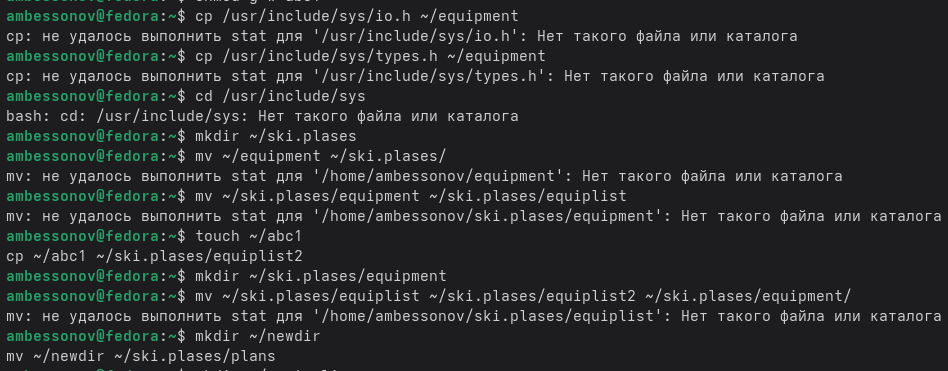
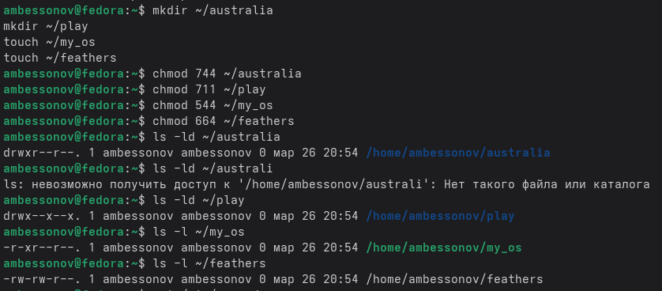
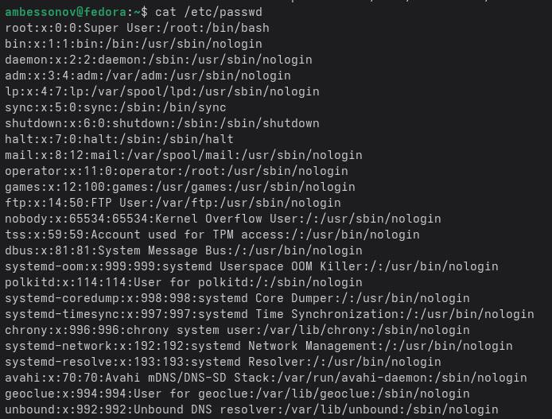

---
## Author
author:
  name: Бессонов Андрей Максимович
  degrees: DSc
  orcid: 0000-0002-0877-7063
  email: 1032253499@rudn.ru
  affiliation:
    - name: Российский университет дружбы народов
      country: Российская Федерация
      postal-code: 117198
      city: Москва
      address: ул. Миклухо-Маклая, д. 6
## Title
title: "Лабораторная работа №7"
license: "CC BY"
---

# Цель работы

Ознакомление с файловой системой Linux, ее структурой, именами и содержимым каталогов. Приобретение практических навыков по применению команд для работы с файлами и каталогами, по управлению процессами, по проверке использования диска и обслуживанию файловой системы.

# Теоретическое введение

## Файловая система Linux
В операционных системах семейства Linux используется иерархическая файловая система, где все данные организованы в виде дерева каталогов, начиная от корневого каталога `/`. Каждый файл или каталог имеет права доступа, определяющие, кто и какие операции может выполнять с данным объектом.

## Типы файловых систем
В Linux используются различные типы файловых систем:
- **ext2fs (second extended filesystem)** — базовая файловая система без журналирования;
- **ext3fs (third extended filesystem)** — журналируемая файловая система, обратно совместимая с ext2;
- **ext4 (fourth extended filesystem)** — современная журналируемая файловая система с поддержкой больших файлов и разделов;
- **ReiserFS** — журналируемая файловая система, оптимизированная для работы с мелкими файлами;
- **xfs** — высокопроизводительная 64-битная журналируемая файловая система;
- **fat (file allocation table)** — файловая система для совместимости с Windows;
- **ntfs (new technology file system)** — основная файловая система Windows.

## Права доступа
Каждый файл или каталог имеет три категории прав доступа:
- **Владелец (user)** — пользователь, создавший файл;
- **Группа (group)** — группа, к которой принадлежит владелец;
- **Остальные (others)** — все остальные пользователи.

Для каждой категории определены три типа прав:
- **r (read)** — чтение;
- **w (write)** — запись;
- **x (execute)** — выполнение (для файлов) или доступ (для каталогов).

# Выполнение лабораторной работы

В ходе работы мы выполнили все поставленные задачи:

## Выполнение примеров из первой части описания (раздел 5.2)

### Работа с файлами (5.2.1)

**Выполненные команды:**
- touch testfile
- cat testfile
- less testfile
- head -n 5 testfile
- tail -n 5 testfile

### Копирование файлов и каталогов (5.2.2)

**Выполненные команды:**
- touch abc1
- cp abc1 april
- cp abc1 may
- mkdir monthly
- cp april may monthly
- cp monthly/may monthly/june
- ls monthly
- mkdir monthly.00
- cp -r monthly monthly.00
- cp -r monthly.00 /tmp

### Перемещение и переименование (5.2.3)

**Выполненные команды:**
- mv april july
- mkdir monthly.00
- mv july monthly.00
- ls monthly.00
- mv monthly.00 monthly.01
- mkdir reports
- mv monthly.01 reports
- mv reports/monthly.01 reports/monthly

### Права доступа (5.2.5)

**Выполненные команды:**
- touch may
- ls -l may
- chmod u+x may
- ls -l may
- chmod u-x may
- mkdir monthly
- chmod g-r,o-r monthly
- touch abc1
- chmod g+w abc1

## Выполнение индивидуальных заданий (пункты 2.1–2.8)

**Выполненные команды:**
Скопировать файл io.h в домашний каталог как equipment
cp /usr/include/sys/io.h ~/equipment

Создать директорию ~/ski.plases
mkdir ~/ski.plases

Переместить equipment в ~/ski.plases
mv ~/equipment ~/ski.plases/

Переименовать в equiplist
mv ~/ski.plases/equipment ~/ski.plases/equiplist

Создать abc1 и скопировать в ~/ski.plases как equiplist2
touch ~/abc1
cp ~/abc1 ~/ski.plases/equiplist2

Создать каталог equipment внутри ~/ski.plases
mkdir ~/ski.plases/equipment

Переместить equiplist и equiplist2 в equipment
mv ~/ski.plases/equiplist ~/ski.plases/equiplist2 ~/ski.plases/equipment/

Создать newdir, переместить в ski.plases и переименовать в plans
mkdir ~/newdir
mv ~/newdir ~/ski.plases/plans

## Определение опций chmod (пункты 3.1–3.4)

**Выполненные команды:**
# Создание файлов/каталогов
mkdir ~/australia
mkdir ~/play
touch ~/my_os
touch ~/feathers

drwxr--r-- для australia (каталог)
chmod 744 ~/australia

drwx--x--x для play (каталог)
chmod 711 ~/play

-r-xr--r-- для my_os (файл)
chmod 544 ~/my_os

-rw-rw-r-- для feathers (файл)
chmod 664 ~/feathers

Проверка установленных прав
ls -ld ~/australia ~/play
ls -l ~/my_os ~/feathers

## Выполнение упражнений (пункты 4.1–4.12)

**Выполненные команды:**
Просмотр содержимого /etc/passwd
cat /etc/passwd

Копирование feathers в file.old
cp ~/feathers ~/file.old

Перемещение file.old в play
mv ~/file.old ~/play/

Копирование каталога play в fun
cp -r ~/play ~/fun

Перемещение fun в play и переименование в games
mv ~/fun ~/play/games

Лишение владельца feathers права на чтение
chmod u-r ~/feathers

Попытка просмотра feathers
cat ~/feathers
Результат: Permission denied

Попытка копирования feathers
cp ~/feathers ~/feathers_copy
Результат: Permission denied

Возврат права на чтение
chmod u+r ~/feathers

Лишение владельца play права на выполнение
chmod u-x ~/play

Попытка перехода в play
cd ~/play
Результат: Permission denied

Возврат права на выполнение
chmod u+x ~/play
cd ~

## Изучение man-страниц (раздел 5)

**Выполненные команды:**
- man mount
- man fsck
- man mkfs
- man kill

# Выводы
В ходе выполнения лабораторной работы были изучены и практически освоены:
- Основные команды для работы с файлами (`touch`, `cat`, `less`, `head`, `tail`);
- Команды для копирования (`cp`) и перемещения файлов (`mv`);
- Управление правами доступа с помощью команды `chmod`;
- Структура файловой системы Linux и типы файловых систем;
- Команды для анализа файловой системы (`df`, `mount`, `fsck`).

Полученные навыки являются основой для администрирования и эффективной работы в операционной системе Linux.

# Контрольные вопросы
1. Дайте характеристику каждой файловой системе, существующей на жёстком диске компьютера, на котором вы выполняли лабораторную работу.

Для просмотра файловых систем использовалась команда `df -Th` и `lsblk -f`:

| ФС | Характеристика |
|----|----------------|
| **ext4** | Стандартная файловая система Linux. Поддерживает файлы до 16 ТБ, разделы до 1 ЭБ. Журналируемая, обеспечивает высокую производительность и надежность. |
| **xfs** | Высокопроизводительная 64-битная журналируемая ФС, оптимальна для работы с большими файлами. |
| **swap** | Раздел подкачки, используется для организации виртуальной памяти. |

2. Приведите общую структуру файловой системы и дайте характеристику каждой директории первого уровня этой структуры.

/ (корень) — вершина иерархии
├── /bin   — основные исполняемые файлы (ls, cp, mv)
├── /boot  — файлы загрузчика (ядро, initrd)
├── /dev   — файлы устройств
├── /etc   — конфигурационные файлы
├── /home  — домашние каталоги пользователей
├── /lib   — библиотеки и модули ядра
├── /media — точки монтирования съемных носителей
├── /mnt   — временные точки монтирования
├── /opt   — дополнительное ПО
├── /proc  — виртуальная ФС с информацией о процессах
├── /root  — домашний каталог root
├── /run   — данные о работающей системе
├── /sbin  — системные исполняемые файлы
├── /srv   — данные сервисов
├── /sys   — виртуальная ФС с информацией об устройствах
├── /tmp   — временные файлы
├── /usr   — пользовательские программы и данные
└── /var   — изменяемые данные (логи, кэш)

3. Какая операция должна быть выполнена, чтобы содержимое некоторой файловой системы было доступно операционной системе?

Необходимо выполнить **монтирование** (mount) — подключение файловой системы устройства к корневой файловой системе через точку монтирования:
mount /dev/sdb1 /mnt/data

4. Назовите основные причины нарушения целостности файловой системы. Как устранить повреждения файловой системы?

**Основные причины:**
- Некорректное выключение системы (потеря питания);
- Сбои оборудования (поврежденные сектора диска);
- Ошибки программного обеспечения.

**Устранение:**
fsck /dev/sda1
fsck -y /dev/sda1    # автоматическое исправление ошибок

5. Как создаётся файловая система?

Файловая система создается командой `mkfs`:
mkfs.ext4 /dev/sdb1    # создание ext4
mkfs.xfs /dev/sdb1     # создание xfs
mkfs.vfat /dev/sdb1    # создание FAT32

6. Дайте характеристику командам для просмотра текстовых файлов.

| Команда | Назначение |
|---------|------------|
| `cat` | Вывод всего файла на экран |
| `less` | Постраничный просмотр с навигацией |
| `head` | Вывод первых N строк |
| `tail` | Вывод последних N строк |
| `more` | Постраничный просмотр (упрощенный) |

7. Приведите основные возможности команды cp в Linux.

| Опция | Назначение |
|-------|------------|
| `-i` | Запрос подтверждения перед перезаписью |
| `-r` | Рекурсивное копирование каталогов |
| `-v` | Вывод информации о копируемых файлах |
| `-u` | Копирование только новых файлов |
| `-a` | Архивное копирование (сохраняет атрибуты) |

8. Приведите основные возможности команды mv в Linux.

| Опция | Назначение |
|-------|------------|
| `-i` | Запрос подтверждения перед перезаписью |
| `-v` | Вывод информации |
| `-u` | Перемещение только новых файлов |

**Возможности:**
- Переименование файлов: `mv oldname newname`
- Перемещение файлов: `mv file dir/`
- Перемещение каталогов: `mv dir1 dir2/`

9. Что такое права доступа? Как они могут быть изменены?

**Права доступа** — механизм разграничения доступа к файлам и каталогам для трех категорий пользователей: владелец (u), группа (g), остальные (o).

Изменяются командой `chmod`:
Символьный режим
chmod u+x file     # добавить право выполнения
chmod g-w file     # убрать право записи

Числовой режим
chmod 755 file     # rwxr-xr-x
chmod 644 file     # rw-r--r--

# Список литературы{.unnumbered}

::: {#refs}
:::

# ********
