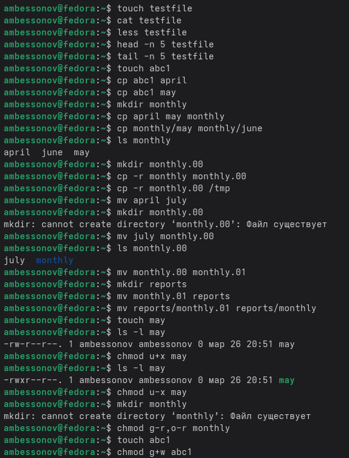
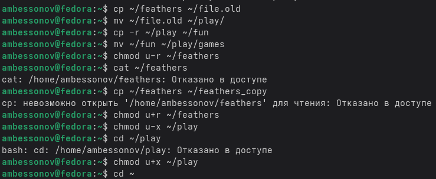
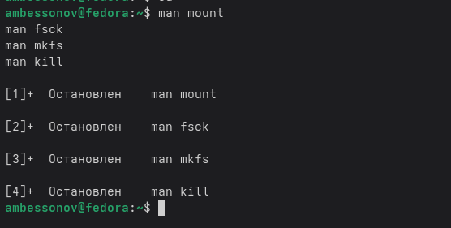

---
## Author
author:
  name: Бессонов Андрей Максимович
  degrees: DSc
  orcid: 0000-0002-0877-7063
  email: 1032253499@rudn.ru
  affiliation:
    - name: Российский университет дружбы народов
      country: Российская Федерация
      postal-code: 117198
      city: Москва
      address: ул. Миклухо-Маклая, д. 6
## Title
title: Презентация лабораторной работы №7
subtitle: Анализ файловой системы Linux. Команды для работы с файлами и каталогами
license: CC BY
date: 2026-03-26
---

# Информация

## Докладчик

:::::::::::::: {.columns align=center}
::: {.column width="70%"}

  * Бессонов Андрей Максимович
  * Студент 1-го курса
  * Группа НКАбд-01-25
  * Российский университет дружбы народов им. П. Лумумбы

:::
::: {.column width="30%"}

:::
::::::::::::::

# Вводная часть

## Актуальность

- Файловая система Linux — основа организации данных в операционной системе.
- Умение работать с файлами и каталогами через командную строку — критически важный навык для системных администраторов и разработчиков.
- Понимание прав доступа и механизмов управления ими необходимо для обеспечения безопасности данных.

## Объект и предмет исследования

- **Объект:** Файловая система операционной системы Linux.

- **Предмет:** Команды для работы с файлами и каталогами (`touch`, `cat`, `less`, `head`, `tail`, `cp`, `mv`, `chmod`), права доступа, анализ файловой системы.

## Цели и задачи

- **Цель:** Ознакомление с файловой системой Linux, ее структурой, именами и содержимым каталогов. Приобретение практических навыков по применению команд для работы с файлами и каталогами.

- **Задачи:**
    1. Выполнить примеры команд для работы с файлами и каталогами.
    2. Выполнить индивидуальные задания по копированию, перемещению и переименованию файлов и каталогов.
    3. Освоить управление правами доступа с помощью команды `chmod`.
    4. Изучить команды для анализа файловой системы.

## Материалы и методы

- **Оборудование:** ПК с ОС Linux.
- **Программное обеспечение:** Эмулятор терминала, командная оболочка.
- **Методы:** Выполнение практических заданий в командной строке, анализ вывода команд, работа со встроенной документацией.

---

# Выполнение работы

## Определение домашнего каталога
- Первым делом необходимо убедиться в своем местоположении в файловой системе.
- Команда `pwd` (print working directory) выводит полный (абсолютный) путь к текущему каталогу.

## Выполнение примеров (5.2.1) — работа с файлами

- `touch testfile` — создание пустого файла.
- `cat testfile` — просмотр содержимого файла.
- `less testfile` — постраничный просмотр (выход — `q`).
- `head -n 5 testfile` — вывод первых 5 строк.
- `tail -n 5 testfile` — вывод последних 5 строк.

## Выполнение примеров (5.2.2) — копирование файлов и каталогов

- `touch abc1` — создание файла.
- `cp abc1 april` — копирование в файл `april`.
- `cp abc1 may` — копирование в файл `may`.
- `mkdir monthly` — создание каталога.
- `cp april may monthly` — копирование файлов в каталог.
- `cp -r monthly monthly.00` — рекурсивное копирование каталога.
- `cp -r monthly.00 /tmp` — копирование в каталог `/tmp`.

## Выполнение примеров (5.2.3) — перемещение и переименование

- `mv april july` — переименование файла.
- `mkdir monthly.00` — создание каталога.
- `mv july monthly.00` — перемещение файла в каталог.
- `mv monthly.00 monthly.01` — переименование каталога.
- `mkdir reports` — создание каталога.
- `mv monthly.01 reports` — перемещение каталога.
- `mv reports/monthly.01 reports/monthly` — переименование не текущего каталога.

## Выполнение примеров (5.2.5) — права доступа

- `touch may` — создание файла.
- `chmod u+x may` — добавление права выполнения владельцу.
- `chmod u-x may` — удаление права выполнения.
- `mkdir monthly` — создание каталога.
- `chmod g-r,o-r monthly` — удаление права чтения для группы и остальных.
- `touch abc1` — создание файла.
- `chmod g+w abc1` — добавление права записи для группы.



## Индивидуальное задание (пункты 2.1–2.8)

```bash
# 2.1 Копирование файла io.h в домашний каталог как equipment
cp /usr/include/sys/io.h ~/equipment

# 2.2 Создание директории ~/ski.plases
mkdir ~/ski.plases

# 2.3 Перемещение equipment в ~/ski.plases
mv ~/equipment ~/ski.plases/

# 2.4 Переименование в equiplist
mv ~/ski.plases/equipment ~/ski.plases/equiplist

# 2.5 Создание abc1 и копирование в ~/ski.plases как equiplist2
touch ~/abc1
cp ~/abc1 ~/ski.plases/equiplist2

# 2.6 Создание каталога equipment внутри ~/ski.plases
mkdir ~/ski.plases/equipment

# 2.7 Перемещение equiplist и equiplist2 в equipment
mv ~/ski.plases/equiplist ~/ski.plases/equiplist2 ~/ski.plases/equipment/

# 2.8 Создание newdir и перемещение в ~/ski.plases как plans
mkdir ~/newdir
mv ~/newdir ~/ski.plases/plans
```


## Определение опций chmod (пункты 3.1–3.4)

```bash
# Создание файлов/каталогов
mkdir ~/australia
mkdir ~/play
touch ~/my_os
touch ~/feathers

# 3.1 drwxr--r-- для australia (каталог)
chmod 744 ~/australia

# 3.2 drwx--x--x для play (каталог)
chmod 711 ~/play

# 3.3 -r-xr--r-- для my_os (файл)
chmod 544 ~/my_os

# 3.4 -rw-rw-r-- для feathers (файл)
chmod 664 ~/feathers
```


## Упражнения (пункты 4.1–4.12)

```bash
# 4.1 Просмотр содержимого /etc/passwd
cat /etc/passwd

# 4.2 Копирование feathers в file.old
cp ~/feathers ~/file.old

# 4.3 Перемещение file.old в play
mv ~/file.old ~/play/

# 4.4 Копирование каталога play в fun
cp -r ~/play ~/fun

# 4.5 Перемещение fun в play и переименование в games
mv ~/fun ~/play/games

# 4.6 Лишение владельца feathers права на чтение
chmod u-r ~/feathers

# 4.7 Попытка просмотра feathers
cat ~/feathers
# Результат: Permission denied

# 4.8 Попытка копирования feathers
cp ~/feathers ~/feathers_copy
# Результат: Permission denied
```

## Упражнения (пункты 4.9–4.12) (продолжение)

```bash
# 4.9 Возврат права на чтение
chmod u+r ~/feathers

# 4.10 Лишение владельца play права на выполнение
chmod u-x ~/play

# 4.11 Попытка перехода в play
cd ~/play
# Результат: Permission denied

# 4.12 Возврат права на выполнение
chmod u+x ~/play
cd ~
```




## Изучение man-страниц

- `man mount` — документация по монтированию файловых систем.
- `man fsck` — документация по проверке и восстановлению ФС.
- `man mkfs` — документация по созданию файловых систем.
- `man kill` — документация по отправке сигналов процессам.



---

# Заключение

## Результаты работы

В ходе лабораторной работы были изучены и практически закреплены следующие навыки:

1. **Работа с файлами:** создание (`touch`), просмотр (`cat`, `less`, `head`, `tail`).
2. **Копирование и перемещение:** копирование файлов и каталогов (`cp`, `cp -r`), перемещение и переименование (`mv`).
3. **Права доступа:** управление правами с помощью `chmod` в символьном и числовом форматах.
4. **Анализ файловой системы:** просмотр смонтированных ФС (`mount`), проверка свободного места (`df`), проверка целостности (`fsck`).

## Вывод

В результате выполнения лабораторной работы были успешно приобретены практические навыки работы с файловой системой Linux. Освоены команды для управления файлами и каталогами, настройки прав доступа, а также методы диагностики и обслуживания файловой системы. Полученные знания являются фундаментом для дальнейшего изучения администрирования операционных систем семейства Linux.
