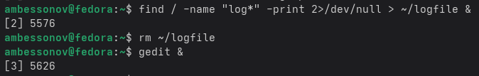
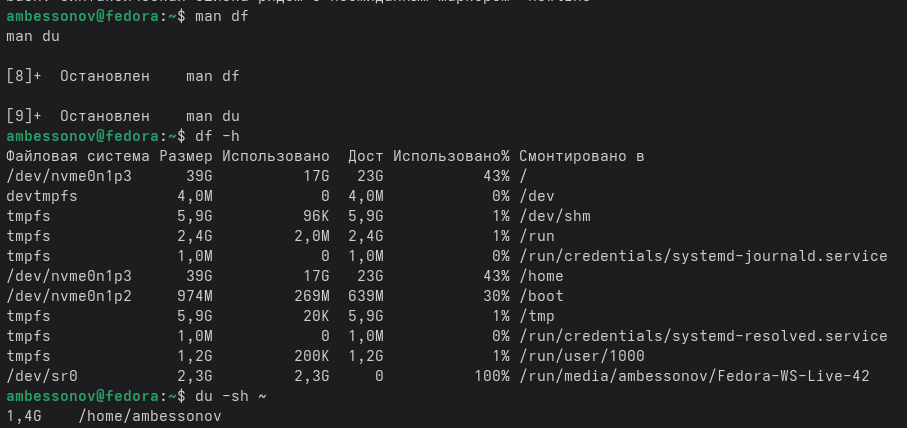
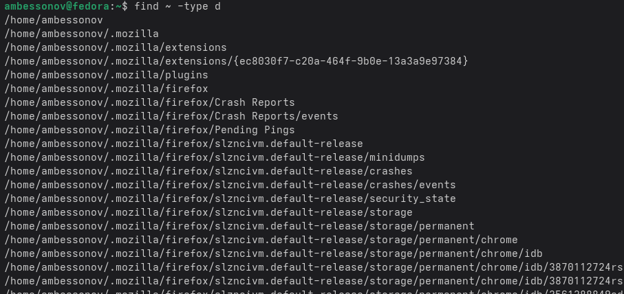

---
## Author
author:
  name: Бессонов Андрей Максимович
  degrees: DSc
  orcid: 0000-0002-0877-7063
  email: 1032253499@rudn.ru
  affiliation:
    - name: Российский университет дружбы народов
      country: Российская Федерация
      postal-code: 117198
      city: Москва
      address: ул. Миклухо-Маклая, д. 6
## Title
title: "Лабораторная работа №8"
license: "CC BY"
---

# Цель работы

Ознакомление с инструментами поиска файлов и фильтрации текстовых данных. Приобретение практических навыков: по управлению процессами (и заданиями), по проверке использования диска и обслуживанию файловых систем.

# Теоретическое введение

## Перенаправление ввода-вывода

В Linux по умолчанию открыто три специальных потока:
- **stdin** (0) – стандартный ввод (клавиатура);
- **stdout** (1) – стандартный вывод (консоль);
- **stderr** (2) – стандартный вывод ошибок (консоль).

Перенаправление выполняется с помощью символов:
- `>` – перезапись stdout в файл;
- `>>` – добавление stdout в конец файла;
- `2>` – перенаправление stderr;
- `&>` – перенаправление stdout и stderr.

## Конвейер (pipe)

Символ `|` передаёт вывод одной команды на ввод другой.  
Пример: `ls -la | sort > sorted_list`

## Поиск файлов – `find`

Команда `find` рекурсивно ищет файлы по заданному пути с различными критериями:
- `-name` – по имени (с шаблонами);
- `-type` – по типу (f – файл, d – каталог);
- `-exec` – выполнить команду над найденными файлами.

Пример: `find ~ -name "*.txt" -print`

## Фильтрация текста – `grep`

`grep` ищет строки, содержащие заданный образец. Работает как с файлами, так и со стандартным вводом.  
Пример: `grep "error" log.txt` или `ps aux | grep bash`

## Проверка использования диска

- `df` – отображает размер, занятое и свободное место на смонтированных разделах.  
- `du` – показывает объём, занимаемый файлами и каталогами.  
Пример: `df -h`, `du -sh ~`

## Управление процессами и задачами

- Запуск в фоновом режиме: `&` в конце команды.  
- `jobs` – список фоновых задач текущей оболочки.  
- `ps aux` – информация о процессах.  
- `kill <PID>` – завершение процесса.

# Выполнение лабораторной работы

В ходе работы мы выполнили все поставленные задачи:

## 1. Вход в систему
Вход выполнен под своей учётной записью.

## 2. Запись в файл file.txt списков /etc и домашнего каталога
ls /etc > file.txt
ls ~ >> file.txt

## 3. Вывод и запись в conf.txt имён файлов с расширением .conf
grep '\.conf$' file.txt > conf.txt
cat conf.txt

## 4. Поиск файлов в домашнем каталоге, начинающихся с 'c'
ls ~ | grep '^c'

## 5. Постраничный вывод имён файлов из /etc, начинающихся с 'h'
ls /etc | grep '^h' | less

## 6. Запуск фонового процесса, записывающего в ~/logfile имена файлов, начинающихся с 'log'
find / -name "log*" -print 2>/dev/null > ~/logfile &

## 7. Удаление файла ~/logfile
rm ~/logfile

## 8. Запуск gedit в фоновом режиме
gedit &

## 9. Определение PID процесса gedit
ps aux | grep gedit | grep -v grep

## 10. Изучение справки kill и завершение процесса gedit
man kill

## 11. Выполнение df и du с предварительным изучением man
man df
man du
df -h
du -sh ~

## 12. Вывод имён всех директорий в домашнем каталоге
find ~ -type d

# Выводы

В ходе выполнения лабораторной работы были освоены:
- Перенаправление потоков ввода-вывода (`>`, `>>`, `2>`);
- Работа с конвейерами (`|`);
- Поиск файлов с помощью `find` и `grep`;
- Управление процессами (фон, `jobs`, `ps`, `kill`);
- Анализ дискового пространства (`df`, `du`).

Полученные навыки необходимы для эффективной работы в командной строке Linux.

# Контрольные вопросы
## 1. Какие потоки ввода-вывода вы знаете?
- `stdin` (0) – стандартный ввод;
- `stdout` (1) – стандартный вывод;
- `stderr` (2) – стандартный вывод ошибок.

## 2. Объясните разницу между операцией `>` и `>>`.
- `>` – перезаписывает файл;
- `>>` – добавляет в конец файла.

## 3. Что такое конвейер?
Конвейер (`|`) – передача вывода одной команды на ввод другой.

## 4. Что такое процесс? Чем отличается от программы?
- **Программа** – статичный исполняемый файл.
- **Процесс** – экземпляр программы во время выполнения с собственным PID, состоянием и ресурсами.

## 5. Что такое PID и GID?
- **PID** – идентификатор процесса;
- **GID** – идентификатор группы (процесса или пользователя).

## 6. Что такое задачи и какая команда позволяет ими управлять?
**Задачи (jobs)** – фоновые процессы текущей оболочки. Команда `jobs` выводит их список. Управление: `fg`, `bg`, `kill %номер`.

## 7. Найдите информацию об утилитах top и htop. Каковы их функции?
- **top** – интерактивный просмотр процессов в реальном времени (загрузка CPU, память).
- **htop** – улучшенная версия с цветами, прокруткой и управлением мышью.

## 8. Назовите и дайте характеристику команде поиска файлов. Примеры.
Команда `find` – рекурсивный поиск по критериям.
Примеры:
- `find ~ -name "*.txt"`
- `find /etc -type d`
- `find . -size +10M -exec rm {} \;`

## 9. Можно ли по контексту (содержанию) найти файл? Если да, то как?
Да, с помощью `grep -r "слово" ~/каталог` или `find ~ -type f -exec grep -l "текст" {} \;`.

## 10. Как определить объем свободной памяти на жёстком диске?
Команда `df -h` показывает свободное место для всех смонтированных разделов.

## 11. Как определить объем вашего домашнего каталога?
`du -sh ~`

## 12. Как удалить зависший процесс?
- Найти PID: `ps aux | grep имя_процесса`
- Завершить: `kill <PID>` или `kill -9 <PID>` (принудительно).

# Список литературы{.unnumbered}
Кулябов Д. С. и др. Лабораторная работа №6: Поиск файлов. Перенаправление ввода-вывода. Просмотр запущенных процессов. 
::: {#refs}
:::

# ********
