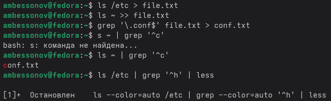
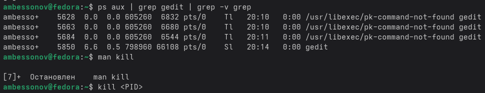

---
## Author
author:
  name: Бессонов Андрей Максимович
  degrees: DSc
  orcid: 0000-0002-0877-7063
  email: 1032253499@rudn.ru
  affiliation:
    - name: Российский университет дружбы народов
      country: Российская Федерация
      postal-code: 117198
      city: Москва
      address: ул. Миклухо-Маклая, д. 6
## Title
title: Презентация лабораторной работы №8
subtitle: Поиск файлов. Перенаправление ввода-вывода. Просмотр запущенных процессов
license: CC BY
date: 2026-03-26
---

# Информация

## Докладчик

:::::::::::::: {.columns align=center}
::: {.column width="70%"}

  * Бессонов Андрей Максимович
  * Студент 1-го курса
  * Группа НКАбд-01-25
  * Российский университет дружбы народов им. П. Лумумбы

:::
::: {.column width="30%"}

:::
::::::::::::::

# Вводная часть

## Актуальность

- Умение искать файлы в командной строке — ключевой навык для эффективной работы в Linux.
- Перенаправление потоков и конвейеры позволяют гибко обрабатывать данные без создания промежуточных файлов.
- Управление процессами необходимо для контроля выполнения задач, особенно длительных или фоновых.

## Объект и предмет исследования

- **Объект:** Операционная система Linux, её командная оболочка.

- **Предмет:** Инструменты поиска файлов (`find`, `grep`), перенаправление ввода-вывода (`>`, `>>`, `|`), управление процессами (`ps`, `jobs`, `kill`), анализ дискового пространства (`df`, `du`).

## Цели и задачи

- **Цель:** Ознакомление с инструментами поиска файлов и фильтрации текстовых данных. Приобретение практических навыков: по управлению процессами, по проверке использования диска и обслуживанию файловых систем.

- **Задачи:**
    1. Освоить перенаправление стандартных потоков ввода/вывода.
    2. Научиться использовать конвейеры для объединения команд.
    3. Применить команды `find` и `grep` для поиска файлов и фильтрации текста.
    4. Изучить запуск фоновых процессов и управление ими (`jobs`, `ps`, `kill`).
    5. Выполнить анализ дискового пространства с помощью `df` и `du`.

## Материалы и методы

- **Оборудование:** ПК с операционной системой Linux.
- **Программное обеспечение:** Эмулятор терминала, командная оболочка bash.
- **Методы:** Выполнение практических заданий в командной строке, использование встроенной документации (`man`), анализ вывода команд.

---

# Выполнение работы

## 1–2. Запись списков файлов в `file.txt`
ls /etc > file.txt
ls ~ >> file.txt

## 3. Выделение файлов `.conf` в `conf.txt`
grep '\.conf$' file.txt > conf.txt
cat conf.txt

## 4. Поиск файлов в домашнем каталоге на `c*`
ls ~ | grep '^c'

## 5. Постраничный вывод имён файлов из `/etc`, начинающихся с `h`
ls /etc | grep '^h' | less

## 6. Запуск фонового процесса для поиска `log*`
find / -name "log*" -print 2>/dev/null > ~/logfile 

## 7–8. Удаление `logfile` и запуск `gedit`
rm ~/logfile
gedit &

## 9. Определение PID процесса `gedit`
ps aux | grep gedit | grep -v grep

## 10. Изучение `man kill` и завершение процесса
man kill
kill <PID>

## 11. Анализ дискового пространства (`df`, `du`)
man df
man du
df -h
du -sh ~

## 12. Вывод всех директорий в домашнем каталоге
find ~ -type d

---

# Заключение

## Результаты работы

В ходе лабораторной работы были освоены следующие навыки:

1. **Перенаправление потоков** – использование `>`, `>>`, `2>`.
2. **Конвейеры** – объединение команд с помощью символа `|`.
3. **Поиск файлов** – применение `find` по имени, типу, с выполнением действий (`-exec`).
4. **Фильтрация текста** – использование `grep` для поиска строк.
5. **Управление процессами** – запуск фоновых задач (`&`), просмотр (`ps`, `jobs`), завершение (`kill`).
6. **Анализ диска** – оценка занятого и свободного пространства командами `df` и `du`.

## Вывод

В результате выполнения лабораторной работы были успешно приобретены практические навыки работы с командной строкой Linux в части поиска файлов, фильтрации данных, управления процессами и контроля дискового пространства. Полученные знания являются важной основой для дальнейшего изучения системного администрирования и автоматизации задач в Unix-подобных операционных системах.
