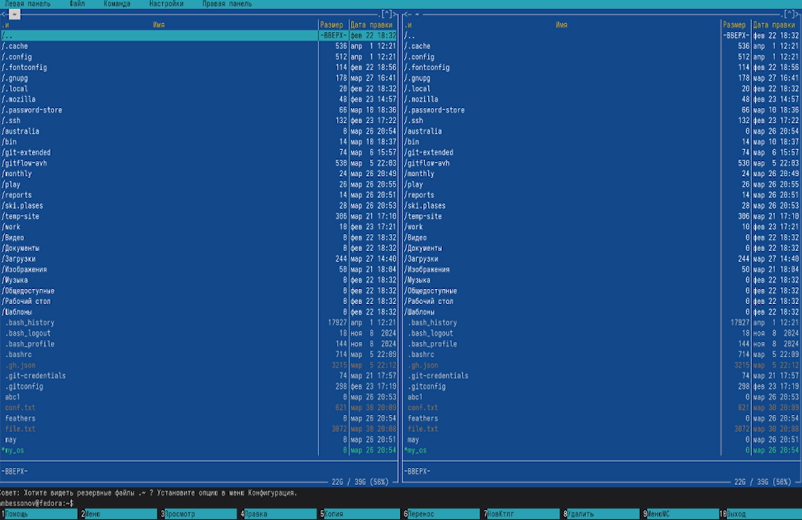
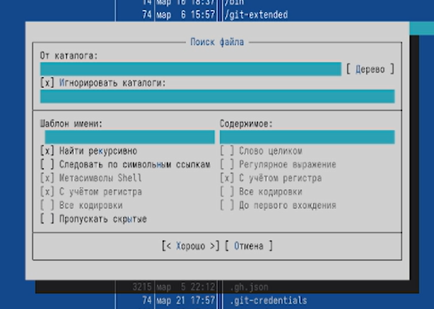
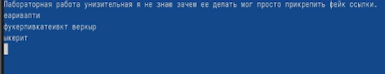
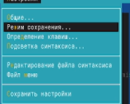

---
## Author
author:
  name: Бессонов Андрей Максимович
  degrees: DSc
  orcid: 0000-0002-0877-7063
  email: 1032253499@rudn.ru
  affiliation:
    - name: Российский университет дружбы народов
      country: Российская Федерация
      postal-code: 117198
      city: Москва
      address: ул. Миклухо-Маклая, д. 6
## Title
title: "Лабораторная работа №9"
license: "CC BY"
---

# Цель работы

Освоение основных возможностей командной оболочки Midnight Commander. Приобретение навыков практической работы по просмотру каталогов и файлов, манипуляций с ними, а также работы со встроенным редактором.

# Теоретическое введение

## Общие сведения о Midnight Commander

Midnight Commander (mc) — псевдографическая командная оболочка для UNIX/Linux систем. Запускается командой `mc`. Рабочее пространство состоит из двух панелей, отображающих списки файлов двух каталогов. Над панелями расположено меню (вызов по F9), под панелями — управляющие кнопки, ассоциированные с функциональными клавишами F1–F10, и командная строка для ввода команд.

## Режимы отображения панелей

- **Список файлов** – стандартный режим.
- **Быстрый просмотр** – показывает содержимое выбранного файла.
- **Информация** – выводит сведения о файле и файловой системе.
- **Дерево** – отображает структуру каталогов.

Управление панелями: перестановка (`Ctrl+u`), временное отключение (`Ctrl+o`), сравнение каталогов (`Ctrl+x d`).

## Меню mc

- **Левая панель / Правая панель** – настройка формата списка, режимов отображения.
- **Файл** – операции с файлами: просмотр (F3), редактирование (F4), копирование (F5), перемещение (F6), создание каталога (F7), удаление (F8), права доступа (Ctrl+x o), ссылки и т.д.
- **Команда** – общие команды: поиск файлов, сравнение каталогов, история команд, каталоги быстрого доступа, редактирование пользовательского меню и расширений.
- **Настройки** – конфигурация внешнего вида, подтверждения, раскладка клавиш, настройки виртуальных файловых систем.

## Встроенный редактор mc

Вызывается по F4. Поддерживает основные операции редактирования, работу с блоками, поиск/замену, подсветку синтаксиса.

# Выполнение лабораторной работы

В ходе работы были последовательно выполнены все задания.

## 1. Изучение справочной информации
Запущена команда:
```bash
man mc
```
Просмотрена документация по Midnight Commander.



## 2. Основные операции с панелями и файлами
Выполнены следующие действия:
- Переключение между панелями (`Tab`).
- Выделение файлов (`Insert` / `Ctrl+T`).
- Копирование выделенных файлов (`F5`).
- Перемещение файлов (`F6`).
- Просмотр информации о размере и правах доступа (меню *Левая панель* → *Формат списка*).
- Удаление файлов (`F8`).


## 3. Меню левой (правой) панели
Через `F9 → Левая панель` последовательно выбраны режимы:
- *Список файлов* – стандартный вид.
- *Быстрый просмотр* (`Ctrl+X Q`) – в правой панели отображается содержимое выделенного файла.
- *Информация* – вывод сведений о выделенном файле и файловой системе.
- *Дерево* – отображение дерева каталогов.

## 4. Меню «Файл»
Выполнены действия:
- **Просмотр текстового файла** – выделен файл `text.txt`, нажато `F3`.
- **Редактирование без сохранения** – `F4`, внесены изменения, выход без сохранения (ответ «Нет»).
- **Создание каталога** – нажато `F7`, введено имя `test_dir`.
- **Копирование файлов в созданный каталог** – выделено несколько файлов (`Insert`), нажато `F5`, в качестве целевого каталога указано `test_dir/`.

## 5. Меню «Команда»
- **Поиск файлов** (`Alt+F7`):
  - задано имя `*.c`, содержимое `main` – найденные файлы отображены.
- **История командной строки** (`Alt+H`) – выбран и повторно выполнен предыдущий `grep`.
- **Каталоги быстрого доступа** (`Ctrl+\`) – выполнен переход в `/etc`.
- **Редактирование файла меню** и **файла расширений** – просмотр содержимого без изменений.



## 6. Меню «Настройки»
- **Конфигурация** – включена опция «Показывать скрытые файлы» (Show Hidden Files).
- **Внешний вид** – изменена геометрия панелей.
- **Подтверждение** – отключены запросы на подтверждение удаления.

## 7. Работа со встроенным редактором

1. **Создание файла** – `F7`, имя `text.txt`.
2. **Открытие в редакторе** – выделен файл, `F4`.
3. **Вставка текста** – скопирован фрагмент из другого файла, вставлен (`Shift+Insert`).
4. **Манипуляции с текстом**:
   - 4.1 Удаление строки – курсор на строке, `Ctrl+Y`.
   - 4.2 Копирование фрагмента – выделение (`Shift`+стрелки), `F5` (копировать), переход на новую строку, `F6` (вставить).
   - 4.3 Перемещение фрагмента – выделение, `F6` (вырезать), вставка на новую строку.
   - 4.4 Сохранение – `F2`.
   - 4.5 Отмена последнего действия – `Ctrl+U`.
   - 4.6 Переход в конец файла (`Ctrl+End`), добавление текста.
   - 4.7 Переход в начало (`Ctrl+Home`), добавление текста.
   - 4.8 Сохранение и закрытие – `F2`, затем `F10`.
5. **Открытие файла с исходным кодом** – выбран файл `example.c`, `F4`.
6. **Подсветка синтаксиса** – через меню редактора `F9 → Настройки → Подсветка синтаксиса` включена/выключена.







# Выводы

В ходе выполнения лабораторной работы были освоены основные возможности Midnight Commander:
- управление панелями и их режимами;
- выполнение операций с файлами (копирование, перемещение, удаление, создание каталогов) как через меню, так и с помощью функциональных клавиш;
- использование меню «Файл», «Команда», «Настройки»;
- работа со встроенным редактором (создание, редактирование, манипуляции с текстом, подсветка синтаксиса);
- поиск файлов по различным критериям.

Полученные навыки позволяют эффективно управлять файловой системой в UNIX/Linux-системах без использования графического интерфейса.

# Контрольные вопросы

## 1. Какие режимы работы есть в mc. Охарактеризуйте их.
- **Список файлов** – отображение содержимого текущего каталога.
- **Быстрый просмотр** – показывает содержимое выделенного файла (для текстовых файлов – текст, для каталогов – список).
- **Информация** – выводит подробные сведения о выделенном файле (размер, права, время изменения) и информацию о файловой системе.
- **Дерево** – отображает древовидную структуру каталогов, позволяя быстро перемещаться по ним.

## 2. Какие операции с файлами можно выполнить как с помощью команд shell, так и с помощью меню (комбинаций клавиш) mc? Приведите несколько примеров.
- Копирование: `cp source dest` в shell, `F5` в mc.
- Перемещение: `mv source dest` в shell, `F6` в mc.
- Удаление: `rm file` в shell, `F8` в mc.
- Создание каталога: `mkdir dir` в shell, `F7` в mc.
- Просмотр содержимого: `cat file` / `less file` в shell, `F3` в mc.
- Редактирование: `nano file` в shell, `F4` в mc.

## 3. Опишите структуру меню левой (или правой) панели mc, дайте характеристику командам.
Меню левой/правой панели (вызов F9 → Левая панель) содержит:
- **Список файлов** – стандартный режим.
- **Быстрый просмотр** – активация режима быстрого просмотра.
- **Информация** – режим вывода информации.
- **Дерево** – режим дерева каталогов.
- **Формат списка** – настройка отображаемых полей (имя, размер, дата, права и т.д.).
- **Сортировка** – упорядочивание файлов (по имени, дате, размеру и др.).
- **Фильтр** – отображение только файлов, удовлетворяющих маске.

## 4. Опишите структуру меню Файл mc, дайте характеристику командам.
Меню Файл (F9 → Файл):
- **Просмотр** (F3) – просмотр текущего/выделенного файла.
- **Редактирование** (F4) – открытие во встроенном редакторе.
- **Копирование** (F5) – копирование одного или нескольких файлов.
- **Перемещение** (F6) – перемещение/переименование.
- **Создание каталога** (F7) – создание нового каталога.
- **Удалить** (F8) – удаление файлов/каталогов.
- **Права доступа** – изменение прав (chmod).
- **Владелец/группа** – смена владельца (chown).
- **Жёсткая ссылка** – создание жёсткой ссылки.
- **Символическая ссылка** – создание символьной ссылки.
- **Выход** (F10) – завершение работы mc.

## 5. Опишите структуру меню Команда mc, дайте характеристику командам.
Меню Команда (F9 → Команда):
- **Дерево каталогов** – отображение дерева каталогов системы.
- **Поиск файла** – поиск файлов по имени, размеру, содержимому и т.п.
- **Переставить панели** – меняет местами левую и правую панели.
- **Сравнить каталоги** – сравнение содержимого двух панелей.
- **Размеры каталогов** – вычисление размера каталогов.
- **История командной строки** – просмотр ранее выполненных команд.
- **Каталоги быстрого доступа** – быстрый переход в заданные каталоги.
- **Восстановление файлов** – восстановление удалённых файлов (ext2/ext3).
- **Редактировать файл расширений** – задание действий для файлов по расширению.
- **Редактировать файл меню** – настройка пользовательского меню (F2).
- **Редактировать файл расцветки имён** – настройка цветов для разных типов файлов.

## 6. Опишите структуру меню Настройки mc, дайте характеристику командам.
Меню Настройки (F9 → Настройки):
- **Конфигурация** – общие настройки: поведение панелей, подтверждения, режим работы.
- **Внешний вид** – настройка элементов интерфейса (расположение панелей, цветовая схема).
- **Вывод символов** – кодировка, форматы отображения.
- **Подтверждение** – включение/отключение запросов подтверждения (удаление, перезапись).
- **Раскладка клавиш** – настройка функциональных клавиш.
- **Виртуальные ФС** – настройки для работы с файловыми системами (FTP, SFTP и др.).

## 7. Назовите и дайте характеристику встроенным командам mc.
Встроенные команды – это действия, доступные через функциональные клавиши и их комбинации:
- `F1` – помощь.
- `F2` – вызов пользовательского меню.
- `F3` – просмотр файла.
- `F4` – редактирование файла.
- `F5` – копирование.
- `F6` – перемещение/переименование.
- `F7` – создание каталога.
- `F8` – удаление.
- `F9` – активация меню.
- `F10` – выход из mc.
- `Ctrl+O` – временно скрыть панели (показать вывод команд).
- `Ctrl+U` – переставить панели.
- `Ctrl+X D` – сравнение каталогов.

## 8. Назовите и дайте характеристику командам встроенного редактора mc.
Встроенный редактор (вызов F4) поддерживает:
- Навигацию: `Ctrl+Home` – в начало, `Ctrl+End` – в конец, `PageUp/PageDown`.
- Удаление строки: `Ctrl+Y`.
- Копирование/вырезание блока: выделение мышью или клавишами, `F5` – копировать, `F6` – вырезать, вставка – `F6` (в некоторых версиях `Shift+Insert`).
- Отмена/повтор: `Ctrl+U` (отмена), `Alt+U` (повтор).
- Поиск: `F7` (поиск), `F8` (замена).
- Сохранение: `F2`.
- Выход без сохранения: `F10` (или Esc).
- Подсветка синтаксиса: меню `Настройки → Подсветка синтаксиса`.

## 9. Дайте характеристику средствам mc, которые позволяют создавать меню, определяемые пользователем.
Пользовательское меню (вызов F2) определяется файлом `~/.mc/menu`. В этом файле можно описать пункты меню, которые будут выполнять произвольные команды (например, открыть файл в определённой программе, запустить скрипт). Синтаксис: `+ "Название пункта"` и далее команды, каждая с отступом. Пользовательское меню позволяет расширить функциональность mc под конкретные задачи.

## 10. Дайте характеристику средствам mc, которые позволяют выполнять действия, определяемые пользователем, над текущим файлом.
Через файл расширений (`~/.mc/ext`) можно задать действия для файлов с определёнными расширениями или типами. При попытке открыть файл (Enter или F4) mc проверяет соответствие расширению и выполняет связанную команду. Например, для `.c` можно задать открытие в `gedit`, для `.pdf` – вызов `evince`. Это позволяет интегрировать mc с внешними программами, настроив поведение в зависимости от типа файла.


# Список литературы{.unnumbered}
::: {#refs}
:::

# ********
