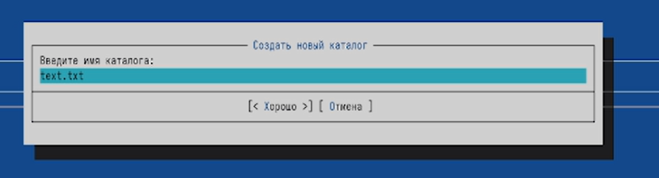
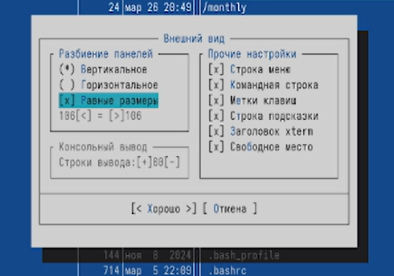
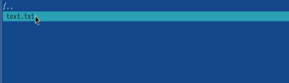
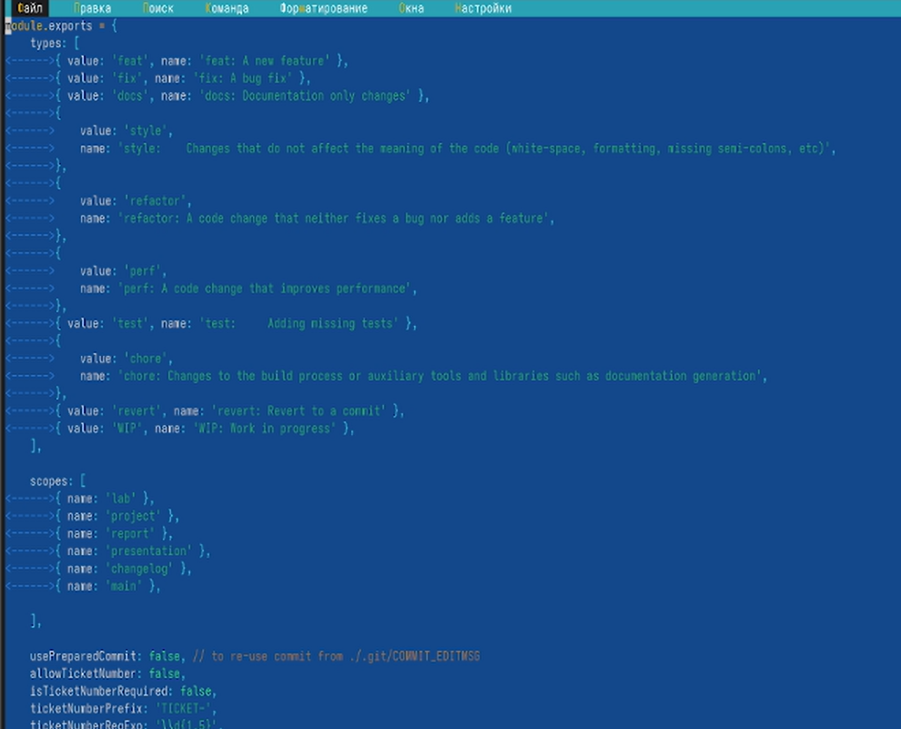

---
## Author
author:
  name: Бессонов Андрей Максимович
  degrees: DSc
  orcid: 0000-0002-0877-7063
  email: 1032253499@rudn.ru
  affiliation:
    - name: Российский университет дружбы народов
      country: Российская Федерация
      postal-code: 117198
      city: Москва
      address: ул. Миклухо-Маклая, д. 6
## Title
title: Презентация лабораторной работы №9
subtitle: Командная оболочка Midnight Commander.
license: CC BY
date: 2026-03-26
---

# Информация

## Докладчик

:::::::::::::: {.columns align=center}
::: {.column width="70%"}

  * Бессонов Андрей Максимович
  * Студент 1-го курса
  * Группа НКАбд-01-25
  * Российский университет дружбы народов им. П. Лумумбы

:::
::: {.column width="30%"}

:::
::::::::::::::

# Вводная часть

## Актуальность

- Midnight Commander (mc) — мощная псевдографическая оболочка, широко используемая в UNIX/Linux системах.
- Умение работать с mc позволяет эффективно управлять файлами и каталогами без графического интерфейса.
- Встроенный редактор и пользовательские настройки делают mc гибким инструментом для повседневных задач.

## Объект и предмет исследования

- **Объект:** Операционная система Linux, её командная оболочка.

- **Предмет:** Командная оболочка Midnight Commander: управление панелями, операции с файлами, встроенный редактор, настройка интерфейса.

## Цели и задачи

- **Цель:** Освоение основных возможностей Midnight Commander. Приобретение навыков практической работы по просмотру каталогов и файлов, манипуляций с ними, а также работы со встроенным редактором.

- **Задачи:**
    1. Изучить интерфейс mc, режимы отображения панелей.
    2. Освоить операции с файлами (копирование, перемещение, удаление, создание каталогов) через меню и функциональные клавиши.
    3. Научиться пользоваться меню «Файл», «Команда», «Настройки».
    4. Приобрести навыки работы во встроенном редакторе (создание, редактирование, подсветка синтаксиса).
    5. Выполнить поиск файлов по различным критериям.

## Материалы и методы

- **Оборудование:** ПК с операционной системой Linux.
- **Программное обеспечение:** Midnight Commander (mc), эмулятор терминала.
- **Методы:** Практическая работа с интерфейсом mc, использование встроенной документации (`man mc`), выполнение заданий в соответствии с методическими указаниями.

---

# Выполнение работы

## 1. Изучение справочной информации
- Запущена команда `man mc`.
- Просмотрена документация по Midnight Commander.

## 2. Основные операции с панелями и файлами
- Переключение между панелями (`Tab`).
- Выделение файлов (`Insert` / `Ctrl+T`).
- Копирование (`F5`), перемещение (`F6`), удаление (`F8`).
- Просмотр информации о файле (меню *Левая панель* → *Формат списка*).

## 3. Меню левой (правой) панели
- Режимы: *Список файлов*, *Быстрый просмотр* (`Ctrl+X Q`), *Информация*, *Дерево*.
- Настройка формата списка, сортировка, фильтр.

## 4. Меню «Файл»
- **Просмотр файла** (`F3`).
- **Редактирование без сохранения** (`F4`, выход без сохранения).
- **Создание каталога** (`F7`) — `test_dir`.
- **Копирование файлов** (`F5`) в созданный каталог.

## 5. Меню «Команда»
- **Поиск файлов** (`Alt+F7`) по имени `*.c` и содержимому `main`.
- **История командной строки** (`Alt+H`) — повторный вызов.
- **Каталоги быстрого доступа** (`Ctrl+\`) — переход в `/etc`.
- Просмотр файлов расширений и пользовательского меню.

## 6. Меню «Настройки»
- **Конфигурация** — включение показа скрытых файлов.
- **Внешний вид** — изменение геометрии панелей.
- **Подтверждение** — отключение запросов на удаление.

## 7. Работа со встроенным редактором

### 7.1 Создание и редактирование файла
- Создан файл `text.txt` (`F7`).
- Открыт в редакторе (`F4`).
- Вставлен текст (`Shift+Insert`).

### 7.2 Манипуляции с текстом
- Удаление строки: `Ctrl+Y`.
- Копирование/перемещение блока: выделение, `F5`/`F6`, вставка.
- Сохранение (`F2`), отмена (`Ctrl+U`).
- Переход в конец (`Ctrl+End`) и начало (`Ctrl+Home`).

### 7.3 Редактирование кода и подсветка синтаксиса
- Открыт файл `example.js`.
- Включена/отключена подсветка синтаксиса (F9 → Настройки → Подсветка синтаксиса).

---

# Заключение

## Результаты работы

В ходе лабораторной работы были освоены:

1. **Управление панелями** – перестановка (`Ctrl+U`), отключение (`Ctrl+O`), сравнение каталогов (`Ctrl+X D`), различные режимы отображения.
2. **Операции с файлами** – копирование, перемещение, удаление, создание каталогов через функциональные клавиши (F5–F8) и меню.
3. **Меню mc** – структура и назначение пунктов «Левая/Правая панель», «Файл», «Команда», «Настройки».
4. **Встроенный редактор** – создание файлов, редактирование текста, работа с блоками, поиск/замена, подсветка синтаксиса.
5. **Поиск файлов** – использование встроенного диалога поиска по имени, содержимому, типу.

## Вывод

Приобретённые навыки позволяют эффективно управлять файловой системой в терминале Linux, выполнять повседневные операции с файлами и каталогами, а также настраивать интерфейс mc под индивидуальные потребности. Встроенный редактор делает mc полноценной средой для работы с текстовыми файлами и кодом.
