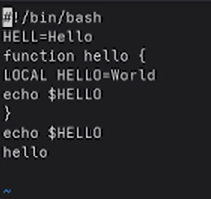
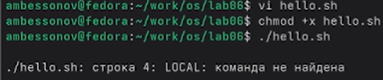
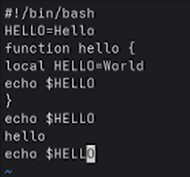
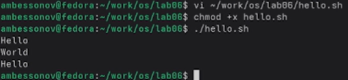

---
## Author
author:
  name: Бессонов Андрей Максимович
  degrees: DSc
  orcid: 0000-0002-0877-7063
  email: 1032253499@rudn.ru
  affiliation:
    - name: Российский университет дружбы народов
      country: Российская Федерация
      postal-code: 117198
      city: Москва
      address: ул. Миклухо-Маклая, д. 6
## Title
title: "Лабораторная работа №10"
license: "CC BY"
---

# Цель работы

Познакомиться с операционной системой Linux. Получить практические навыки работы с редактором `vi`, установленным по умолчанию практически во всех дистрибутивах.

# Теоретическое введение

## Общие сведения о редакторе vi

`vi` (Visual display editor) – интерактивный экранный редактор, входящий в состав практически всех UNIX-подобных систем. Он работает в трёх режимах:

- **Командный режим** – предназначен для ввода команд редактирования и навигации по файлу. Переход в этот режим осуществляется клавишей `Esc`.
- **Режим вставки** – предназначен для ввода текста. Переход в него возможен из командного режима клавишами `i`, `a`, `o` и др.
- **Режим последней (командной) строки** – используется для записи изменений в файл, выхода из редактора, поиска, замены и настройки опций. Вызывается нажатием `:` (двоеточие) из командного режима.

Вызов редактора: `vi <имя_файла>`. Если файл не существует, он будет создан.

## Основные команды vi

### Управление курсором
- `h` / `←` – влево
- `l` / `→` – вправо
- `k` / `↑` – вверх
- `j` / `↓` – вниз

### Позиционирование
- `0` – в начало текущей строки
- `$` – в конец текущей строки
- `G` – в конец файла
- `nG` – на строку с номером `n`

### Перемещение по файлу
- `Ctrl+d` – на полэкрана вперёд
- `Ctrl+u` – на полэкрана назад
- `Ctrl+f` – на страницу вперёд
- `Ctrl+b` – на страницу назад

### Перемещение по словам
- `w` – на слово вперёд
- `nw` – на `n` слов вперёд
- `b` – на слово назад
- `nb` – на `n` слов назад

### Вставка текста
- `a` – после курсора
- `A` – в конец строки
- `i` – перед курсором
- `I` – в начало строки
- `o` – вставить строку под курсором
- `O` – вставить строку над курсором

### Удаление
- `x` – удалить символ (в буфер)
- `dw` – удалить слово
- `d$` – удалить от курсора до конца строки
- `d0` – удалить от начала строки до курсора
- `dd` – удалить строку
- `ndd` – удалить `n` строк

### Отмена и повтор
- `u` – отменить последнее изменение
- `.` – повторить последнюю команду
- `U` – отменить все изменения в строке

### Команды режима последней строки
- `:w` – записать файл
- `:q` – выйти
- `:wq` – записать и выйти
- `:q!` – выйти без сохранения
- `:e!` – вернуться в командный режим, отменив все изменения после последней записи

### Опции (команда `:set`)
- `:set all` – показать все опции
- `:set nu` – показывать номера строк
- `:set list` – показывать невидимые символы
- `:set ic` – игнорировать регистр при поиске
- Отмена опции: `:set no<опция>` (например, `:set nonu`)

# Выполнение лабораторной работы

В ходе работы были последовательно выполнены все задания из разделов 8.3.1 и 8.3.2.

## Задание 1. Создание нового файла hello.sh

1. Создан каталог `~/work/os/lab06` и выполнен переход в него:
   ```bash
   mkdir -p ~/work/os/lab06
   cd ~/work/os/lab06
   ```

   

2. Вызван редактор `vi` для создания файла `hello.sh`:
   ```bash
   vi hello.sh
   ```

3. Нажата клавиша `i` для перехода в режим вставки, введён следующий текст:
   ```bash
   #!/bin/bash
   HELL=Hello
   function hello {
       LOCAL HELLO=World
       echo $HELLO
   }
   echo $HELLO
   hello
   ```

   

4. После завершения ввода нажата клавиша `Esc` для перехода в командный режим, затем `:` для входа в режим последней строки, набрано `wq` и нажат `Enter` – файл сохранён.

5. Файл сделан исполняемым:
   ```bash
   chmod +x hello.sh
   ```

6. Выполнена попытка запуска:
   ```bash
   ./hello.sh
   ```
   Выявлена ошибка: в строке 4 команда `LOCAL` не найдена (должно быть `local`).  
   (Скриншот ошибки – `3.png`)

   

## Задание 2. Редактирование существующего файла

1. Файл `hello.sh` открыт для редактирования:
   ```bash
   vi ~/work/os/lab06/hello.sh
   ```

2. **Исправление `HELL` → `HELLO`**  
   Курсор установлен в конец слова `HELL` во второй строке, нажата `i` (режим вставки), удалена буква `L` (Backspace), набрана `O`, затем `Esc`.

3. **Исправление `LOCAL` → `local`**  
   Курсор перемещён на четвёртую строку, слово `LOCAL` удалено командой `dw` (в командном режиме). Затем нажата `i` и набрано `local`, `Esc`.

4. **Добавление новой строки**  
   Курсор перемещён в конец файла (`G`). Нажата `o` (вставка строки под курсором), набран текст `echo $HELLO`, `Esc`.

5. **Удаление последней строки**  
   В командном режиме нажато `dd` – последняя строка удалена.

6. **Отмена удаления**  
   Нажата `u` – удалённая строка восстановлена.

7. **Сохранение и выход**  
   Нажато `:`, введено `wq`, `Enter`.

   В результате файл `hello.sh` приобрёл следующий вид:
   ```bash
   #!/bin/bash
   HELLO=Hello
   function hello {
       local HELLO=World
       echo $HELLO
   }
   echo $HELLO
   hello
   echo $HELLO
   ```
   (Скриншот исправленного файла – `4.png`)

   

8. Проверка работоспособности скрипта:
   ```bash
   ./hello.sh
   ```
   Вывод:
   ```
   Hello
   World
   Hello
   ```
   (Скриншот успешного выполнения – `5.png`)

   

# Выводы

В ходе выполнения лабораторной работы были получены практические навыки работы с текстовым редактором `vi` в ОС Linux. Освоены:

- три режима работы редактора (командный, вставки, последней строки);
- навигация по тексту (по символам, словам, строкам, экранам);
- команды вставки, удаления, замены текста;
- команды отмены изменений (`u`);
- работа с режимом последней строки (`:w`, `:q`, `:wq`, `:q!`);
- создание и редактирование bash-скриптов.

Полученные знания являются базовыми для администрирования и разработки в UNIX-подобных системах.

# Контрольные вопросы

## 1. Дайте краткую характеристику режимам работы редактора vi.
- **Командный режим** – режим по умолчанию, позволяет перемещаться по тексту, удалять, копировать, вставлять, вызывать другие команды.
- **Режим вставки** – ввод текста с клавиатуры. Переход из командного режима клавишами `i`, `a`, `o`, `O` и др.
- **Режим последней строки** – выполнение команд, связанных с файлом (сохранение, выход, поиск, замена, настройка). Вызывается нажатием `:` в командном режиме.

## 2. Как выйти из редактора, не сохраняя произведённые изменения?
В командном режиме нажать `:`, затем ввести `q!` и нажать `Enter`.

## 3. Назовите и дайте краткую характеристику командам позиционирования.
- `0` – переход в начало текущей строки.
- `$` – переход в конец текущей строки.
- `G` – переход в конец файла.
- `nG` – переход на строку с номером `n`.
- `Ctrl+f` – на страницу вперёд.
- `Ctrl+b` – на страницу назад.

## 4. Что для редактора vi является словом?
Словом считается последовательность букв, цифр и знаков подчёркивания. Другие символы (пробелы, знаки препинания, скобки) являются разделителями слов.

## 5. Каким образом из любого места редактируемого файла перейти в начало (конец) файла?
- В начало файла: дважды нажать `g` (`gg`) или `1G`.
- В конец файла: нажать `G`.

## 6. Назовите и дайте краткую характеристику основным группам команд редактирования.
- **Вставка текста** – `i`, `a`, `o`, `O`, `I`, `A`.
- **Удаление** – `x` (символ), `dw` (слово), `dd` (строка), `d$` (до конца строки).
- **Замена** – `r` (один символ), `R` (режим замены).
- **Копирование и вставка** – `yy` (копировать строку), `p` (вставить после курсора).
- **Отмена** – `u` (последнее действие), `U` (все изменения в строке).

## 7. Необходимо заполнить строку символами $. Каковы ваши действия?
Перейти в командный режим (`Esc`), установить курсор в начало строки, затем нажать `I` (вставка в начало строки), ввести нужное количество символов `$` и нажать `Esc`. Или использовать команду `r` для замены существующих символов.

## 8. Как отменить некорректное действие, связанное с процессом редактирования?
В командном режиме нажать `u` – отмена последнего действия. Повторное нажатие `u` отменяет предыдущие действия (в некоторых версиях). Для отмены всех изменений в строке – `U`.

## 9. Назовите и дайте характеристику основным группам команд режима последней строки.
- **Работа с файлами** – `:w` (сохранить), `:q` (выйти), `:wq` (сохранить и выйти), `:q!` (выйти без сохранения).
- **Поиск и замена** – `:/pattern` (поиск), `:s/old/new/` (замена в строке), `:%s/old/new/g` (замена во всём файле).
- **Настройка опций** – `:set nu`, `:set ic`, `:set list` и т.д.
- **Выполнение внешних команд** – `:! команда`.

## 10. Как определить, не перемещая курсора, позицию, в которой заканчивается строка?
В режиме последней строки набрать `:set list` – тогда символ конца строки будет отображаться как `$`. Также можно использовать `:set number` для отображения номеров строк, но это не покажет конец конкретной строки без перемещения. Самый прямой способ – `:set list`.

## 11. Выполните анализ опций редактора vi (сколько их, как узнать их назначение и т.д.).
Полный список опций можно получить командой `:set all`. Количество опций зависит от версии `vi/vim` (обычно несколько десятков). Назначение каждой опции описано в справочной системе (`:help option-name`). Основные опции:
- `autoindent`, `ignorecase`, `number`, `list`, `tabstop`, `wrapmargin` и др.
Для включения опции используется `:set option`, для выключения – `:set nooption`. Значение можно узнать командой `:set option?`.

## 12. Как определить режим работы редактора vi?
- **Командный режим** – внизу экрана нет никакого индикатора, нажатия клавиш воспринимаются как команды.
- **Режим вставки** – внизу экрана обычно появляется `-- INSERT --`.
- **Режим последней строки** – внизу экрана появляется двоеточие `:` и строка для ввода команды.
Если индикатор отсутствует, можно нажать `Esc` для гарантированного перехода в командный режим.

## 13. Постройте граф взаимосвязи режимов работы редактора vi.

```
                  +-----------------+
                  |  Командный режим |
                  +--------+--------+
                           |
         Esc (отмена)      |  i, a, o, O, I, A
                           v
                  +--------+--------+
           +----->|  Режим вставки   |<----+
           |      +-----------------+     |
           |                |              |
           |              Esc              |
           |                v              |
           |      +--------+--------+     |
           +------|  Режим последней |-----+
                  |      строки      |
                  +-----------------+
```


# Список литературы{.unnumbered}
::: {#refs}
:::

# ********
