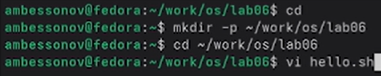

---
## Author
author:
  name: Бессонов Андрей Максимович
  degrees: DSc
  orcid: 0000-0002-0877-7063
  email: 1032253499@rudn.ru
  affiliation:
    - name: Российский университет дружбы народов
      country: Российская Федерация
      postal-code: 117198
      city: Москва
      address: ул. Миклухо-Маклая, д. 6
## Title
title: Презентация лабораторной работы №10
subtitle: Текстовой редактор vi
license: CC BY
date: 2026-04-04
---

# Информация

## Докладчик

:::::::::::::: {.columns align=center}
::: {.column width="70%"}

  * Бессонов Андрей Максимович
  * Студент 1-го курса
  * Группа НКАбд-01-25
  * Российский университет дружбы народов им. П. Лумумбы

:::
::: {.column width="30%"}

:::
::::::::::::::

# Вводная часть

## Актуальность

- Редактор `vi` (Visual display editor) входит в состав практически всех UNIX-подобных систем.
- Знание `vi` необходимо для работы в средах без графического интерфейса (серверы, встраиваемые системы).
- `vi` обладает высокой эффективностью при редактировании текстов и кода благодаря режимам и клавиатурным командам.

## Объект и предмет исследования

- **Объект:** Операционная система Linux, её текстовые редакторы.

- **Предмет:** Редактор `vi`: режимы работы, команды навигации и редактирования, работа с файлами, опции.

## Цели и задачи

- **Цель:** Познакомиться с ОС Linux, получить практические навыки работы с редактором `vi`.

- **Задачи:**
    1. Изучить три режима работы `vi` (командный, вставки, последней строки).
    2. Освоить команды управления курсором, позиционирования, перемещения по файлу.
    3. Научиться вставлять, удалять, изменять текст.
    4. Освоить команды отмены изменений.
    5. Научиться сохранять файл и выходить из редактора.
    6. Создать и отредактировать bash-скрипт `hello.sh`.

## Материалы и методы

- **Оборудование:** ПК с ОС Linux (Fedora).
- **Программное обеспечение:** Текстовый редактор `vi`, эмулятор терминала.
- **Методы:** Работа в командной строке, выполнение заданий по методическим указаниям, создание и отладка bash-скрипта.

---

# Выполнение работы

## Задание 1. Создание нового файла hello.sh

- Создан каталог `~/work/os/lab06` и переход в него:
  ```bash
  mkdir -p ~/work/os/lab06
  cd ~/work/os/lab06
  ```
- Вызов `vi` для создания файла `hello.sh`:
  ```bash
  vi hello.sh
  ```



## Ввод текста в файл hello.sh

- В режиме вставки (`i`) введён следующий код:

```bash
#!/bin/bash
HELL=Hello
function hello {
    LOCAL HELLO=World
    echo $HELLO
}
echo $HELLO
hello
```


## Сохранение и попытка выполнения

- После ввода текста нажата `Esc` (командный режим), затем `:wq` – сохранение и выход.
- Файл сделан исполняемым: `chmod +x hello.sh`.
- Запуск: `./hello.sh` – обнаружена ошибка (команда `LOCAL` не найдена).


## Задание 2. Редактирование hello.sh

1. Открыт файл для редактирования: `vi ~/work/os/lab06/hello.sh`.
2. Исправление `HELL` → `HELLO` (курсор, `i`, замена, `Esc`).
3. Исправление `LOCAL` → `local` (удаление словом `dw`, вставка `i`, `local`, `Esc`).
4. Добавление новой строки в конец файла (`G`, `o`, текст `echo $HELLO`, `Esc`).
5. Удаление последней строки (`dd`).
6. Отмена удаления (`u`).
7. Сохранение и выход (`:wq`).


## Проверка работоспособности скрипта

- Повторный запуск: `./hello.sh`
- Вывод программы:
  ```
  Hello
  World
  Hello
  ```


---

# Заключение

## Результаты работы

В ходе лабораторной работы были освоены:

1. **Три режима `vi`**:
   - Командный (навигация, удаление, копирование).
   - Вставки (ввод текста).
   - Последней строки (сохранение, выход, настройка).

2. **Команды навигации**:
   - `h`, `j`, `k`, `l` – перемещение по символам.
   - `w`, `b` – по словам.
   - `0`, `$` – начало/конец строки.
   - `G`, `gg` – конец/начало файла.

3. **Команды редактирования**:
   - `i`, `a`, `o`, `O` – вставка.
   - `dw`, `dd`, `x` – удаление.
   - `u` – отмена последнего действия.

4. **Работа с файлами**:
   - `:w` – сохранить.
   - `:q` – выйти.
   - `:wq` – сохранить и выйти.
   - `:q!` – выйти без сохранения.

5. **Создание и отладка bash-скрипта** с использованием `vi`.

## Вывод

Приобретённые навыки работы с `vi` позволяют эффективно редактировать текстовые файлы и скрипты в среде командной строки Linux. `vi` является мощным инструментом, знание которого необходимо для системных администраторов, разработчиков и всех, кто работает с UNIX-подобными системами. В ходе выполнения работы был успешно создан и отлажен bash-скрипт, демонстрирующий работу локальной и глобальной переменных.


