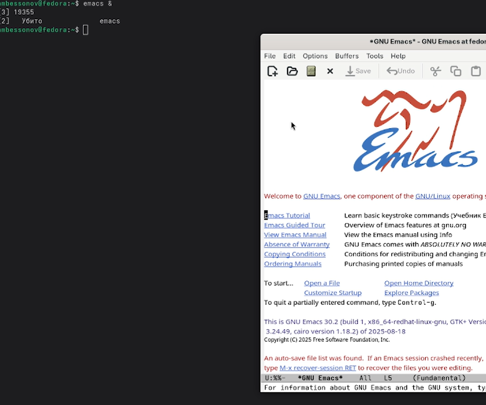
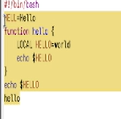

---
## Author
author:
  name: Бессонов Андрей Максимович
  degrees: DSc
  orcid: 0000-0002-0877-7063
  email: 1032253499@rudn.ru
  affiliation:
    - name: Российский университет дружбы народов
      country: Российская Федерация
      postal-code: 117198
      city: Москва
      address: ул. Миклухо-Маклая, д. 6
## Title
title: "Лабораторная работа №11"
license: "CC BY"
---

# Цель работы

Познакомиться с операционной системой Linux. Получить практические навыки работы с редактором Emacs.

# Теоретическое введение

## Основные понятия Emacs

Emacs — мощный экранный редактор текста, написанный на языке Elisp. Он предоставляет широкие возможности для редактирования, программирования, работы с файлами и буферами.

**Буфер** — объект, представляющий какой-либо текст (файл, результат команды, подсказки).  
**Фрейм** — графическое окно (в обычном понимании), содержит область вывода и одно или несколько окон Emacs.  
**Окно** — прямоугольная область фрейма, отображающая один из буферов.  
**Область вывода** — одна или несколько строк внизу фрейма для сообщений и запросов.  
**Минибуфер** — используется для ввода дополнительной информации, всегда находится в области вывода.  
**Точка вставки** — место вставки/удаления данных в буфере.

## Основные комбинации клавиш

| Комбинация | Действие |
|------------|----------|
| `C-x C-f` | Открыть файл |
| `C-x C-s` | Сохранить буфер |
| `C-x C-c` | Выйти из Emacs |
| `C-g` | Прервать текущую операцию |
| `C-k` | Удалить строку от курсора до конца |
| `C-y` | Вставить из кольца удалений |
| `C-space` | Начать выделение области |
| `M-w` | Скопировать выделенную область |
| `C-w` | Вырезать выделенную область |
| `C-/` (или `C-x u`) | Отменить последнее действие |
| `C-a` / `C-e` | Начало / конец строки |
| `M-<` / `M->` | Начало / конец буфера |
| `C-x C-b` | Показать список буферов |
| `C-x b` | Переключиться на другой буфер |
| `C-x 2` | Разделить окно по горизонтали |
| `C-x 3` | Разделить окно по вертикали |
| `C-x o` | Переключиться на другое окно |
| `C-x 0` | Закрыть текущее окно |
| `C-s` | Поиск вперёд |
| `M-%` | Поиск с заменой |

# Выполнение лабораторной работы

В ходе работы были последовательно выполнены все задания согласно описанию.

## 1. Запуск Emacs

В терминале введена команда:
```bash
emacs &
```
Открылся стартовый экран GNU Emacs.



## 2. Создание файла `lab07.sh`

Нажата комбинация `C-x C-f`, в минибуфере введено имя `lab07.sh`. Создан новый буфер.

## 3. Ввод текста

В процессе выполнения различных операций текст изменялся. На скриншотах представлены разные варианты содержимого файла.





### 4. Сохранение файла

Выполнено `C-x C-s`. Файл сохранён на диск.

## 5. Стандартные процедуры редактирования

5.1 **Вырезать целую строку** — курсор установлен на строке `echo $HELLO`, нажато `C-k`. Строка удалена и помещена в кольцо удалений.  
5.2 **Вставить строку в конец файла** — перемещение в конец буфера (`M->`), вставка (`C-y`).  
5.3 **Выделить область текста** — курсор в начало первой строки, нажато `C-space`, затем перемещение в конец последней строки (`C-e`). Область подсвечена.  
5.4 **Скопировать область в буфер обмена** — нажато `M-w`.  
5.5 **Вставить скопированную область в конец файла** — `M->`, затем `C-y`.  
5.6 **Вырезать эту же область** — повторное выделение, затем `C-w`.  
5.7 **Отменить последнее действие** — нажато `C-/`. Область восстановлена.

## 6. Перемещение курсора

Опробованы команды:
- `C-a` — переход в начало строки,
- `C-e` — в конец строки,
- `M-<` — в начало буфера,
- `M->` — в конец буфера.

## 7. Управление буферами

7.1 **Вывести список активных буферов** — `C-x C-b`. Открыто окно со списком.


7.2 **Переключиться в другое окно и выбрать другой буфер** — `C-x o` для перехода в окно со списком, затем выбор буфера (например, `*scratch*`) и `Enter`.  
7.3 **Закрыть окно со списком** — `C-x 0`.  
7.4 **Переключиться между буферами без вывода списка** — `C-x b`, ввести имя буфера (например, `lab07.sh`).

## 8. Управление окнами

8.1 **Разделить фрейм на 4 части** — выполнено `C-x 3` (вертикальное разделение), затем в каждом из двух окон `C-x 2` (горизонтальное разделение). Получено 4 окна.  
8.2 **Открыть новые буферы в каждом окне** — в каждом окне через `C-x C-f` созданы файлы `file1.txt`, `file2.txt`, `file3.txt`, `file4.txt`, в каждом набрано несколько строк текста.

## 9. Режимы поиска

9.1 **Обычный поиск вперёд** — `C-s`, введено искомое слово `hello`. Emacs подсветил совпадения.  
9.2 **Переход между результатами** — повторное нажатие `C-s` перемещает курсор к следующему совпадению.  
9.3 **Выход из поиска** — `C-g`.  
9.4 **Поиск с заменой** — `M-%`, введено `hello` → `hi`, для замены всех вхождений нажато `!`.  
9.5 **Альтернативный режим поиска** — `M-s o`. Отличие от обычного поиска: позволяет искать по регулярным выражениям (например, `h.llo` найдёт `hello`, `hallo` и т.п.).

# Выводы

В ходе выполнения лабораторной работы были освоены основные приёмы работы в редакторе Emacs:
- создание и сохранение файлов;
- редактирование текста с использованием комбинаций клавиш (удаление, вставка, копирование, вырезание, отмена действий);
- навигация по тексту (по строкам, по буферу);
- управление буферами (список, переключение, закрытие);
- управление окнами (разделение, переключение между окнами);
- организация поиска и замены текста, включая использование регулярных выражений.

Полученные навыки позволяют эффективно работать с текстовыми файлами и программным кодом в среде Linux без использования графического интерфейса.


# Контрольные вопросы

## Кратко охарактеризуйте редактор Emacs.

Emacs — это многофункциональный расширяемый текстовый редактор, работающий в режиме экранного редактирования. Он поддерживает множество режимов для различных языков программирования, имеет встроенную справку, позволяет работать с буферами и окнами, а также может быть настроен пользователем с помощью языка Elisp.

## Какие особенности данного редактора могут сделать его сложным для освоения новичком?

- Обилие комбинаций клавиш (многие действия не интуитивны).  
- Отсутствие стандартных для Windows/Linux сочетаний (например, `Ctrl+S` не сохраняет, а запускает поиск).  
- Терминология (буферы, фреймы, минибуфер) отличается от привычной.  
- Высокая степень настраиваемости требует изучения языка Elisp.

## Своими словами опишите, что такое буфер и окно в терминологии Emacs’а.

**Буфер** — это область памяти, содержащая текст (например, содержимое файла, вывод команды, справочная информация). Буфер может быть связан с файлом на диске или быть временным.  
**Окно** — это видимая прямоугольная область внутри фрейма (графического окна), которая отображает содержимое какого-либо буфера. Один фрейм может содержать несколько окон, показывающих разные буферы или разные части одного буфера.

## Можно ли открыть больше 10 буферов в одном окне?

Да. Количество буферов ограничено только доступной памятью. Окно может отображать только один буфер в данный момент, но переключаться между буферами можно в любом количестве.

## Какие буферы создаются по умолчанию при запуске Emacs?

При запуске создаются буферы:  
- `*GNU Emacs*` — приветственный экран;  
- `*scratch*` — черновик для ввода выражений Elisp;  
- `*Messages*` — системные сообщения;  
- возможно, `*Backtrace*` при ошибках.

## Какие клавиши вы нажмёте, чтобы ввести следующую комбинацию `C-c |` и `C-c C-|`?

- Для `C-c |`: удерживая `Ctrl`, нажать `c`, отпустить, затем удерживая `Ctrl`, нажать `|` (обычно `Shift+\`).  
- Для `C-c C-|`: удерживая `Ctrl`, нажать `c`, затем, не отпуская `Ctrl`, нажать `|` (или `Shift+\`).

## Как поделить текущее окно на две части?

- По горизонтали: `C-x 2`.  
- По вертикали: `C-x 3`.

## В каком файле хранятся настройки редактора Emacs?

Настройки хранятся в файле `~/.emacs` или `~/.emacs.d/init.el` (в домашнем каталоге пользователя).

## Какую функцию выполняет клавиша `|` и можно ли её переназначить?

Символ `|` (вертикальная черта) обычно вводится как обычный символ. В Emacs любая клавиша может быть переназначена с помощью `global-set-key` или `define-key`. Например, чтобы привязать `|` к какой-то команде, можно использовать `(global-set-key (kbd "|") 'имя-команды)`.

## Какой редактор вам показался удобнее в работе vi или Emacs? Поясните почему.

Emacs показался удобнее, так как он предоставляет более привычную модель редактирования без модальности (не нужно переключаться между режимами ввода и команд). Кроме того, встроенная система меню и интерактивный учебник облегчают освоение. Однако vi (vim) быстрее для небольших правок благодаря лаконичным командам. Выбор зависит от задачи: для программирования и сложной настройки удобнее Emacs, для быстрого редактирования конфигов — vi.


# Список литературы{.unnumbered}
::: {#refs}
:::

# ********
