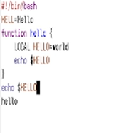
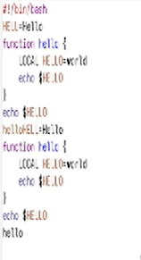
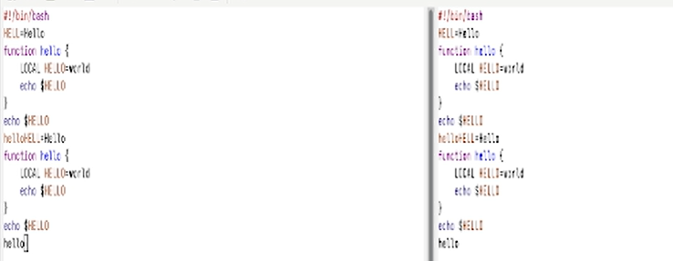
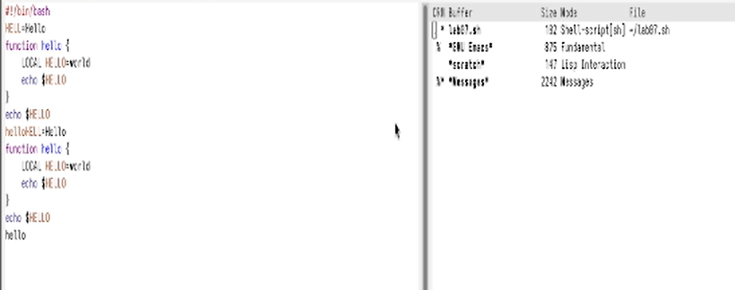

---
## Author
author:
  name: Бессонов Андрей Максимович
  degrees: DSc
  orcid: 0000-0002-0877-7063
  email: 1032253499@rudn.ru
  affiliation:
    - name: Российский университет дружбы народов
      country: Российская Федерация
      postal-code: 117198
      city: Москва
      address: ул. Миклухо-Маклая, д. 6
## Title
title: Презентация лабораторной работы №11
subtitle: Текстовой редактор Emacs
license: CC BY
date: 2026-04-04
---

# Информация

## Докладчик

:::::::::::::: {.columns align=center}
::: {.column width="70%"}

  * Бессонов Андрей Максимович
  * Студент 1-го курса
  * Группа НКАбд-01-25
  * Российский университет дружбы народов им. П. Лумумбы

:::
::: {.column width="30%"}

:::
::::::::::::::

# Вводная часть

## Актуальность

- Emacs — один из мощнейших текстовых редакторов в экосистеме GNU/Linux.
- Расширяемость (язык Elisp) позволяет адаптировать редактор под любые задачи.
- Навыки работы в Emacs полезны для программирования, написания документации и системного администрирования.

## Объект и предмет исследования

- **Объект:** Операционная система Linux, её инструменты для работы с текстом.

- **Предмет:** Редактор Emacs: буферы, окна, основные режимы редактирования, поиск и замена, управление буферами и окнами.

## Цели и задачи

- **Цель:** Познакомиться с операционной системой Linux. Получить практические навыки работы с редактором Emacs.

- **Задачи:**
    1. Изучить основные термины Emacs (буфер, окно, фрейм, минибуфер).
    2. Освоить базовые комбинации клавиш для редактирования и навигации.
    3. Научиться управлять буферами и окнами.
    4. Овладеть режимами поиска и замены текста.
    5. Выполнить все упражнения из лабораторной работы.

## Материалы и методы

- **Оборудование:** ПК с операционной системой Linux (Fedora).
- **Программное обеспечение:** GNU Emacs, эмулятор терминала.
- **Методы:** Практическая работа в редакторе, использование встроенной справки (`C-h t`, `C-h k`), выполнение заданий в соответствии с методическими указаниями.

---

# Выполнение работы

## 1. Запуск Emacs и создание файла
- Запуск: `emacs &` в терминале.
- Открылся стартовый экран GNU Emacs.

- Создание файла `lab07.sh` через `C-x C-f`.

## 2. Ввод и редактирование текста
- На разных этапах работы текст изменялся (вырезание, вставка, копирование).

## 3. Стандартные процедуры редактирования
- Вырезать строку: `C-k`.
- Вставить в конец файла: `M->` → `C-y`.
- Выделить область: `C-space` → переместить курсор.
- Скопировать область: `M-w`.
- Вставить копию: `C-y`.
- Вырезать область: `C-w`.
- Отменить действие: `C-/`.

## 4. Перемещение курсора
- `C-a` — начало строки
- `C-e` — конец строки
- `M-<` — начало буфера
- `M->` — конец буфера

## 5. Управление буферами
- Список буферов: `C-x C-b`

- Переключение в другое окно: `C-x o`
- Выбор другого буфера: `C-x b` (с именем) или из списка
- Закрыть окно: `C-x 0`

## 6. Управление окнами
- Разделение по вертикали: `C-x 3`
- Разделение по горизонтали: `C-x 2`
- Получено 4 окна (2 вертикальных × 2 горизонтальных)
- В каждом окне через `C-x C-f` созданы новые файлы (`file1.txt`…`file4.txt`) и набран текст.

## 7. Режимы поиска
- Поиск вперёд: `C-s` → ввод слова → `C-s` для следующего совпадения
- Выход из поиска: `C-g`
- Поиск с заменой: `M-%` → образец → строка замены → `!` (заменить все)
- Альтернативный поиск (`M-s o`) — по регулярным выражениям (отличие от `C-s`)

---

# Заключение

## Результаты работы

В ходе лабораторной работы были освоены:

1. **Основные термины Emacs** – буфер, окно, фрейм, минибуфер, точка вставки.
2. **Базовые комбинации клавиш** – навигация, удаление, вставка, копирование, отмена.
3. **Управление буферами** – просмотр списка, переключение, закрытие окон.
4. **Управление окнами** – разделение по горизонтали и вертикали, переключение между окнами.
5. **Поиск и замена** – прямой поиск, поиск с заменой, использование регулярных выражений.

## Вывод

Приобретённые навыки позволяют эффективно работать с текстовыми файлами и программным кодом в среде Linux без использования графического интерфейса. Emacs является мощным инструментом, который после освоения базовых комбинаций становится удобной средой для редактирования, программирования и настройки системы.

