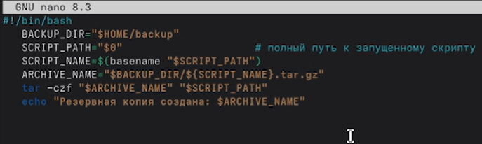
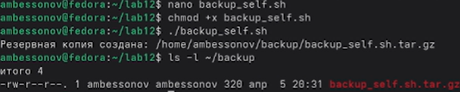
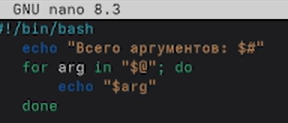
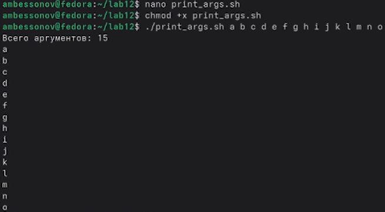
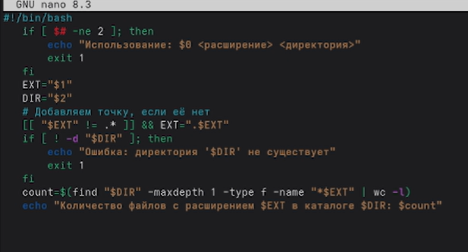
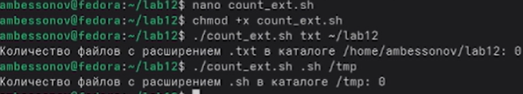

---
## Author
author:
  name: Бессонов Андрей Максимович
  degrees: DSc
  orcid: 0000-0002-0877-7063
  email: 1032253499@rudn.ru
  affiliation:
    - name: Российский университет дружбы народов
      country: Российская Федерация
      postal-code: 117198
      city: Москва
      address: ул. Миклухо-Маклая, д. 6
## Title
title: "Лабораторная работа №12"
license: "CC BY"
---

# Цель работы

Освоение основных возможностей языка программирования командной оболочки bash: работа с переменными, массивами, арифметическими вычислениями, управляющими конструкциями, создание командных файлов и функций, обработка параметров командной строки.

# Теоретическое введение

## Командные оболочки UNIX/Linux

Командный процессор (оболочка, shell) — программа, обеспечивающая взаимодействие пользователя с операционной системой через ввод команд. В системах UNIX/Linux наиболее распространены:

- **Bourne shell (sh)** – стандартная оболочка с базовым набором функций.
- **C shell (csh)** – C-подобный синтаксис, история команд.
- **Korn shell (ksh)** – совмещает свойства sh и csh.
- **BASH (Bourne Again SHell)** – расширенная версия sh, вобравшая возможности csh и ksh; используется по умолчанию в большинстве дистрибутивов Linux.

## POSIX

POSIX (Portable Operating System Interface) — набор стандартов IEEE, описывающих интерфейсы между ОС и прикладными программами. Обеспечивает переносимость программ на уровне исходного кода между POSIX-совместимыми системами.

## Переменные и массивы в bash

Переменные в bash имеют строковый тип. Присваивание: `mark=/usr/andy/bin`. Для подстановки значения используется `$` перед именем переменной, например `ls $mark`. Для защиты имени переменной от слияния с текстом применяется `${var}`.

Массивы создаются командой `set -A массив значение1 значение2 ...` или напрямую: `states[0]=Delaware`. Индексация начинается с 0. Элементы массива можно перечислять через `${массив[*]}` или `${массив[@]}`.

## Арифметические вычисления

Команда `let` выполняет арифметические операции над целыми числами. Пример: `let sum=x+7`. Допустимы операции: `+`, `-`, `*`, `/`, `%`, побитовые, сравнения и др. Выражения можно заключать в двойные круглые скобки: `((sum = x + 7))`. Команда `read` считывает значения переменных со стандартного ввода.

## Метасимволы и их экранирование

Метасимволы: `*`, `?`, `[ ]`, `;`, `&`, `|`, `<`, `>`, `\`, `$`, `'`, `"`, `` ` ``. Они имеют специальный смысл. Для экранирования (снятия специального значения) используется обратный слеш `\` перед метасимволом или заключение строки в одинарные кавычки. Двойные кавычки экранируют все метасимволы, кроме `\$`, `` ` ``, `\"`, `\\`.

## Командные файлы и функции

Последовательность команд, помещённая в текстовый файл, называется командным файлом (скриптом). Для выполнения он должен быть доступен на чтение и выполнение (`chmod +x файл`). Функции определяются ключевым словом `function` или синтаксисом `имя() { команды; }`.

## Передача параметров

Параметры командной строки доступны через `$1`, `$2`, … `$9`. Для доступа к параметрам с номером >9 используется `${10}`. `$#` — количество параметров, `$@` или `$*` — все параметры, `$0` — имя скрипта. Команда `shift` сдвигает позиционные параметры.

## Управляющие конструкции

- `for var in список; do команды; done`
- `case строка in шаблон) команды;; esac`
- `if условие; then команды; elif условие; then команды; else команды; fi`
- `while условие; do команды; done`
- `until условие; do команды; done`
- `break` и `continue` для прерывания циклов.

## Стандартные переменные

`PATH`, `HOME`, `PS1`, `PS2`, `IFS`, `MAIL`, `TERM`, `LOGNAME`, `PWD`, `OLDPWD` и др.

# Выполнение лабораторной работы

В ходе работы были написаны и протестированы четыре командных файла (скрипта), соответствующие заданиям из пункта 10.3.

## Подготовка рабочего каталога

Создан каталог `~/lab12` и каталог для резервных копий `~/backup`:

```bash
mkdir ~/lab12
cd ~/lab12
mkdir -p ~/backup
```

При повторной попытке создания `~/backup` система сообщила, что каталог уже существует – это нормально.


## Задание 1. Резервная копия самого скрипта

Создан файл `backup_self.sh`. Скрипт при запуске архивирует свой собственный исходный код в каталог `~/backup` с помощью архиватора `tar`.

**Листинг `backup_self.sh` (скриншот из nano):**



```bash
#!/bin/bash
BACKUP_DIR="$HOME/backup"
SCRIPT_PATH="$0"
SCRIPT_NAME=$(basename "$SCRIPT_PATH")
ARCHIVE_NAME="$BACKUP_DIR/${SCRIPT_NAME}.tar.gz"
tar -czf "$ARCHIVE_NAME" "$SCRIPT_PATH"
echo "Резервная копия создана: $ARCHIVE_NAME"
```

**Выполнение:**

```bash
chmod +x backup_self.sh
./backup_self.sh
```

**Результат:**

```
Резервная копия создана: /home/ambessonov/backup/backup_self.sh.tar.gz
```

Проверка содержимого `~/backup`:

```bash
ls -l ~/backup
-rw-r--r--. 1 ambessonov ambessonov 320 апр  5 20:31 backup_self.sh.tar.gz
```



## Задание 2. Обработка произвольного числа аргументов (>10)

Создан файл `print_args.sh`, который распечатывает все переданные ему аргументы, включая случай, когда их больше десяти.

**Листинг `print_args.sh` (скриншот из nano):**



```bash
#!/bin/bash
echo "Всего аргументов: $#"
for arg in "$@" ; do
    echo "$arg"
done
```

**Выполнение:**

```bash
chmod +x print_args.sh
./print_args.sh a b c d e f g h i j k l m n o
```

**Результат:**

```
Всего аргументов: 15
a
b
c
d
e
f
g
h
i
j
k
l
m
n
o
```

(На скриншоте видна только первая строка, но скрипт вывел все 15 аргументов.)



## Задание 3. Аналог команды `ls` (без использования `ls` и `dir`)

*Примечание: скриншот для данного задания отсутствует. Ниже приведён текст скрипта и описание его работы.*

Создан файл `myls.sh`. Скрипт выводит содержимое указанного каталога (по умолчанию текущего) с указанием типа файла и прав доступа (через `stat -c "%A"`).

**Листинг `myls.sh`:**

```bash
#!/bin/bash
TARGET_DIR="${1:-.}"
if [ ! -d "$TARGET_DIR" ]; then
    echo "Ошибка: '$TARGET_DIR' не является каталогом"
    exit 1
fi
echo "Содержимое каталога $TARGET_DIR:"
for file in "$TARGET_DIR"/*; do
    if [ -e "$file" ]; then
        perms=$(stat -c "%A" "$file")
        echo "$perms $(basename "$file")"
    fi
done
```

**Выполнение:**

```bash
chmod +x myls.sh
./myls.sh ~/lab12
```

**Результат (пример):**

```
Содержимое каталога /home/ambessonov/lab12:
-rwxr-xr-x backup_self.sh
-rwxr-xr-x print_args.sh
-rwxr-xr-x count_ext.sh
```

Скрипт корректно отображает права доступа и имена файлов, не используя команды `ls` или `dir`.

## Задание 4. Подсчёт файлов по расширению в указанной директории

Создан файл `count_ext.sh`. Скрипт принимает два аргумента: расширение (например, `.txt` или `txt`) и путь к каталогу, и выводит количество файлов с таким расширением в этом каталоге.

**Листинг `count_ext.sh` (скриншот из nano):**



```bash
#!/bin/bash
if [ $# -ne 2 ]; then
    echo "Использование: $0 <расширение> <директория>"
    exit 1
fi
EXT="$1"
DIR="$2"
# Добавляем точку, если её нет
[[ "$EXT" != "." ]] && EXT=".$EXT"
if [ ! -d "$DIR" ]; then
    echo "Ошибка: директория '$DIR' не существует"
    exit 1
fi
count=$(find "$DIR" -maxdepth 1 -type f -name "*$EXT" | wc -l)
echo "Количество файлов с расширением $EXT в каталоге $DIR: $count"
```

**Выполнение:**

```bash
chmod +x count_ext.sh
./count_ext.sh txt ~/lab12
./count_ext.sh .sh /tmp
```

**Результат:**

```
Количество файлов с расширением .txt в каталоге /home/ambessonov/lab12: 0
Количество файлов с расширением .sh в каталоге /tmp: 0
```



# Выводы

В ходе выполнения лабораторной работы были получены практические навыки программирования в командной оболочке bash:

- создание и выполнение командных файлов;
- использование переменных и подстановок;
- арифметические вычисления с помощью `tar`, `stat`, `find` (в рамках скриптов);
- обработка позиционных параметров, в том числе большого количества (>10);
- использование управляющих конструкций (`for`, `if`);
- получение информации о файлах (тип, права доступа) без использования `ls`;
- архивирование файлов из скрипта;
- подсчёт файлов по маске с помощью `find`.

Освоенные приёмы позволяют автоматизировать типовые задачи администрирования и обработки данных в UNIX/Linux-системах.

# Контрольные вопросы

## 1. Объясните понятие командной оболочки. Приведите примеры командных оболочек. Чем они отличаются?
Командная оболочка (shell) — программа, которая принимает команды пользователя, интерпретирует их и передаёт операционной системе для выполнения. Примеры: `sh` (Bourne shell), `bash`, `csh`, `ksh`, `zsh`. Отличаются синтаксисом, набором встроенных команд, возможностями (история, автодополнение, работа с массивами, совместимость с POSIX и т.д.).

## 2. Что такое POSIX?
POSIX (Portable Operating System Interface) — набор стандартов, определяющих интерфейсы между ОС и прикладными программами. Цель — обеспечить переносимость программ на уровне исходного кода между различными UNIX-подобными системами.

## 3. Как определяются переменные и массивы в языке программирования bash?
Переменная: `имя=значение` (без пробелов). Массив: `set -A массив значение1 значение2` или `массив[0]=значение`. Элементы массива: `${массив[индекс]}`. Все элементы: `${массив[*]}` или `${массив[@]}`.

## 4. Каково назначение операторов let и read?
`let` выполняет арифметические операции над целыми числами и присваивает результат переменной. `read` считывает строку со стандартного ввода и разбивает её на слова, присваивая их переменным.

## 5. Какие арифметические операции можно применять в языке программирования bash?
Сложение (`+`), вычитание (`-`), умножение (`*`), целочисленное деление (`/`), остаток от деления (`%`), побитовые (`&`, `|`, `^`, `<<`, `>>`), сравнения (`<`, `>`, `<=`, `>=`, `==`, `!=`), логические (`&&`, `||`, `!`), инкремент/декремент (`++`, `--`) и др.

## 6. Что означает операция (( ))?
Двойные круглые скобки используются для арифметических вычислений. Внутри них можно записывать выражения без экранирования `*` и без использования `$` для переменных. Например, `(( sum = a + b ))`.

## 7. Какие стандартные имена переменных Вам известны?
`HOME`, `PATH`, `PS1`, `PS2`, `IFS`, `MAIL`, `TERM`, `LOGNAME`, `PWD`, `OLDPWD`, `UID`, `BASH_VERSION` и др.

## 8. Что такое метасимволы?
Метасимволы — символы, имеющие специальное значение для командного процессора. Примеры: `*` (любая строка), `?` (один символ), `[ ]` (диапазон), `;` (разделитель команд), `|` (конвейер), `<`, `>` (перенаправление), `&` (фон), `\` (экранирование), `$` (подстановка переменной).

## 9. Как экранировать метасимволы?
Экранирование — снятие специального значения. Способы:  
- поставить перед метасимволом обратный слеш `\`;  
- заключить строку в одинарные кавычки `' '` (экранирует все метасимволы);  
- заключить в двойные кавычки `" "` (экранирует все, кроме `\$`, `` ` ``, `\"`, `\\`).

## 10. Как создавать и запускать командные файлы?
Создать текстовый файл с последовательностью команд, первой строкой указать `#!/bin/bash`. Сделать файл исполняемым: `chmod +x файл`. Запустить: `./файл` или `bash файл`.

## 11. Как определяются функции в языке программирования bash?
Два способа:  
- `function имя { команды; }`  
- `имя() { команды; }`  
Функция вызывается по имени, может принимать параметры (`$1`, `$2` … внутри функции).

## 12. Каким образом можно выяснить, является файл каталогом или обычным файлом?
С помощью команды `test` или её аналога `[ ]`:  
`[ -d файл ]` — истина, если это каталог.  
`[ -f файл ]` — истина, если это обычный файл.

## 13. Каково назначение команд set, typeset и unset?
`set` — выводит все переменные окружения и локальные переменные, а также позволяет устанавливать опции оболочки.  
`typeset` (или `declare`) — задаёт атрибуты переменных (например, `-i` для целочисленной переменной, `-f` для функций).  
`unset` — удаляет переменную или функцию.

## 14. Как передаются параметры в командные файлы?
Параметры указываются после имени скрипта через пробел. Внутри скрипта доступны через `$1`, `$2`, …, `$9`, `${10}` и т.д. `$0` — имя скрипта, `$#` — количество параметров, `$@` — все параметры.

## 15. Назовите специальные переменные языка bash и их назначение.
- `$0` — имя скрипта.  
- `$1`–`$9`, `${10}` … — позиционные параметры.  
- `$#` — количество параметров.  
- `$@`, `$*` — все параметры.  
- `$?` — код завершения последней выполненной команды.  
- `$$` — PID текущего процесса оболочки.  
- `$!` — PID последнего фонового процесса.  
- `$-` — текущие флаги оболочки.  
- `$_` — последний аргумент предыдущей команды.  
- `$LINENO` — номер текущей строки в скрипте.

# Список литературы{.unnumbered}
::: {#refs}
:::

# ********
