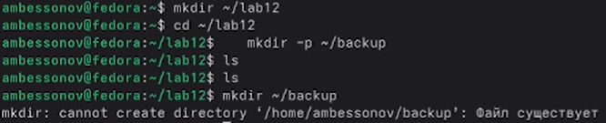

---
## Author
author:
  name: Бессонов Андрей Максимович
  degrees: DSc
  orcid: 0000-0002-0877-7063
  email: 1032253499@rudn.ru
  affiliation:
    - name: Российский университет дружбы народов
      country: Российская Федерация
      postal-code: 117198
      city: Москва
      address: ул. Миклухо-Маклая, д. 6
## Title
title: Презентация лабораторной работы №12
subtitle: Программирования командной оболочки bash.
license: CC BY
date: 2026-04-04
---

# Информация

## Докладчик

:::::::::::::: {.columns align=center}
::: {.column width="70%"}

  * Бессонов Андрей Максимович
  * Студент 1-го курса
  * Группа НКАбд-01-25
  * Российский университет дружбы народов им. П. Лумумбы

:::
::: {.column width="30%"}

:::
::::::::::::::

# Вводная часть

## Актуальность

- Командная оболочка bash является стандартом де-факто в UNIX/Linux системах.
- Навыки написания скриптов позволяют автоматизировать рутинные задачи администратора и пользователя.
- Понимание работы с переменными, циклами, условиями и параметрами необходимо для эффективной работы в командной строке.

## Объект и предмет исследования

- **Объект:** Операционная система Linux, её командный интерпретатор bash.

- **Предмет:** Язык программирования командной оболочки bash: переменные, массивы, арифметические операции, управляющие конструкции, создание командных файлов, обработка параметров.

## Цели и задачи

- **Цель:** Освоение основных возможностей языка программирования bash. Приобретение навыков написания командных файлов (скриптов) для автоматизации задач.

- **Задачи:**
    1. Научиться создавать и выполнять командные файлы.
    2. Освоить работу с переменными и массивами.
    3. Изучить арифметические вычисления с помощью `let` и `(( ))`.
    4. Научиться обрабатывать произвольное число параметров командной строки.
    5. Реализовать аналог команды `ls` без использования самой `ls`.
    6. Написать скрипт для подсчёта файлов по расширению.
    7. Создать скрипт для резервного копирования самого себя.

## Материалы и методы

- **Оборудование:** ПК с операционной системой Linux (Fedora).
- **Программное обеспечение:** Терминал, текстовый редактор nano, командная оболочка bash, архиватор tar.
- **Методы:** Написание скриптов в соответствии с методическими указаниями, выполнение и отладка в терминале, использование справочной системы (`man bash`, `man tar`).

---

# Выполнение работы

## 1. Подготовка рабочего окружения

- Создан каталог `~/lab12` и каталог для резервных копий `~/backup`:
  ```bash
  mkdir ~/lab12
  cd ~/lab12
  mkdir -p ~/backup
  ```
- При повторном вызове `mkdir ~/backup` получено сообщение «Файл существует» – каталог уже создан.



## 2. Задание 1: резервная копия самого скрипта

- Создан файл `backup_self.sh` в редакторе nano.
- Скрипт архивирует свой собственный код в `~/backup` с помощью `tar`.


**Код:**
```bash
#!/bin/bash
BACKUP_DIR="$HOME/backup"
SCRIPT_PATH="$0"
SCRIPT_NAME=$(basename "$SCRIPT_PATH")
ARCHIVE_NAME="$BACKUP_DIR/${SCRIPT_NAME}.tar.gz"
tar -czf "$ARCHIVE_NAME" "$SCRIPT_PATH"
echo "Резервная копия создана: $ARCHIVE_NAME"
```

- Выполнение:
  ```bash
  chmod +x backup_self.sh
  ./backup_self.sh
  ```
- Результат: создан архив `backup_self.sh.tar.gz` в `~/backup`.


## 3. Задание 2: обработка произвольного числа аргументов

- Создан файл `print_args.sh`, который выводит все переданные аргументы (любое количество, в том числе >10).


**Код:**
```bash
#!/bin/bash
echo "Всего аргументов: $#"
for arg in "$@" ; do
    echo "$arg"
done
```

- Выполнение с 15 аргументами:
  ```bash
  ./print_args.sh a b c d e f g h i j k l m n o
  ```
- Скрипт вывел количество аргументов и каждый из них (на скриншоте видна первая строка).


## 4. Задание 3: аналог команды `ls` (без `ls` и `dir`)

*Примечание: скриншот отсутствует. Ниже приведён код и описание.*

- Создан файл `myls.sh`, который для указанного каталога выводит права доступа и имена файлов, используя `stat -c "%A"`.

**Код `myls.sh`:**
```bash
#!/bin/bash
TARGET_DIR="${1:-.}"
if [ ! -d "$TARGET_DIR" ]; then
    echo "Ошибка: '$TARGET_DIR' не является каталогом"
    exit 1
fi
echo "Содержимое каталога $TARGET_DIR:"
for file in "$TARGET_DIR"/*; do
    if [ -e "$file" ]; then
        perms=$(stat -c "%A" "$file")
        echo "$perms $(basename "$file")"
    fi
done
```

- Пример вывода для `~/lab12`:
  ```
  -rwxr-xr-x backup_self.sh
  -rwxr-xr-x print_args.sh
  -rwxr-xr-x count_ext.sh
  ```

## 5. Задание 4: подсчёт файлов по расширению

- Создан файл `count_ext.sh`. Принимает два аргумента: расширение и путь к каталогу. Выводит количество файлов с данным расширением.


**Код:**
```bash
#!/bin/bash
if [ $# -ne 2 ]; then
    echo "Использование: $0 <расширение> <директория>"
    exit 1
fi
EXT="$1"
DIR="$2"
[[ "$EXT" != "." ]] && EXT=".$EXT"
if [ ! -d "$DIR" ]; then
    echo "Ошибка: директория '$DIR' не существует"
    exit 1
fi
count=$(find "$DIR" -maxdepth 1 -type f -name "*$EXT" | wc -l)
echo "Количество файлов с расширением $EXT в каталоге $DIR: $count"
```

- Проверка:
  ```bash
  ./count_ext.sh txt ~/lab12
  ./count_ext.sh .sh /tmp
  ```
- Результат: в обоих случаях 0 (в каталогах нет файлов с такими расширениями).


---

# Заключение

## Результаты работы

В ходе лабораторной работы были освоены:

1. **Создание и выполнение командных файлов** – использование shebang (`#!/bin/bash`), прав доступа (`chmod +x`).
2. **Переменные и подстановки** – `$HOME`, `$0`, `$#`, `$@`, `${var}`.
3. **Управляющие конструкции** – `for arg in "$@"`, `if`, `test -d`, `[[ ]]`.
4. **Арифметические и строковые операции** – через `tar`, `find`, `stat`, `basename`.
5. **Обработка параметров** – произвольное число аргументов, доступ через `$@`.
6. **Автоматизация задач** – резервное копирование скрипта, подсчёт файлов по расширению.
7. **Работа с файловой системой без стандартных команд** – аналог `ls` на основе `stat`.

## Вывод

Приобретённые навыки позволяют создавать скрипты для автоматизации повседневных задач в UNIX/Linux: резервное копирование, анализ содержимого каталогов, обработку пользовательских данных. Понимание работы bash является фундаментом для системного администрирования и разработки в среде Linux.
