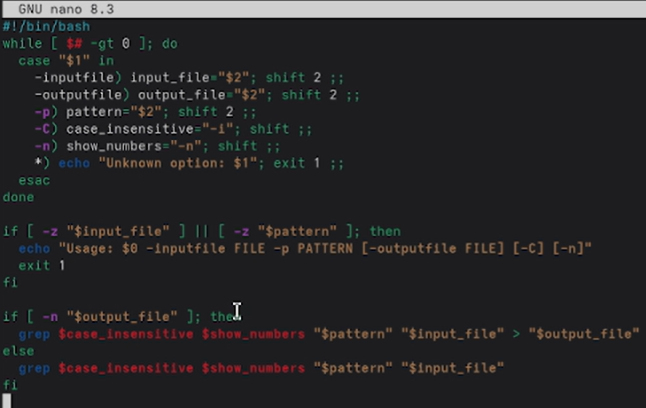
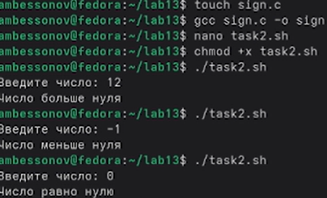
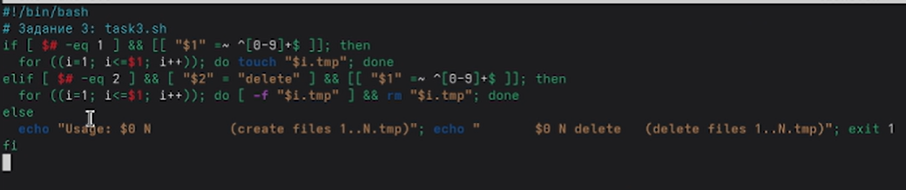
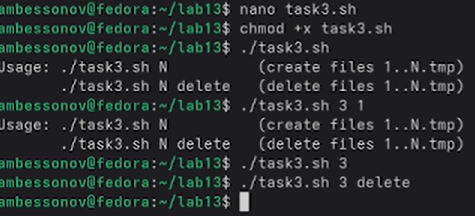
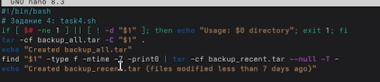
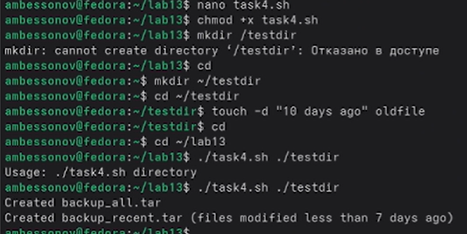

---
## Author
author:
  name: Бессонов Андрей Максимович
  degrees: DSc
  orcid: 0000-0002-0877-7063
  email: 1032253499@rudn.ru
  affiliation:
    - name: Российский университет дружбы народов
      country: Российская Федерация
      postal-code: 117198
      city: Москва
      address: ул. Миклухо-Маклая, д. 6
## Title
title: "Лабораторная работа №13"
license: "CC BY"
---

# Цель работы

Изучить основы программирования в оболочке ОС UNIX. Научиться писать сложные командные файлы с использованием логических управляющих конструкций и циклов, анализировать ключи командной строки, работать с кодом возврата программ, создавать и удалять группы файлов, а также архивировать файлы с фильтрацией по времени изменения.

# Теоретическое введение

## Команда getopts

`getopts` — встроенная команда bash, предназначенная для разбора коротких ключей командной строки. Она позволяет обрабатывать опции вида `-a`, `-b`, `-c` с возможными аргументами. Команда используется внутри цикла `while` и автоматически сдвигает позиционные параметры. Для длинных опций (например, `--inputfile`) применяется внешняя команда `getopt` или ручной разбор.

## Метасимволы и генерация имен файлов

Метасимволы (wildcards) — символы `*`, `?`, `[...]`, которые интерпретируются оболочкой для подстановки имен файлов. Например, `*.txt` раскрывается в список всех файлов с расширением `.txt`. Это позволяет упрощать операции с группами файлов.

## Операторы управления действиями

- `if` — условное выполнение.
- `case` — множественный выбор.
- `for` — цикл с перечислением.
- `while` — цикл с предусловием.
- `until` — цикл с постусловием (повторяет, пока условие ложно).
- `break` — прерывание цикла.
- `continue` — переход к следующей итерации.

## Операторы прерывания цикла

- `break` — немедленный выход из цикла.
- `continue` — переход на следующую итерацию (пропуск оставшейся части тела).

## Команды true и false

`true` всегда возвращает код 0 (успех), `false` — код 1 (ошибка). Используются для организации бесконечных циклов или для явного задания условия.

## Конструкции while и until

- `while` выполняет тело цикла, пока условие истинно (код возврата = 0).
- `until` выполняет тело цикла, пока условие ложно (код возврата ≠ 0). То есть `until команда; do ... done` эквивалентно `while ! команда; do ... done`.

# Выполнение лабораторной работы

В ходе работы были последовательно выполнены все задания.

## 1. Создание рабочей директории

Создана директория `lab13` , выполнен переход в неё.


## 2. Задание 1: Скрипт с разбором ключей

Написан командный файл `task1.sh`, который анализирует ключи `-inputfile`, `-outputfile`, `-p`, `-C`, `-n`. Использован ручной разбор аргументов, так как требуются длинные имена с одним дефисом.

Листинг `task1.sh`:

```bash
#!/bin/bash
while [ $# -gt 0 ]; do
    case "$1" in
    -inputfile) input_file="$2"; shift 2 ;;
    -outputfile) output_file="$2"; shift 2 ;;
    -p) pattern="$2"; shift 2 ;;
    -C) case_insensitive="-i"; shift ;;
    -n) show_numbers="-n"; shift ;;
    *) echo "Unknown option: $1"; exit 1 ;;
    esac
done

if [ -z "$input_file" ] || [ -z "$pattern" ]; then
    echo "Usage: $0 -inputfile FILE -p PATTERN [-outputfile FILE] [-C] [-n]"
    exit 1
fi

if [ -n "$output_file" ]; then
    grep $case_insensitive $show_numbers "$pattern" "$input_file" > "$output_file"
else
    grep $case_insensitive $show_numbers "$pattern" "$input_file"
fi
```

Скрипту даны права на выполнение, создан тестовый файл `data.txt` с содержимым (строка "hello" на 11-й строке). Выполнена проверка:

```bash
./task1.sh -inputfile data.txt -p "hello" -n
```

Результат: вывод `11:hello`. Скрипт отработал корректно.




## 3. Задание 2: Программа на C и анализ кода возврата

Написана программа `sign.c`, которая запрашивает число и завершается с кодом:
- `exit(1)` – число больше нуля;
- `exit(2)` – число меньше нуля;
- `exit(0)` – число равно нулю.

Листинг `sign.c`:

```c
#include <stdio.h>
#include <stdlib.h>

int main() {
    int num;
    printf("Введите число: ");
    scanf("%d", &num);
    if (num > 0)
        exit(1);
    else if (num < 0)
        exit(2);
    else
        exit(0);
}
```

Программа скомпилирована:

```bash
gcc sign.c -o sign
```

Создан скрипт `task2.sh`, который вызывает `sign` и анализирует код возврата `$?` через конструкцию `case`:

```bash
#!/bin/bash
./sign
case $? in
0) echo "Число равно нулю" ;;
1) echo "Число больше нуля" ;;
2) echo "Число меньше нуля" ;;
*) echo "Ошибка выполнения" ;;
esac
```

Скрипт протестирован для разных входных значений. Результат выводится в зависимости от введённого числа.




## 4. Задание 3: Создание и удаление нумерованных файлов

Разработан скрипт `task3.sh`, который создаёт файлы `1.tmp`, `2.tmp`, …, `N.tmp` при запуске с одним аргументом N, и удаляет их при запуске с аргументами `N delete`.

Первоначальный вариант содержал ошибки (использование `$1` вместо `$i` в циклах), но в процессе отладки они были исправлены. Итоговый корректный код:

```bash
#!/bin/bash
if [ $# -eq 1 ] && [[ "$1" =~ ^[0-9]+$ ]]; then
    for ((i=1; i<=$1; i++)); do touch "$i.tmp"; done
    echo "Создано $1 файлов"
elif [ $# -eq 2 ] && [ "$2" = "delete" ] && [[ "$1" =~ ^[0-9]+$ ]]; then
    for ((i=1; i<=$1; i++)); do [ -f "$i.tmp" ] && rm "$i.tmp"; done
    echo "Удалено $1 файлов"
else
    echo "Usage: $0 N    (create files 1..N.tmp)"
    echo "       $0 N delete (delete files 1..N.tmp)"
    exit 1
fi
```

Скрипту даны права на выполнение. Выполнены команды:

```bash
./task3.sh 3      # создание трёх файлов
./task3.sh 3 delete # удаление этих файлов
```

Файлы успешно создавались и удалялись.





## 5. Задание 4: Архивация файлов с фильтром по времени

Создан скрипт `task4.sh`, который принимает путь к директории и выполняет:
- базовую архивацию всех файлов в `backup_all.tar`;
- архивацию только файлов, изменённых менее 7 дней назад, в `backup_recent.tar`.

Листинг `task4.sh`:

```bash
#!/bin/bash
if [ $# -ne 1 ] || [ ! -d "$1" ]; then
    echo "Usage: $0 directory"
    exit 1
fi
tar -cf backup_all.tar -C "$1" .
echo "Created backup_all.tar"
find "$1" -type f -mtime -7 -print0 | tar -cf backup_recent.tar --null -T -
echo "Created backup_recent.tar (files modified less than 7 days ago)"
```

Скрипт протестирован. Создана тестовая директория `~/testdir`, в ней с помощью `touch -d "10 days ago" oldfile` создан старый файл. Затем выполнен запуск:

```bash
./task4.sh ~/testdir
```

Оба архива успешно созданы. В `backup_recent.tar` попали только новые файлы (старый файл не включён).





# Выводы

В ходе выполнения лабораторной работы были изучены:

- способы разбора ключей командной строки в bash (ручной разбор для длинных опций, `getopts` для коротких);
- механизм получения кода возврата программы через `$?` и его анализ с помощью `case`;
- написание циклов `for` для создания и удаления групп файлов;
- использование `find` для фильтрации файлов по времени изменения и передача списка в `tar` через `--null -T -`;
- различия между управляющими конструкциями `while` и `until`, операторы `break` и `continue`.

Все задания выполнены успешно, скрипты отработали корректно. Полученные навыки позволяют автоматизировать типовые задачи администрирования в UNIX-средах.

# Контрольные вопросы

## Каково предназначение команды getopts?

`getopts` — встроенная команда bash для разбора коротких ключей командной строки (вида `-a`, `-b`, `-c`). Она упрощает обработку опций с возможными аргументами, автоматически сдвигая позиционные параметры. Используется внутри цикла `while` вместе с `case`.

## Какое отношение метасимволы имеют к генерации имён файлов?

Метасимволы (`*`, `?`, `[...]`) используются для подстановки шаблонов (wildcard expansion). Оболочка заменяет их на список имён файлов, соответствующих шаблону. Это позволяет выполнять операции над группами файлов без явного перечисления каждого.

## Какие операторы управления действиями вы знаете?

- `if` — условное выполнение.
- `else` / `elif` — альтернативные ветви.
- `case` — множественный выбор.
- `for` — цикл со списком.
- `while` — цикл с предусловием.
- `until` — цикл с условием продолжения (пока ложно).
- `break` — выход из цикла.
- `continue` — переход к следующей итерации.

## Какие операторы используются для прерывания цикла?

- `break` — немедленно прерывает выполнение цикла.
- `continue` — прерывает текущую итерацию и переходит к следующей (условие проверяется заново).

## Для чего нужны команды false и true?

`true` всегда возвращает код завершения 0 (успех), `false` — код 1 (ошибка). Они применяются для создания бесконечных циклов (`while true`), явного указания успеха/неуспеха в условных конструкциях, а также в сценариях, где требуется фиксированный код возврата.

## Что означает строка if test -f man$s/$i.$s, встреченная в командном файле?

Эта строка проверяет, существует ли файл с именем, сформированным из переменных `man$s/$i.$s`. Здесь `$s` и `$i` — переменные оболочки. Команда `test -f` возвращает истину, если файл существует и является обычным файлом. Таким образом, проверяется наличие файла, путь к которому зависит от значений переменных.

## Объясните различия между конструкциями while и until.

- `while` выполняет тело цикла, **пока условие истинно** (код возврата команды-условия равен 0).
- `until` выполняет тело цикла, **пока условие ложно** (код возврата команды-условия не равен 0).  
  То есть `until команда; do ... done` эквивалентно `while ! команда; do ... done`.  
  `while` используется для повторения, пока что-то верно; `until` — пока что-то не станет верным.

# Список литературы{.unnumbered}
::: {#refs}
:::

# ********
