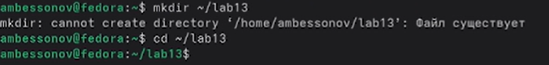
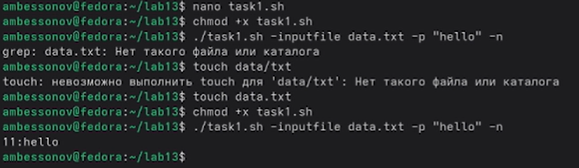
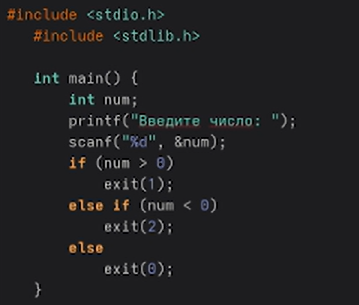
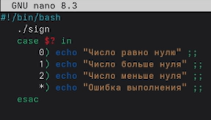

---
## Author
author:
  name: Бессонов Андрей Максимович
  degrees: DSc
  orcid: 0000-0002-0877-7063
  email: 1032253499@rudn.ru
  affiliation:
    - name: Российский университет дружбы народов
      country: Российская Федерация
      postal-code: 117198
      city: Москва
      address: ул. Миклухо-Маклая, д. 6
## Title
title: Презентация лабораторной работы №13
subtitle: Основы программирования в оболочке ОС UNIX.
license: CC BY
date: 2026-05-04
---

# Информация

## Докладчик

:::::::::::::: {.columns align=center}
::: {.column width="70%"}

  * Бессонов Андрей Максимович
  * Студент 1-го курса
  * Группа НКАбд-01-25
  * Российский университет дружбы народов им. П. Лумумбы

:::
::: {.column width="30%"}

:::
::::::::::::::

# Вводная часть

## Актуальность

- Умение писать командные файлы (скрипты) в оболочке UNIX необходимо для автоматизации системного администрирования.
- Конструкции ветвления и циклов позволяют создавать сложные сценарии обработки данных.
- Навыки разбора ключей командной строки, анализа кодов возврата и работы с архивами востребованы в повседневной практике.

## Объект и предмет исследования

- **Объект:** Операционная система Linux, интерпретатор командной оболочки bash.
- **Предмет:** Программирование в bash: разбор опций (`getopts`, ручной разбор), условные операторы, циклы, анализ кода возврата (`$?`), работа с файлами и архивами.

## Цели и задачи

- **Цель:** Изучить основы программирования в оболочке ОС UNIX. Научиться писать командные файлы с использованием логических управляющих конструкций и циклов.

- **Задачи:**
    1. Написать скрипт с разбором длинных ключей (`-inputfile`, `-outputfile`, `-p`, `-C`, `-n`) для поиска строк в файле.
    2. Создать программу на C, возвращающую код в зависимости от знака числа, и скрипт, анализирующий этот код.
    3. Разработать скрипт для создания и удаления нумерованных файлов (`1.tmp` … `N.tmp`).
    4. Написать скрипт для архивации всех файлов в директории и модифицировать его для архивации только изменённых за последнюю неделю.

## Материалы и методы

- **Оборудование:** ПК с операционной системой Linux (Fedora).
- **Программное обеспечение:** Bash, GCC, утилиты `grep`, `tar`, `find`, `touch`, `rm`, текстовый редактор `nano`.
- **Методы:** Ручной разбор аргументов, использование `getopts`, анализ кода возврата, циклы `for`, условные операторы `if/case`, команды `find` и `tar`.


# Выполнение работы

## 1. Подготовка рабочей среды

- Создана директория `~/lab13` и выполнен переход в неё.



## 2. Задание 1: скрипт с разбором ключей

- Написан скрипт `task1.sh`, обрабатывающий опции `-inputfile`, `-outputfile`, `-p`, `-C`, `-n` (ручной разбор).
- Создан тестовый файл `data.txt` со строкой "hello" на 11-й позиции.

```bash
#!/bin/bash
while [ $# -gt 0 ]; do
    case "$1" in
    -inputfile) input_file="$2"; shift 2 ;;
    -outputfile) output_file="$2"; shift 2 ;;
    -p) pattern="$2"; shift 2 ;;
    -C) case_insensitive="-i"; shift ;;
    -n) show_numbers="-n"; shift ;;
    *) exit 1 ;;
    esac
done
grep $case_insensitive $show_numbers "$pattern" "$input_file"
```

- Запуск: `./task1.sh -inputfile data.txt -p "hello" -n` → вывод `11:hello`.




## 3. Задание 2: программа на C и анализ кода возврата

- Программа `sign.c` запрашивает число и завершается с кодом:
  - `exit(1)` – число > 0
  - `exit(2)` – число < 0
  - `exit(0)` – число == 0

```c
#include <stdio.h>
#include <stdlib.h>
int main() {
    int num;
    scanf("%d", &num);
    if (num > 0) exit(1);
    else if (num < 0) exit(2);
    else exit(0);
}
```

- Скомпилировано: `gcc sign.c -o sign`
- Скрипт `task2.sh` вызывает `./sign` и анализирует `$?` через `case`.

```bash
#!/bin/bash
./sign
case $? in
0) echo "Число равно нулю" ;;
1) echo "Число больше нуля" ;;
2) echo "Число меньше нуля" ;;
esac
```

  
  


## 4. Задание 3: создание и удаление нумерованных файлов

- Скрипт `task3.sh`:
  - с одним аргументом `N` создаёт файлы `1.tmp` … `N.tmp`
  - с аргументами `N delete` удаляет их

```bash
#!/bin/bash
if [ $# -eq 1 ] && [[ "$1" =~ ^[0-9]+$ ]]; then
    for ((i=1; i<=$1; i++)); do touch "$i.tmp"; done
elif [ $# -eq 2 ] && [ "$2" = "delete" ] && [[ "$1" =~ ^[0-9]+$ ]]; then
    for ((i=1; i<=$1; i++)); do rm "$i.tmp"; done
else
    echo "Usage: $0 N | $0 N delete"
fi
```

- Проверка: `./task3.sh 3` → созданы файлы; `./task3.sh 3 delete` → удалены.

  


## 5. Задание 4: архивация с фильтром по времени

- Скрипт `task4.sh` принимает директорию:
  - `tar -cf backup_all.tar -C "$1" .` – все файлы
  - `find "$1" -type f -mtime -7 -print0 | tar -cf backup_recent.tar --null -T -` – только изменённые менее 7 дней назад

```bash
#!/bin/bash
if [ $# -ne 1 ] || [ ! -d "$1" ]; then
    echo "Usage: $0 directory"; exit 1
fi
tar -cf backup_all.tar -C "$1" .
echo "Created backup_all.tar"
find "$1" -type f -mtime -7 -print0 | tar -cf backup_recent.tar --null -T -
echo "Created backup_recent.tar (files modified less than 7 days ago)"
```

- Тест: создана директория `~/testdir`, в ней старый файл (`touch -d "10 days ago" oldfile`). Запуск `./task4.sh ~/testdir` создаёт оба архива. В `backup_recent.tar` старый файл не попал.

  


# Заключение

## Результаты работы

В ходе лабораторной работы были освоены:

1. **Разбор ключей командной строки** – ручной для длинных опций, а также принципы работы `getopts`.
2. **Анализ кода возврата** – использование `$?` и конструкции `case` для ветвления.
3. **Циклы и условия** – цикл `for` для массового создания/удаления файлов, проверки существования файлов.
4. **Фильтрация файлов по времени** – команда `find -mtime -7` в связке с `tar`.
5. **Архивация** – создание архивов `tar` с включением всех файлов или только выбранных.

## Вывод

Приобретённые навыки позволяют автоматизировать типовые задачи администрирования: обработку ключей запуска, анализ результатов выполнения программ, массовые операции с файлами, выборочное резервное копирование. Это основа для написания сложных сценариев оболочки в UNIX-средах.

