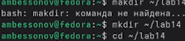
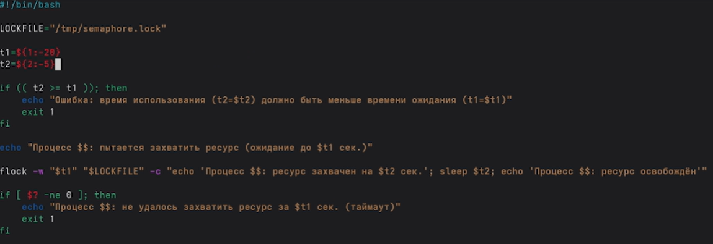
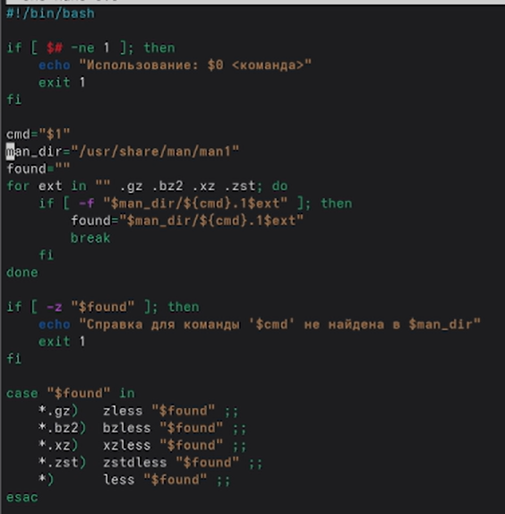
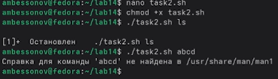
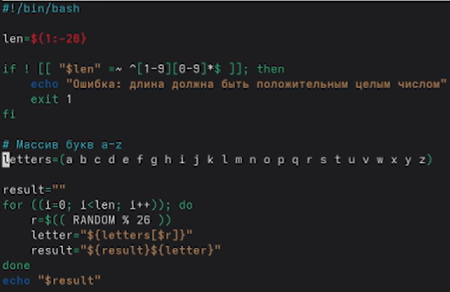
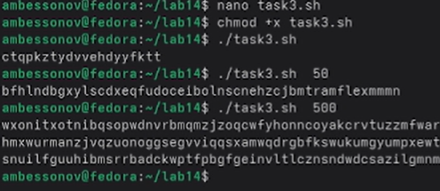

---
## Author
author:
  name: Бессонов Андрей Максимович
  degrees: DSc
  orcid: 0000-0002-0877-7063
  email: 1032253499@rudn.ru
  affiliation:
    - name: Российский университет дружбы народов
      country: Российская Федерация
      postal-code: 117198
      city: Москва
      address: ул. Миклухо-Маклая, д. 6
## Title
title: "Лабораторная работа №14"
license: "CC BY"
---

# Цель работы

Изучить основы программирования в оболочке ОС UNIX. Научиться писать более сложные командные файлы с использованием логических управляющих конструкций и циклов.

# Теоретическое введение

## Программирование в bash

Командная оболочка bash (Bourne Again SHell) предоставляет возможности для написания скриптов: переменные, условные операторы (`if`, `case`), циклы (`for`, `while`, `until`), функции, обработка аргументов командной строки. Встроенная переменная `$RANDOM` генерирует псевдослучайные целые числа от 0 до 32767.

## Семафоры в UNIX

Для синхронизации процессов можно использовать файловые блокировки. Утилита `flock` позволяет захватить эксклюзивную блокировку на файл с заданным таймаутом, что удобно для реализации бинарного семафора.

## Страницы справочной системы

Справка по командам хранится в сжатых файлах в каталоге `/usr/share/man/man1/`. Для просмотра используются `zless`, `bzless`, `xzless` в зависимости от типа сжатия.

# Выполнение лабораторной работы

В ходе работы были последовательно выполнены все задания.

## Подготовка рабочего каталога

Создан каталог `~/lab14` для размещения скриптов (рис. 1).



## Задание 1. Упрощённый механизм семафоров

### Листинг скрипта `task1.sh`

```bash
#!/bin/bash

LOCKFILE="/tmp/semaphore.lock"
t1=${1:-20}   # время ожидания (по умолчанию 20 сек)
t2=${2:-5}    # время использования (по умолчанию 5 сек)

if (( t2 >= t1 )); then
    echo "Ошибка: время использования (t2=$t2) должно быть меньше времени ожидания (t1=$t1)"
    exit 1
fi

echo "Процесс $$: пытается захватить ресурс (ожидание до $t1 сек.)"

flock -w "$t1" "$LOCKFILE" -c "echo 'Процесс $$: ресурс захвачен на $t2 сек.'; sleep $t2; echo 'Процесс $$: ресурс освобождён'"

if [ $? -ne 0 ]; then
    echo "Процесс $$: не удалось захватить ресурс за $t1 сек. (таймаут)"
    exit 1
fi
```



### Проверка работы

Скрипт был запущен в двух терминалах. В первом терминале (привилегированный режим) – в foreground, во втором – в фоне с перенаправлением вывода в первый терминал. На рис. 3 показан результат корректной работы: процессы поочерёдно захватывают и освобождают ресурс.


Для взаимодействия трёх и более процессов дополнительных изменений не требуется – `flock` автоматически ставит процессы в очередь.

## Задание 2. Реализация команды `man`

### Листинг скрипта `task2.sh`

Скрипт принимает имя команды как аргумент, ищет сжатую man-страницу в `/usr/share/man/man1/` и отображает её через `zless` (или `bzless`/`xzless` в зависимости от расширения).

```bash
#!/bin/bash

if [ $# -ne 1 ]; then
    echo "Использование: $0 <команда>"
    exit 1
fi

cmd="$1"
found=""
for ext in "" .gz .bz2 .xz; do
    if [ -f "/usr/share/man/man1/${cmd}.1$ext" ]; then
        found="/usr/share/man/man1/${cmd}.1$ext"
        break
    fi
done

if [ -z "$found" ]; then
    echo "Справка для команды '$cmd' не найдена."
    exit 1
fi

case "$found" in
    *.gz)  zless "$found" ;;
    *.bz2) bzless "$found" ;;
    *.xz)  xzless "$found" ;;
    *)     less "$found" ;;
esac
```

### Проверка работы

Скрипт успешно отображает справку для существующих команд (например, `ls`) и выдаёт сообщение об отсутствии для несуществующих. Результаты показаны на рис. 4 и 5.





## Задание 3. Генерация случайной последовательности букв латинского алфавита

### Листинг скрипта `task3.sh`

```bash
#!/bin/bash

len=${1:-20}

if ! [[ "$len" =~ ^[1-9][0-9]*$ ]]; then
    echo "Ошибка: длина должна быть положительным целым числом"
    exit 1
fi

letters=(a b c d e f g h i j k l m n o p q r s t u v w x y z)
result=""

for ((i=0; i<len; i++)); do
    r=$(( RANDOM % 26 ))
    letter="${letters[$r]}"
    result="${result}${letter}"
done

echo "$result"
```



### Проверка работы

Скрипт генерирует случайные строки заданной длины из строчных латинских букв. Примеры выполнения для длины 50 и 500 символов приведены на рис. 7.



# Выводы

В ходе лабораторной работы были освоены:
- написание командных файлов на bash с использованием условных операторов, циклов, арифметических выражений;
- синхронизация процессов с помощью файловых блокировок (`flock`) – реализован упрощённый семафор;
- создание аналога команды `man` для просмотра справочных страниц;
- генерация случайных последовательностей с использованием `$RANDOM` и преобразование чисел в символы.

Полученные навыки позволяют автоматизировать типовые задачи администрирования и разработки в среде UNIX.

# Контрольные вопросы

## Найдите синтаксическую ошибку в следующей строке:
`while [$1 != "exit"]`

**Ответ:**  
- Отсутствуют пробелы между `[` и `$1`, а также между `"exit"` и `]`.  
- Переменная `$1` должна быть заключена в двойные кавычки.  
**Исправленный вариант:**  
`while [ "$1" != "exit" ]`

## Как объединить (конкатенация) несколько строк в одну?

**Ответ:**  
В bash можно использовать прямое присваивание:  
```bash
str="$line1$line2$line3"
```
Или через подстановку:  
```bash
result="${result}${new_line}"
```

## Найдите информацию об утилите `seq`. Какими иными способами можно реализовать её функционал при программировании на bash?

**Ответ:**  
`seq` генерирует последовательность чисел. Альтернативы в bash:  
- Цикл `for ((i=1; i<=N; i++)); do echo $i; done`  
- Оператор `{1..N}` (работает только с константами)  
- Использование `eval echo {1..$N}` (потенциально опасно)  
- Команда `printf '%d\n' {1..10}`

## Какой результат даст вычисление выражения `$((10/3))`?

**Ответ:**  
Целочисленное деление: **3**.

## Укажите кратко основные отличия командной оболочки `zsh` от `bash`.

**Ответ:**  
- В `zsh` индексация массивов начинается с 1 (в bash с 0).  
- Более мощный глоббинг (`**/*.txt` рекурсивно).  
- Нет необходимости экранировать фигурные скобки в регулярных выражениях.  
- Встроенная поддержка ассоциативных массивов (в bash – с версии 4).  
- Более настраиваемый промпт и автодополнение.

## Проверьте, верен ли синтаксис данной конструкции:
`for ((a=1; a <= LIMIT; a++))`

**Ответ:**  
Синтаксис неверен: не хватает закрывающей `))` и ключевого слова `do`.  
**Правильно:**  
`for ((a=1; a <= LIMIT; a++)); do ...; done`

## Сравните язык bash с какими-либо языками программирования. Какие преимущества у bash по сравнению с ними? Какие недостатки?

**Ответ:**  
Сравнение с Python/C:  
**Преимущества bash:**  
- Простота запуска внешних команд и управления процессами.  
- Встроенные средства для работы с файлами, конвейерами, перенаправлением ввода-вывода.  
- Не требует компиляции, идеален для склеивания утилит.  

**Недостатки bash:**  
- Низкая производительность при вычислениях и обработке больших объёмов данных.  
- Слабая типизация, все переменные – строки.  
- Сложный синтаксис для арифметики и работы с массивами.  
- Много «подводных камней» (пробелы, кавычки, подстановки).  
- Отсутствие модульной системы и нормальных структур данных.

# Список литературы{.unnumbered}
::: {#refs}
:::

# ********
