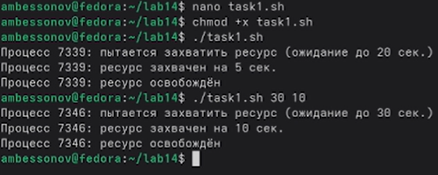

---
## Author
author:
  name: Бессонов Андрей Максимович
  degrees: DSc
  orcid: 0000-0002-0877-7063
  email: 1032253499@rudn.ru
  affiliation:
    - name: Российский университет дружбы народов
      country: Российская Федерация
      postal-code: 117198
      city: Москва
      address: ул. Миклухо-Маклая, д. 6
## Title
title: Презентация лабораторной работы №14
subtitle: Программирование в командном процессоре ОС UNIX. Расширенное программирование
license: CC BY
date: 2026-04-06
---

# Информация

## Докладчик

:::::::::::::: {.columns align=center}
::: {.column width="70%"}

  * Бессонов Андрей Максимович
  * Студент 1-го курса
  * Группа НКАбд-01-25
  * Российский университет дружбы народов им. П. Лумумбы

:::
::: {.column width="30%"}

:::
::::::::::::::

# Вводная часть

## Актуальность

- Навыки написания командных файлов (скриптов) в UNIX необходимы для автоматизации администрирования и разработки.
- Управление параллельными процессами (семафоры) — основа работы многозадачных систем.
- Генерация случайных данных и работа со справочной системой востребованы в повседневной практике.

## Объект и предмет исследования

- **Объект:** Операционная система Linux, её командная оболочка bash.
- **Предмет:** Программирование в bash: условные конструкции, циклы, синхронизация процессов (файловые семафоры), обработка аргументов, работа с man-страницами и генерация случайных последовательностей.

## Цели и задачи

- **Цель:** Изучить основы программирования в оболочке ОС UNIX. Научиться писать более сложные командные файлы с использованием логических управляющих конструкций и циклов.
- **Задачи:**
    1. Реализовать упрощённый механизм семафоров для синхронизации процессов.
    2. Создать аналог команды `man` для просмотра справочных страниц.
    3. Написать скрипт, генерирующий случайную последовательность букв латинского алфавита с помощью `$RANDOM`.

## Материалы и методы

- **Оборудование:** ПК с ОС Linux (Fedora).
- **Программное обеспечение:** bash, утилиты `flock`, `zless`, `less`, текстовый редактор nano.
- **Методы:** Написание bash-скриптов, запуск в фоновом режиме, перенаправление вывода, использование переменных окружения.

---

# Выполнение работы

## Подготовка рабочего каталога

- Создан каталог `~/lab14` для размещения скриптов.
- Все скрипты сделаны исполняемыми (`chmod +x`).


## Задание 1. Упрощённый механизм семафоров

### Листинг `task1.sh`

```bash
#!/bin/bash
LOCKFILE="/tmp/semaphore.lock"
t1=${1:-20}   # время ожидания (по умолчанию 20 сек)
t2=${2:-5}    # время использования (по умолчанию 5 сек)

if (( t2 >= t1 )); then
    echo "Ошибка: время использования (t2=$t2) должно быть меньше времени ожидания (t1=$t1)"
    exit 1
fi

echo "Процесс $$: пытается захватить ресурс (ожидание до $t1 сек.)"
flock -w "$t1" "$LOCKFILE" -c "echo 'Процесс $$: ресурс захвачен на $t2 сек.'; sleep $t2; echo 'Процесс $$: ресурс освобождён'"

if [ $? -ne 0 ]; then
    echo "Процесс $$: не удалось захватить ресурс за $t1 сек. (таймаут)"
    exit 1
fi
```

### Проверка работы семафора

- Скрипт запущен в двух терминалах: один в foreground, другой в фоне с перенаправлением вывода в первый терминал.
- Процессы поочерёдно захватывают ресурс, соблюдая очередь.
- Для трёх и более процессов изменений не требуется – `flock` автоматически обрабатывает очередь.



## Задание 2. Реализация команды `man`

### Листинг `task2.sh`

```bash
#!/bin/bash
if [ $# -ne 1 ]; then
    echo "Использование: $0 <команда>"
    exit 1
fi
cmd="$1"
found=""
for ext in "" .gz .bz2 .xz; do
    if [ -f "/usr/share/man/man1/${cmd}.1$ext" ]; then
        found="/usr/share/man/man1/${cmd}.1$ext"
        break
    fi
done
if [ -z "$found" ]; then
    echo "Справка для команды '$cmd' не найдена."
    exit 1
fi
case "$found" in
    *.gz)  zless "$found" ;;
    *.bz2) bzless "$found" ;;
    *.xz)  xzless "$found" ;;
    *)     less "$found" ;;
esac
```

### Проверка работы

- Для существующей команды (например, `ls`) скрипт открывает справочную страницу через `zless`.
- Для несуществующей команды выдаёт сообщение об ошибке.


## Задание 3. Генерация случайной последовательности букв

### Листинг `task3.sh`

```bash
#!/bin/bash
len=${1:-20}
if ! [[ "$len" =~ ^[1-9][0-9]*$ ]]; then
    echo "Ошибка: длина должна быть положительным целым числом"
    exit 1
fi
letters=(a b c d e f g h i j k l m n o p q r s t u v w x y z)
result=""
for ((i=0; i<len; i++)); do
    r=$(( RANDOM % 26 ))
    letter="${letters[$r]}"
    result="${result}${letter}"
done
echo "$result"
```

### Проверка работы

- Скрипт генерирует строки заданной длины (например, 50 или 500 символов) из строчных латинских букв.
- Результат носит случайный характер благодаря `$RANDOM`.


---

# Заключение

## Результаты работы

1. **Семафоры** – реализована синхронизация процессов с помощью `flock`; скрипт ожидает ресурс не более t1, захватывает на время t2, корректно обрабатывает очередь из нескольких процессов.
2. **Аналог `man`** – создан скрипт, ищущий сжатую man-страницу в `/usr/share/man/man1` и отображающий её через соответствующую утилиту.
3. **Генератор случайных букв** – написан скрипт, использующий `$RANDOM` для получения случайной буквы из массива a–z; поддерживается аргумент длины последовательности.

## Вывод

В ходе лабораторной работы освоены основные конструкции bash (условия, циклы, арифметика, обработка аргументов), приобретены навыки синхронизации процессов через файловые блокировки, работы со справочной системой и генерации случайных данных. Полученные знания позволяют создавать автоматизированные сценарии для администрирования и разработки в среде UNIX.
